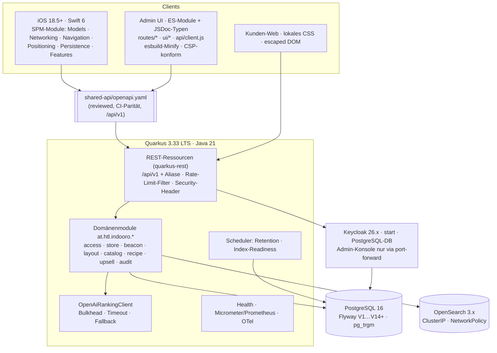
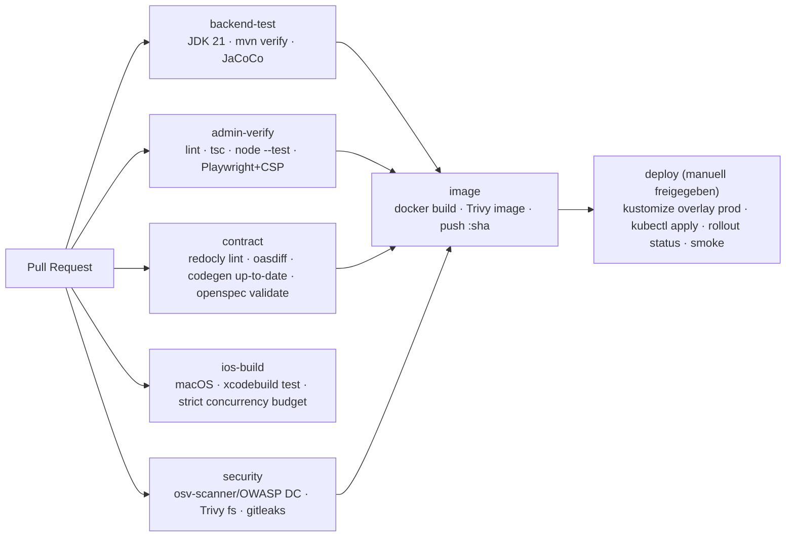
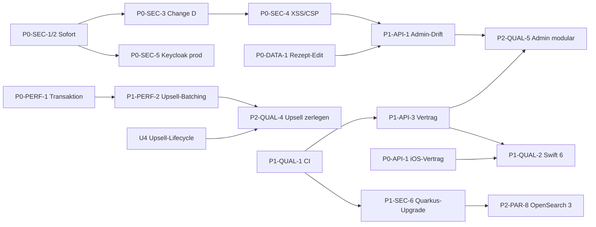

# Indooro – Refactoring & Modernization Blueprint (Phase 4)

| Feld | Wert |
| --- | --- |
| Stand | 2026-09-17, `main` @ `63a42d4` |
| Grundlage | [SYSTEM_MAP.md](SYSTEM_MAP.md) · [CODE_AUDIT.md](CODE_AUDIT.md) (IDs `DC/SEC/API/PERF/BUG/SMELL`) · iOS-Detailplanung [docs/specs/ARCHITECTURE_BLUEPRINT.md](../specs/ARCHITECTURE_BLUEPRINT.md) und [docs/specs/ROADMAP.md](../specs/ROADMAP.md) (IDs `iOS-P0-xx` … `iOS-P2-xx`) |
| Umsetzung | ausschließlich über OpenSpec-Changes; jede Zeile der Prioritätsmatrix nennt den zuständigen Change |
| Versionsrecherche | Quarkus 3.33 LTS (Support bis 2027-03), Keycloak 26.7.4, OpenSearch 3.8.0, PDFBox 3.0.8 – Stand 2026-09-17 |

**OpenSpec-Changes dieses Blueprints**

| Kürzel | Change | Inhalt | Status |
| --- | --- | --- | --- |
| BL | `2026-09-17-add-cross-platform-baseline-specs` | Capabilities `admin-dashboard`, `swift-client`, `backend-core`, `shared-api` + `openapi.yaml` | archiviert ✅ |
| SH | `harden-platform-security-baseline` | SEC-01…05, 07, 10…13, 15…17, 20, 21, 24 | Proposal, 0/40 Tasks |
| AD | `fix-admin-dashboard-contract-drift` | API-11/12/15…19/22/23, BUG-05/13…16, PERF-20…22 | Proposal, 0/25 Tasks |
| DA | `optimize-backend-data-access` | PERF-01…09/25…33, BUG-01/02/03/08/09/11 | Proposal, 0/32 Tasks |
| SC | `establish-shared-api-contract` | API-20/21/27, Versionierung, Codegen, CI-Vertrag | Proposal, 0/20 Tasks |
| D | `protect-legacy-write-endpoints` (bestehend) | SEC-06, SEC-09, SEC-18 | Proposal |
| B | `fix-ios-contract-and-spec-drift` (bestehend) | API-01…10 | Proposal |
| C | `modernize-ios-client-architecture` (bestehend) | Swift 6, Module, Tests, Rate-Limit-Handling | Proposal |
| U4 | `stabilize-upsell-quality-and-request-lifecycle` (bestehend) | Upsell-Qualität | Proposal |

---

## 0. Zielbild

### 0.1 Leitprinzipien

1. **Sicherheit vor Features.** Kein weiterer Feature-Change, solange ein P0 offen ist.
2. **Ein Vertrag.** `openspec/specs/shared-api/openapi.yaml` ist die einzige Quelle für Datenformen; Swift-Wire-Typen und Admin-Typdeklarationen werden daraus generiert.
3. **Kleine, reversible Schritte.** Jeder Schritt ist ein PR mit grünem Build; Upgrades erfolgen über LTS-Stufen.
4. **Messbar statt gefühlt.** Jede Performance-Maßnahme hat ein Budget (Query-Anzahl, Latenz, Diagnosen), das ein Test prüft.
5. **Bestehendes respektieren.** Build-freies Admin-Frontend und Code-first-Backend bleiben; Umbauten auf Frameworks nur nach ADR.

### 0.2 Zielarchitektur



### 0.3 Phasenmodell

| Phase | Zeitraum | Ziel | Exit-Kriterium |
| --- | --- | --- | --- |
| **0 Sofortmaßnahmen** | Tag 0–2 | akute Angriffsflächen schließen, ohne Code-Umbau | Demo-Passwörter rotiert, OpenSearch nicht extern erreichbar, anonymer Layout-Write gesperrt |
| **1 Absichern** | Sprint 1–2 | alle P0 aus CODE_AUDIT behoben | 0 offene P0; SH, D, AD (BUG-13), DA (PERF-01) archiviert oder abgeschlossen |
| **2 Fundament** | Sprint 3–5 | Versionen auf Stand, Vertrag erzwungen, Datenzugriff budgetiert | Quarkus 3.33 LTS, Java 21 durchgängig, CI mit Tests + Vertrag + Scans |
| **3 Architektur** | Sprint 6–9 | Swift 6 + Module, Admin-Modularisierung, Upsell-Zerlegung | 0 Concurrency-Diagnosen, `BeaconManager.swift` gelöscht, `app.js` < 300 LOC |
| **4 Ausbau** | danach | Feature-Parität, Politur | P2-Liste abgearbeitet |

---

## 1. Swift Modernization Plan

Detaillierte Modul- und Schichtplanung: [docs/specs/ARCHITECTURE_BLUEPRINT.md](../specs/ARCHITECTURE_BLUEPRINT.md) und Change C. Dieser Abschnitt ergänzt die **gemessene** Ausgangslage und die Migrationsreihenfolge.

### 1.1 Ausgangslage (gemessen 2026-09-17, Xcode 26.3)

| Datei | Diagnosen | Ursache | Behebung |
| --- | --- | --- | --- |
| `Managers/BeaconManager.swift` | 76 | `self` (nicht `Sendable`) in `@Sendable`-Closures von `DispatchQueue.main.async` und `URLSession.dataTask`; `RouteManager` in Closures | Klasse `@MainActor`; Netzwerk auf `async/await` über `APIClient`; CoreLocation/CoreBluetooth-Delegates als `nonisolated` Methoden, die per `Task { @MainActor in … }` weiterreichen; danach Zerlegung (iOS-P1-05) |
| `AR/RouteMarkerPool.swift` | 35 | RealityKit-`Entity`-APIs sind MainActor-isoliert, Klasse ist es nicht | `@MainActor final class RouteMarkerPool` – eine Zeile behebt alle 35 |
| `Managers/ProductSearchStore.swift` | 4 | wie BeaconManager | `@MainActor` + `async` Suche mit `Task`-Cancellation |
| `Models/LayoutData.swift` | 2 | `static let` mit `ISO8601DateFormatter` (nicht `Sendable`) | `Date.ISO8601FormatStyle` (Sendable) verwenden |
| `AR/ARNavViewController.swift` | 2 | `ARSessionDelegate`-Konformität kreuzt MainActor | `@preconcurrency`-Konformität oder `nonisolated` Delegate-Methoden mit Hop |
| `Views/Main/StoreMapPage.swift` | 1 | `static var defaultValue` (Environment/Preference-Key) | `static let` |
| **Summe** | **120** (37 explizit „error in Swift 6 language mode“) | | |

**Quick Wins (≤ ½ Tag, −40 Diagnosen):** `RouteMarkerPool` → `@MainActor`, `LayoutData` FormatStyle, `StoreMapPage` `static let`, `ARNavViewController` Delegate-Isolation.

### 1.2 Migrationsschritte

| Schritt | Inhalt | Build-Einstellung | Nachweis |
| --- | --- | --- | --- |
| S1 | CI-Job `ios-build` (macOS-Runner) mit `SWIFT_STRICT_CONCURRENCY=complete`, zählt Diagnosen, bricht bei Anstieg ab (Spec `swift-client`) | `complete` nur in CI | Diagnosezahl ≤ 120 |
| S2 | Quick Wins (siehe oben) | – | ≤ 80 |
| S3 | Alle `ObservableObject`-Stores `@MainActor`; `ProductSearchStore` async | – | ≤ 70 |
| S4 | `APIClient` (Actor, `async/await`, Retry, Timeouts, Fehler-Mapping) mit generierten Wire-Typen aus `api/openapi/indooro-mobile.yaml` (Change SC + C 7) | – | 0 × `URLSession.shared.dataTask` |
| S5 | `BeaconManager` zerlegen: `BeaconRadio` (Delegate-Adapter, MainActor), `PositioningEngine` (Actor, Pipeline aus Kalman/Solver/Fusion/MapMatcher), `StoreDetectionService` (Actor), `LayoutRepository` (Actor + `LayoutCacheStore`), `NavigationCoordinator` (MainActor, `@Observable`) | – | Datei gelöscht; ≤ 5 Diagnosen |
| S6 | SPM-Module extrahieren (`IndooroModels`, `IndooroNavigation` rein, ohne UIKit) – Module zuerst in **Swift 6 Language Mode** | Package: `swiftLanguageModes: [.v6]` | Module 0 Diagnosen |
| S7 | App-Target: `SWIFT_VERSION = 6`, `SWIFT_APPROACHABLE_CONCURRENCY = YES`, `SWIFT_DEFAULT_ACTOR_ISOLATION = MainActor`; rechenintensive Pfade (Graph-Bau, A*, Tour-Planung) explizit `@concurrent`/Actor | Swift 6 | 0 Diagnosen |
| S8 | Observation: `ObservableObject` → `@Observable`; State-Ownership über `@Environment`; `@StateObject` entfällt | – | 0 × `@Published` |

### 1.3 UI- und Business-Logik entkoppeln

| Heute | Ziel |
| --- | --- |
| Kategorie-Browse, Bio-Filter, Stopp-Auflösung in `ShoppingFeatureViews.swift` (1 770 LOC) | Feature-Modelle (`PlanningModel`, `ShoppingListsModel`) im Feature-Modul; Views nur Darstellung |
| `ContentView` synchronisiert Session bei jeder Positionsänderung | `NavigationCoordinator` drosselt (≥ 250 ms) und rechnet Tour nur bei Layout-/Listenänderung neu (PERF-11) |
| A* mit `Set.min` | Binary-Heap-A*, Graph-Snapshot je Layout-Version, Distanzmatrix einmal je Tour (PERF-12) |
| CoreMotion auf `.main` (20 Hz) | eigene `OperationQueue`, Fusion im `PositioningEngine`-Actor, UI-Updates gedrosselt auf 10 Hz (PERF-10) |
| Ein `BeaconManager` beobachtet von 5 Tabs | fein granulierte `@Observable`-Modelle; nur die Karte beobachtet Positionen (PERF-13) |

### 1.4 Persistenz, Offline, Konfiguration

- **Persistenz v2** (Change C 8): dateibasiert (`Application Support/shopping-lists-v2.json`), atomar geschrieben, Schema-Version, Backup + Quarantäne defekter Dateien, Migration aus `UserDefaults`-Blob; Schreibvorgänge entprellt (PERF-14).
- **Offline:** `URLCache` + ETag (Change DA) für Store-Layouts; `LayoutCacheStore` für letztes aktives Layout je Store; Rezepte/Stores mit „Stand vom …“ (iOS-P2-04). Keine Server-Synchronisation, keine Push-Notifications (Spec `swift-client`).
- **Konfiguration:** `xcconfig` je Umgebung (`Local`, `LeoCloud`, `Release`), `IndooroAPIBaseURL` im Info.plist, `NSAllowsArbitraryLoads` entfernt (SEC-26).
- **Logging:** `os.Logger` mit Privacy-Levels; Upsell-Body-Logging nur in DEBUG (AUD-19).

### 1.5 SPM-Cleanup

| Heute | Ziel |
| --- | --- |
| keine Pakete, alle Quellen im App-Target (File-System-Synchronized Group inkl. README, Präsentation, 6 ungenutzte Layouts) | lokales Paket `IndooroKit` mit 5 Library-Targets + Test-Targets; App-Target enthält nur `App/` und `Features/`; Ressourcen-Whitelist |
| drei Xcode-Projekte, zwei mit gleicher Bundle-ID | ein Projekt; Legacy-Bäume in Tag `legacy-swift-2026-09` archiviert und aus `main` entfernt (DC-08) |
| – | externe Abhängigkeiten nur `apple/swift-openapi-generator` + `swift-openapi-runtime` (gepinnt, Types-only) – Aufnahme in das Inventar der Spec `swift-client` |
| `xcuserdata` versioniert | `.gitignore`: `xcuserdata/`, `*.xcuserstate`, `*.zip` unter `swift/` |

### 1.6 Tests

- Swift Testing (`import Testing`) für reine Module: Graph/A*, RouteManager, MapMatcher, Kalman, Solver, Persistenz-Migration, Transfer-Import, Decoder-Fixtures aus `openapi.yaml`-Beispielen.
- UI-Smoke-Tests (XCUITest) für die 5 Tabs mit gemocktem `APIClient`.
- Zielabdeckung reine Module ≥ 70 %.

---

## 2. Admin-Frontend Modernization

### 2.1 Ausgangslage

| Kennzahl | Wert |
| --- | --- |
| Laufzeit-Abhängigkeiten | 0 (nur `@playwright/test ^1.60.0` als Dev-Abhängigkeit) |
| Build | keiner; `admin:lint` = `node --check`; `admin:typecheck` = Alias |
| Größe | `app.js` 68,4 KB (gzip 15,8 KB), `editor.js` 61,1 KB (gzip 15,4 KB), `core.js` 12,0 KB, `editor-core.js` 5,0 KB, CSS 18,1 KB |
| Kompression | `quarkus.http.enable-compression` nicht gesetzt → Auslieferung unkomprimiert |
| Cache-Busting | manuelle Query-Strings (`?v=recipe-product-picker-20260617`, `?v=3c7b67f`) |
| Struktur | `app.js` enthält Shell, Router, 9 Seiten, 10 Drawer, Tabellen-Helfer, API-Client |

### 2.2 Technologieentscheidung (BP-ADR-01)

| Option | Aufwand | Nutzen | Bewertung |
| --- | --- | --- | --- |
| **A: build-frei bleiben + JSDoc-Typen + esbuild nur zum Minifizieren/Hashen** | M | Typsicherheit gegen OpenAPI, kleinere Bundles, keine Laufzeit-Abhängigkeit, Team-Know-how bleibt nutzbar | **empfohlen jetzt** |
| B: Vite + TypeScript + leichtgewichtiges UI (Lit/Preact) | XL | Komponenten-Lifecycle, HMR | erst bei wachsendem Team/Scope (bestehendes ADR-012 in docs/specs) |
| C: Angular/React-Neubau | XXL | Ökosystem | nicht gerechtfertigt für 9 Seiten |

### 2.3 Paketabhängigkeiten (Upgrade-Plan)

| Paket | Heute | Ziel | Zweck |
| --- | --- | --- | --- |
| `@playwright/test` | ^1.60.0 | aktuelle 1.x, per Renovate/Dependabot | Smoke-Tests (mit CSP) |
| `typescript` | – | aktuelle 5.x | `tsc --noEmit --checkJs` |
| `openapi-typescript` | – | aktuelle Version | Typen aus `openapi.yaml` (Change SC) |
| `@redocly/cli` | – | aktuelle Version | Vertrags-Lint |
| `esbuild` | – | aktuelle Version | Minify + Content-Hash in `admin:build` |
| `eslint` + `eslint-plugin-no-unsanitized` | – | aktuelle Versionen | verbietet unescaped `innerHTML` (SEC-02-Prävention) |
| `ajv` | – | aktuelle 8.x | Schema-Validierung der Smoke-Mocks |

Paketmanager: `npm` bleibt (bestehendes `package-lock.json`); `npm ci` in CI; Lockfile-Pflege automatisiert.

### 2.4 Refactoring von Legacy-Komponenten

```text
admin/
  app.js                → nur Bootstrap (Session laden, Shell rendern, Router starten)
  router.js             → Routen-Tabelle + dynamic import() je Seite
  api/client.js         → request(), Fehler-Mapping, submitWithFeedback()
  api/types.d.ts        → generiert (openapi-typescript)
  ui/table.js, ui/drawer.js, ui/dialog.js, ui/toast.js, ui/fields.js, ui/escape.js
  routes/dashboard.js, regions.js, stores.js, store-detail.js, beacons.js,
         products.js, categories.js, recipes.js, recipe-mapping.js, diagnostics.js
  editor/
    main.js             → Bootstrap
    state.js            → Elemente, History (aus editor-core.js)
    render-canvas.js    → Elemente als DOM/SVG, nur textContent
    inspector.js, layers.js, validation-panel.js
  core.js, editor-core.js → reine Funktionen (bleiben testbar)
```

Regeln: keine Template-Interpolation ohne `escapeHtml` (ESLint-Regel), keine Inline-Handler, keine Inline-Styles in neuem Code (Vorbereitung für CSP ohne `'unsafe-inline'`), Tabellen rendern nur `[data-table-region]` (PERF-20), `actionRegistry` pro Render (PERF-21).

### 2.5 Bundle-Size-Optimierung

| Maßnahme | Erwarteter Effekt |
| --- | --- |
| `quarkus.http.enable-compression=true` (+ Brotli am Ingress, falls verfügbar) | Übertragung ≈ 23 % der Rohgröße (gemessen: gzip 15,8 KB statt 68,4 KB für `app.js`) |
| Routen-Code-Splitting per `import()` | Initial nur Shell + aktuelle Seite (Schätzung < 25 KB roh) |
| esbuild-Minify mit Content-Hash-Dateinamen + `Cache-Control: max-age=31536000, immutable` für gehashte Assets, `no-cache` für HTML | wiederholte Besuche ohne Download; manuelle `?v=`-Strings entfallen |
| Editor separat (bereits eigene Seite) | kein Editor-Code im Admin-Bundle |

Budget (CI-Check): Initial-JS je Seite ≤ 30 KB gzip, Editor ≤ 25 KB gzip.

### 2.6 Formular-, Data-Grid- und A11y-Plan

- Server-seitige Paginierung/Filter/Suche (Change AD), Debounce 250 ms, Fokus-Erhalt.
- Einheitliche Formular-Pipeline: `formValues → validate (core.js) → build payload → submitWithFeedback` inkl. Inline-Fehler in **allen** Drawern (BUG-16).
- WCAG 2.2 AA: Dialog-Rollen, Fokusfalle, Escape, Label-Zuordnung, Tastaturbedienung im Editor (Pfeiltasten verschieben, Entf löscht), Kontrastprüfung mit `@axe-core/playwright` im Smoke-Test.

---

## 3. Backend Refactoring

### 3.1 Upgrade-Pfad Quarkus 3.6.0 → 3.33 LTS

Ein Sprung über 27 Minor-Versionen wird in LTS-Stufen ausgeführt; jede Stufe endet mit grünen Tests (`./mvnw verify`) und einem Deploy auf eine Testumgebung.

| Stufe | Ziel | Wichtige Punkte (vor Ausführung mit den offiziellen Migrationsleitfäden abgleichen) |
| --- | --- | --- |
| U1 | 3.8 LTS | `quarkus update --stream=3.8`; Flyway 10: Datenbankunterstützung in eigenem Artefakt → `quarkus-flyway-postgresql` ergänzen |
| U2 | 3.15 LTS | RESTEasy-Reactive-Extensions heißen jetzt `quarkus-rest-jackson` / `quarkus-rest-client-jackson`; Packaging-Property `quarkus.package.type` → `quarkus.package.jar.type=uber-jar` |
| U3 | 3.20 LTS | Hibernate-ORM- und Validator-Updates; OIDC-Konfiguration prüfen (`application-type=hybrid`, Split-Tokens) |
| U4 | 3.27 LTS (Support endet 2026-09-24) | nur als Zwischenschritt |
| U5 | **3.33 LTS** | Zielstand; von `quarkus update` gemeldete Property-Umbenennungen übernehmen; OpenRewrite-Rezepte je Stufe committen |

Begleitende Abhängigkeiten:

| Komponente | Heute | Ziel | Hinweis |
| --- | --- | --- | --- |
| Java | 17 / 21 / 25 (Compile / CI / Runtime) | **21 LTS durchgängig** (`maven.compiler.release=21`, CI JDK 21, `eclipse-temurin:21-jre`) | BP-ADR-02; Java 25 nach Quarkus-Freigabe evaluieren |
| PDFBox | 3.0.1 | 3.0.8 | Patch-Upgrade, sofort |
| OpenSearch Server/Client | 2.9.0 | 3.x (Server) + passender `opensearch-java` 3.x | Katalog ist rekonstruierbar (Bulk-Import); **Legacy-Index `layouts` vorher exportieren**; alternativ Zwischenstufe 2.19 → 3.x mit Snapshot |
| OpenSearch-Integration | eigener `@Produces`-Client | Quarkiverse-Extension `quarkus-opensearch` evaluieren (Dev Services für Tests) | sonst D5 aus Change DA |
| Keycloak | 24.0.5 (k8s) / 26.2 (lokal) | 26.x aktuell, identisch lokal und k8s | Change SH |
| Neu | – | `quarkus-smallrye-health`, `quarkus-scheduler`, `quarkus-smallrye-fault-tolerance`, `quarkus-micrometer-registry-prometheus`, `quarkus-opentelemetry` | Health/Retention/Bulkhead/Metriken/Tracing |

### 3.2 Paket- und Modulstruktur

| Heute | Ziel (`at.htl.indooro.*`) |
| --- | --- |
| `at.htl.resource`, `at.htl.resource.admin`, `at.htl.resource.mobile` | `<modul>.api` je Domäne (`catalog.api`, `store.api`, …) |
| `at.htl.admin.service` (inkl. öffentlicher Mobile-Services) | `access`, `region`, `store`, `beacon`, `layout`, `catalog`, `recipe`, `upsell`, `audit`, `errorlog` |
| `at.htl.DTO`, `at.htl.model` | `catalog.model` |
| Exception-Mapper in `resource.admin` | `platform.web` |
| Maven `com.indoor.navigation:opensearch-api` | `at.htl.indooro:indooro-backend` |

Architekturregel (ArchUnit-Test): `*.api` → `*.service` → `*.repository`; kein Zugriff von `api` auf `repository`; `upsell` hängt nur über Interfaces von `catalog` ab.

### 3.3 Zerlegung `UpsellSuggestionService` (2 231 LOC)

| Neuer Baustein | Verantwortung | Herkunft |
| --- | --- | --- |
| `UpsellPlanner` | Orchestrierung, Transaktionsgrenzen | `plan()`/`suggestions()` |
| `ProductClassifier` | Domänen/Familien/Synonym-Regeln (später datengetrieben aus `ingredient_synonyms`) | Enums + `classifyProduct` |
| `CandidateSelector` | Relevanz-Query, Store-Scope, Ausschlüsse, Dismissals | `loadCandidates`, `filter*` |
| `OpenAiRankingClient` | Prompt, Schema, HTTP, Bulkhead/Timeout/Fallback | `rankWithOpenAi`, `openAi*Body` |
| `SuggestionValidator` | ID-Whitelist, Konfidenz, Diversität, Varianten-Filter (U4) | `validatedSuggestions` |
| `UpsellCacheRepository`, `UpsellTelemetryService` | Cache, Events, Dismissals, Retention | `store*`, `recordEvent`, `dismiss` |

### 3.4 API-Versionierungsstrategie (BP-ADR-03)

- URI-Versionierung `/api/v1/…`; unversionierte Pfade bleiben Aliase bis die minimale iOS-Version `/api/v1` nutzt.
- **Additive Änderungen** (neue Felder, neue optionale Parameter, neue Endpunkte) bleiben in v1; Clients lesen tolerant (Spec `shared-api`).
- **Breaking Changes** nur als `/api/v2/…` mit paralleler v1-Laufzeit ≥ 6 Monate; Erkennung per `oasdiff breaking` in CI (Change SC).
- Deprecation per `Deprecation`/`Sunset`/`Link`-Header; Kandidaten: `POST /api/mobile/upsell/suggestions`, `POST /api/products[/bulk]`, `POST /api/layout/current`.
- Response-Header `Indooro-Api-Version`.

### 3.5 Datenbank-Index- und Schema-Optimierung

| Maßnahme | Befund | Change |
| --- | --- | --- |
| Funktionale Unique-Indizes `lower(code|store_code|beacon_code|slug)` | PERF-30 | DA (V14) |
| `pg_trgm` + GIN auf Rezepttexten | PERF-31 | DA (V14) |
| `audit_logs(created_at DESC)`, `upsell_suggestion_cache(expires_at)`, Dismissal-Lookup | PERF-32, BUG-01 | DA (V14) |
| `CHECK major/minor BETWEEN 0 AND 65535` | BUG-08 | DA (V14) |
| `audit_logs.actor_subject` | SEC-10 | SH (V13) |
| Demo-Zuweisungen außerhalb Dev deaktivieren | SEC-01 | SH (V12) |
| Retention-Jobs | PERF-33, SEC-07 | SH, DA |
| Seed-Daten künftig nur über Dev-Profil (`R__dev_seed.sql` mit Flyway-Location je Profil) | V5/V6-Muster | Blueprint P2 |
| Batch-Fetching (`hibernate.default_batch_fetch_size=32`) als Sicherheitsnetz | PERF-02/05/06 | DA |

### 3.6 Strict Type Generation

| Konsument | Mechanismus | Change |
| --- | --- | --- |
| iOS | `openapi.yaml` → Filter `x-indooro-consumers: ios` → `api/openapi/indooro-mobile.yaml` → `swift-openapi-generator` (Types only) → Mapper auf `IndooroModels` | SC + C |
| Admin UI | `openapi-typescript` → `admin/api/types.d.ts` → JSDoc + `tsc --noEmit` | SC |
| Backend | MicroProfile-OpenAPI-Annotationen, Export nach `target/openapi`, Paritätsprüfung gegen das Review-Dokument | SC |
| Tests | httpYac-Schema-Validierung, `ajv` für Smoke-Mocks | SC, AD |

### 3.7 Test- und Qualitätsstrategie Backend

- Testcontainers/Dev Services für PostgreSQL und OpenSearch statt Mock-only; RBAC-Matrix als parametrisierter `@QuarkusTest` für alle 86 Operationen (Rolle × Scope × Route).
- Query-Budget-Tests (Hibernate Statistics) für Listen-Endpunkte (Change DA).
- JaCoCo-Schwellen: Start 40 % Zeilen gesamt, `access`/`upsell`/`recipe` ≥ 60 %; jährlich anheben (heute 31 %).
- Mutationstests (PIT) optional für `AdminAccessService` und Validatoren.

---

## 4. Infrastruktur & CI/CD

### 4.1 Pipeline-Ziel



| Heute | Ziel |
| --- | --- |
| ein Workflow, nur Push auf `main`, `-DskipTests`, JDK 21 | fünf Jobs auf PRs, Image-Build nur nach grünen Jobs |
| `:latest` + manueller `rollout restart` | Image-Tag = Commit-SHA, Deployment-Manifest per Kustomize-Overlay aktualisiert, `kubectl rollout status` + httpYac-Smoke |
| keine Scans | Abhängigkeits-, Image- und Secret-Scans (blockierend für „critical“) |
| Actions ohne Pinning | Actions auf Commit-SHA gepinnt, Dependabot für Actions/Maven/npm |

### 4.2 Environment-Management

- `k8s/base/` + `k8s/overlays/{local,leocloud}` (Kustomize); lokale Umgebung mit `docker-compose.yml` **inklusive PostgreSQL** (API-26) und identischer Keycloak-Version.
- Konfiguration ausschließlich über Env-Variablen/ConfigMaps; Profile `dev`, `test`, `prod` ohne unsichere Defaults im `prod`-Profil.

### 4.3 Secrets-Management

| Stufe | Maßnahme |
| --- | --- |
| sofort | alle Secrets aus Git entfernen (`k8s/keycloak.yaml`), rotieren (Keycloak-Admin, Client-Secret, DB-Passwort) |
| kurzfristig | Secrets per `kubectl create secret --from-env-file` aus lokal ungetrackten Dateien; Dokumentation in `DEPLOYMENT.md` |
| mittelfristig | SOPS (age) oder Sealed Secrets – nur wenn LeoCloud den Controller erlaubt; sonst beim manuellen Verfahren bleiben |
| Git-Hygiene | `gitleaks` in CI; Historie bereits geprüft (keine API-Keys gefunden) |

### 4.4 Betrieb

- PostgreSQL-Backup: `CronJob` mit `pg_dump` (täglich, 7 Generationen) auf ein separates PVC; Restore-Probe monatlich.
- Probes und Ressourcen für alle Deployments (Keycloak, PostgreSQL, OpenSearch).
- Observability: `/q/health`, `/q/metrics` (nur cluster-intern), strukturierte JSON-Logs.

---

## 5. Priority Matrix (P0 / P1 / P2)

**Kategorien:** 🔒 Blocker/Security · ⚡ Performance · 🧹 Code Quality · 🧩 Feature Parity
**Aufwand:** S ≤ ½ Tag · M ≤ 2 Tage · L ≤ 1 Woche · XL > 1 Woche

### 5.1 P0 – Blocker (Phase 0 und 1)

| ID | Kat. | Maßnahme | Befunde | Change | Aufwand | Abnahmekriterium |
| --- | --- | --- | --- | --- | --- | --- |
| P0-SEC-1 | 🔒 | **Sofort:** Passwörter der Demo-Benutzer und des Keycloak-Master-Admins in LeoCloud rotieren, Client-Secret rotieren | SEC-01, SEC-03, SEC-09 | SH 1.1 | S | Login mit Repo-Passwörtern schlägt fehl |
| P0-SEC-2 | 🔒 | **Sofort:** OpenSearch/Dashboards-Services auf `ClusterIP` umstellen | SEC-04 | SH 5.1 | S | Kein Zugriff von außerhalb des Namespace |
| P0-SEC-3 | 🔒 | Legacy-Schreib-/Utility-/Index-Routen absichern, CORS, Prod-Secret ohne Default | SEC-06, SEC-18 | D | M | httpYac-Rollenmatrix: 401/403/2xx wie spezifiziert |
| P0-SEC-4 | 🔒 | Stored-XSS in Editor und Kunden-Seite beseitigen; CSP + Security-Header | SEC-02, SEC-15, SEC-17 | SH 3 | M | Playwright-Test mit bösartigem Label grün, keine CSP-Verletzung |
| P0-SEC-5 | 🔒 | Keycloak in Produktionsmodus mit PostgreSQL, Prod-Realm ohne Benutzer, ohne ROPC, Brute-Force-Schutz, Admin-Konsole privat; Demo-Zuweisungen deaktivieren | SEC-01, SEC-03, SEC-08 | SH 2 | L | Pod-Neustart verliert keine Benutzer; `/keycloak/admin/` extern nicht erreichbar |
| P0-SEC-6 | 🔒 | PDF-Export/Import begrenzen | SEC-05, SEC-11 | SH 4.2–4.3 | S | Export mit Level 2·10⁹ → 400 in < 1 s |
| P0-PERF-1 | ⚡ | OpenAI-Aufruf aus der Transaktion lösen, Bulkhead/Timeout/Fallback | PERF-01, PERF-27 | DA 2.1–2.2 | M | 40 parallele Plan-Requests: `/api/stores` p95 < 500 ms |
| P0-DATA-1 | 🔒 | Rezept-Bearbeitung verlustfrei machen (Detail laden, alle Felder senden, `tagIds: null` behält Tags) | BUG-13, BUG-14 | AD 2.1, 3.2–3.3 | M | Bearbeitetes Seed-Rezept behält Bild, Beschreibung, Tags |
| P0-API-1 | 🧩 | iOS-Dismiss-Vertrag (1 440 vs. max 30) und weitere iOS-Vertragsfehler | API-01…API-10 | B | L | Dismiss liefert 202; Vertragsfehlerliste in B abgehakt |
| P0-GOV-1 | 🧹 | ✅ **Erledigt 2026-09-21.** Abgeschlossene OpenSpec-Changes archivieren, überholten Upsell-Change schließen, `align-openspec-audit-findings` reparieren | AUD-04, AUD-05, AUD-34 | iOS-P0-01/02/06 | S | `openspec/specs` enthält `recipe-catalog-shopping`, `mobile-upsell-*` |

### 5.2 P1 – Nächste Sprints (Phase 1 und 2)

| ID | Kat. | Maßnahme | Befunde | Change | Aufwand | Abnahmekriterium |
| --- | --- | --- | --- | --- | --- | --- |
| P1-SEC-1 | 🔒 | Audit-Akteur + Audit für Tags/Produkte/Kategorien | SEC-10 | SH 4.6–4.7 | M | Audit zeigt Benutzername und Subject |
| P1-SEC-2 | 🔒 | Error-Log-Politik, generische 5xx, Retention | SEC-07, SEC-20 | SH 4.4–4.5 | M | 1 000 anonyme 404 → 0 Zeilen |
| P1-SEC-3 | 🔒 | Rate-Limits (20/120 pro 10 min; Export/Convert 10/min), Upsell-Nested-Validation, reduzierte Diagnosedaten | SEC-12, SEC-13, SEC-21 | SH 4.8–4.9 (+ C 13.2–13.3) | M | 21. Plan-Request → 429 |
| P1-SEC-4 | 🔒 | Workload-Härtung: non-root JRE-Image, SHA-Tags, Health-Probes, NetworkPolicy, DB-Secret | SEC-24 | SH 5 | M | Manifest-Review-Checkliste erfüllt |
| P1-SEC-5 | 🔒 | Tailwind-Play-CDN entfernen | SEC-16 | SH 3.3 | S | Kein Drittanbieter-Request |
| P1-SEC-6 | 🔒 | Versions-Upgrades: PDFBox 3.0.8 sofort; Quarkus-Stufen U1–U5; Keycloak 26.x; Dependency-/Image-Scans | SEC-25 | Blueprint §3.1 (neuer Change `upgrade-quarkus-lts`) | XL | Quarkus 3.33 LTS in Prod, Scans grün |
| P1-SEC-7 | 🔒 | ATS: `NSAllowsArbitraryLoads` entfernen | SEC-26 | C 6 | S | Info.plist ohne Arbitrary Loads |
| P1-PERF-1 | ⚡ | Rezeptlisten ohne N+1 und ohne OpenSearch | PERF-02 | DA 3 | M | ≤ 5 SQL, 0 OpenSearch-Requests je Seite |
| P1-PERF-2 | ⚡ | Upsell: `mget` für Trigger, Relevanz-Kandidaten | PERF-03, PERF-04 | DA 2.3–2.4 | M | 1 `mget` je Plan; deterministische Reihenfolge |
| P1-PERF-3 | ⚡ | Store-/Beacon-Listen batchen, Benutzer je Request cachen | PERF-05…07 | DA 4 | M | Query-Budgets aus Spec eingehalten |
| P1-PERF-4 | ⚡ | Index-Checks beim Start, Parametergrenzen, Default-Layout-Cache, ETag | PERF-08, PERF-09, PERF-25, PERF-26, PERF-29 | DA 5 | M | 0 Index-API-Aufrufe im Request-Pfad |
| P1-PERF-5 | ⚡ | Retention + Indizes (V14) | PERF-30…33 | DA 6 | M | Retention-Job-Tests grün |
| P1-PERF-6 | ⚡ | Swift: Heap-A*, Graph-Cache, Motion-Queue, gedrosselte Session-Sync | PERF-10…13 | C 5, 9 | L | Instruments: Main-Thread-Hangs < 250 ms |
| P1-PERF-7 | ⚡ | Admin: Debounce, Teil-Rendering, Registry-Leck, kein Re-Fetch beim Blättern | PERF-20…22 | AD 3.9 | S | Fokus bleibt beim Tippen erhalten |
| P1-API-1 | 🧩 | Admin-Logout, Server-Paging, Readiness-Regex, Versionsstatus, Fehlerbehandlung, stille Validierung | API-11, API-12, API-15…API-18, BUG-05, BUG-15, BUG-16 | AD | L | Demo-Nachweise aus AD bestanden |
| P1-API-2 | 🧩 | Kunden-Seite: Standort aus `layoutCode` | API-23, API-24 | AD 4.1 | S | Produkt-Hervorhebung funktioniert |
| P1-API-3 | 🧩 | Vertragsdurchsetzung: Annotationen, Parität, `oasdiff`, `/api/v1`, Deprecation, einheitliche Fehler, Codegen | API-20, API-21, API-22, API-27 | SC | L | CI-Job `contract` blockierend |
| P1-API-4 | 🧩 | iOS: Suchbegriff korrekt kodieren (`URLComponents`), `null`-Einträge in Produktlisten vermeiden | API-13, API-14 | B (Ergänzung) + DA 5.4 | S | Suche „Salz & Pfeffer“ liefert Treffer |
| P1-BUG-1 | 🧩 | Dismissals wirksam + null-sicher | BUG-01, BUG-02 | DA 2.5 | S | Verworfenes Produkt erscheint nicht erneut |
| P1-BUG-2 | 🧹 | Nebenläufigkeit (Versionen, Unique → 409), Beacon-Wertebereiche, Fallback-Einschränkung, ehrliche Index-Wartung | BUG-03, BUG-08, BUG-09, BUG-11 | DA 5.7, 6.2–6.4 | M | Parallel-Tests grün |
| P1-QUAL-1 | 🧹 | CI: Tests nicht mehr überspringen, Java 21 durchgängig, iOS-Build-Job, OpenSpec-Validierung | AUD-36, AUD-03 | SC 6 + C 13.4–13.5 | M | Alle Pipeline-Jobs aus §4.1 aktiv |
| P1-QUAL-2 | 🧹 | Swift 6 Schritte S1–S8 | AUD-15, 120 Diagnosen | C | XL | 0 Diagnosen, `SWIFT_VERSION = 6` |
| P1-QUAL-3 | 🧹 | Tote Endpunkte abkündigen (`/upsell/suggestions`) | DC-23 | SC 2.3 | S | Deprecation-Header aktiv |

### 5.3 P2 – Code Quality & Feature Parity (Phase 3 und 4)

| ID | Kat. | Maßnahme | Befunde | Change | Aufwand |
| --- | --- | --- | --- | --- | --- |
| P2-QUAL-1 | 🧹 | Repository-Hygiene (§6) | DC-08, DC-14, DC-15, DC-18, DC-24 | neuer Change `clean-repository-legacy` | S |
| P2-QUAL-2 | 🧹 | Dead Code Backend/Admin/Swift entfernen | DC-01…07, DC-09…13, DC-16, DC-17, DC-19…22, DC-25 | `clean-repository-legacy` + C | M |
| P2-QUAL-3 | 🧹 | Paketstruktur `at.htl.indooro.*`, ArchUnit-Regeln | SMELL-02 | neuer Change `restructure-backend-modules` | L |
| P2-QUAL-4 | 🧹 | `UpsellSuggestionService` zerlegen (§3.3) | SMELL-01 | nach U4 | L |
| P2-QUAL-5 | 🧹 | Admin-Modularisierung, esbuild, ESLint-XSS-Regel, Bundle-Budget | SMELL-01, PERF-23, PERF-24 | neuer Change `modularize-admin-frontend` | L |
| P2-QUAL-6 | 🧹 | Test-Ausbau: RBAC-Matrix, Testcontainers, Coverage-Schwellen | JaCoCo 31 % | neuer Change `expand-backend-test-suite` | L |
| P2-QUAL-7 | 🧹 | Fachentscheidung Store-Manager-Rechte (Archivieren, Beacon-Identität) | SEC-14 | Delta auf `admin-role-access-control` | S |
| P2-QUAL-8 | 🧹 | JSON-Fehlertexte vereinheitlichen, i18n-Vorbereitung Admin | SMELL-04 | `modularize-admin-frontend` | M |
| P2-PAR-1 | 🧩 | Kategorie-Filter serverseitig, Kategorien nicht hartkodiert | AUD-24, PERF-15, SMELL-03 | iOS-P2-03 | M |
| P2-PAR-2 | 🧩 | Offline-Cache Stores/Rezepte, ETag-Nutzung in iOS | AUD-26 | iOS-P2-04 | M |
| P2-PAR-3 | 🧩 | Rezept-Paginierung iOS | – | iOS-P2-10 | S |
| P2-PAR-4 | 🧩 | Synonym-Suche für Rezept-Mapping (Tabelle `ingredient_synonyms` nutzen) | DC-21 | neuer Change | M |
| P2-PAR-5 | 🧩 | Kunden-Seite auf Store-Layouts migrieren (`customer-web-experience` sieht das vor) | – | neuer Change | M |
| P2-PAR-6 | 🧩 | Lokalisierung, Dark Mode, Barrierefreiheit iOS; WCAG-AA Admin | AUD-27, AUD-28 | iOS-P2-01/02 + `modularize-admin-frontend` | L |
| P2-PAR-7 | 🧩 | Seeds aus Migrationen in Dev-Profil verlagern | V5/V6-Muster | `expand-backend-test-suite` | S |
| P2-PAR-8 | 🧩 | OpenSearch 3.x | SEC-25 | neuer Change `upgrade-opensearch-3` | L |

### 5.4 Abhängigkeiten



### 5.5 Kennzahlen (Fitness Functions)

| Kennzahl | Heute | Ziel Phase 2 | Ziel Phase 3 | Prüfung |
| --- | --- | --- | --- | --- |
| Offene P0-Befunde | 9 | 0 | 0 | CODE_AUDIT-Status |
| Swift-Concurrency-Diagnosen | 120 | ≤ 70 | 0 | CI `ios-build` |
| Backend-Zeilenabdeckung | 31 % | 40 % | 55 % | JaCoCo |
| SQL-Statements `GET /api/mobile/recipes?size=20` | ≈ 180 | ≤ 5 | ≤ 5 | Query-Budget-Test |
| OpenSearch-Requests je Upsell-Plan | bis 1 600 + 2 | ≤ 3 | ≤ 3 | Interceptor-Test |
| Vertragsabweichungen Code ↔ `openapi.yaml` | 0 (manuell geprüft) | 0 (CI) | 0 (CI, Schema-Parität) | Job `contract` |
| Admin-Initial-JS (gzip) | ≈ 19 KB ungeteilt, unkomprimiert ausgeliefert | Kompression aktiv | ≤ 30 KB je Seite, gehasht | Budget-Check |
| Quarkus-Version | 3.6.0 (EOL) | 3.33 LTS | aktuelle LTS | `pom.xml` |

---

## 6. Repository-Hygiene

| Aufgabe | Befund |
| --- | --- |
| `swift/indooro-EinkaeuferFinal.zip`, `backend/indooro_server/src/main/java/at/code.zip` löschen | DC-08, DC-18 |
| `xcuserdata/`, `*.xcuserstate`, `.backend.pid`, `*.zip` in `.gitignore`; versionierte Exemplare entfernen | DC-08, DC-15 |
| `.gitignore`: fehlerhaften Eintrag `.env.example/` entfernen, `api-tests/httpyac/.env.example` committen | Hygiene |
| Legacy (`app/`, `Beacons/`, `swift/indooro-`, `swift/indooroApp`, `convert_to_ndjson.py`, `scripts/programB.js`) per Tag `legacy-2026-09` archivieren und aus `main` löschen | DC-08, DC-14, DC-15 |
| Backend-Modulroot: PDFs/CSVs/JSONs nach `src/test/resources/fixtures` oder löschen | DC-24 |
| `k8s/volume-claim.yaml` löschen; `build.sh` an CI-Image-Namen anpassen oder löschen | Hygiene |
| `quarkus.log.category."com.indoor.navigation"` → `at.htl` | SEC-23 |
| `openspec/config.yaml`: Rollout-Kommando auf `deployment/indooro-backend` korrigiert | API-25 (in diesem Audit erledigt) |
| Große Medien (`media/firstProjectPoster.psd`, 10 MB) in Git LFS oder außerhalb des Repos | Hygiene |

---

## 7. Architekturentscheidungen dieses Blueprints

| ID | Entscheidung | Status |
| --- | --- | --- |
| BP-ADR-01 | Admin UI bleibt build-frei zur Laufzeit; Typsicherheit per JSDoc/`tsc`, Minify/Hash per esbuild; Framework-Migration nur über bestehendes ADR-012 | vorgeschlagen |
| BP-ADR-02 | Java 21 LTS als einheitliche Compile-, CI- und Runtime-Version (JRE-Image) bis Quarkus-LTS und Team Java 25 freigeben | vorgeschlagen |
| BP-ADR-03 | URI-Versionierung `/api/v1`, additive Evolution, `oasdiff` als Gate, Deprecation-Header, 6 Monate Parallelbetrieb | vorgeschlagen (Change SC) |
| BP-ADR-04 | Code-first-Backend mit geprüftem OpenAPI-Snapshot als Vertrag; Codegen nur für Clients | vorgeschlagen (Change SC) |
| BP-ADR-05 | Rate-Limiting im Backend-Filter (portabel), Ingress-Limits nur zusätzlich | vorgeschlagen (Change SH) |
| BP-ADR-06 | Keine Message-Queue/kein Redis: Retention und Readiness über `quarkus-scheduler`, Cache in PostgreSQL | vorgeschlagen |
| BP-ADR-07 | OpenSearch-Upgrade per Neuaufbau + Re-Import des Katalogs; Legacy-Layouts vorher exportieren | vorgeschlagen |

---

## 8. Risiken

| Risiko | Wirkung | Gegenmaßnahme |
| --- | --- | --- |
| LeoCloud unterstützt NetworkPolicy/Ingress-Annotationen nicht | OpenSearch/Rate-Limits nur teilweise wirksam | Anwendungsfilter; OpenSearch-Security-Plugin mit Basic-Auth als Fallback |
| Keycloak-Umzug verliert Sessions/Benutzer | Admins ausgesperrt | Realm-Export und DB-Dump vorab; Benutzer mit temporären Passwörtern neu anlegen |
| Quarkus-Sprung über 27 Versionen | Regressionen in OIDC/REST | LTS-Stufen, `quarkus update`, RBAC-Matrix-Tests vor dem Upgrade (P2-QUAL-6 teilweise vorziehen) |
| Swift-6-Umbau parallel zu Feature-Arbeit (U4) | Merge-Konflikte in `BeaconManager`/Upsell | Reihenfolge laut Abhängigkeitsgraph; U4 im neuen `UpsellModel` umsetzen |
| Relevanz-basierte Upsell-Kandidaten ändern Ergebnisse | Qualitätsschwankung | Fixture-Tests (31 bestehende), Abstimmung mit U2/U4 |
| Schulprojekt-Kapazität | Blueprint zu groß | P0 strikt zuerst; P2 nur nach Bedarf |

---

## 9. Definition of Done (jede Matrixzeile)

1. Zugehöriger OpenSpec-Change validiert (`npx -y @fission-ai/openspec@1.3.1 validate <change> --strict`) und alle Tasks abgehakt.
2. `./mvnw verify`, `npm run admin:verify`, iOS-Build/Tests (ab P1-QUAL-1) grün; Vertragsjob grün (ab P1-API-3).
3. `openspec/specs/shared-api/openapi.yaml` aktualisiert, falls Routen oder DTOs betroffen sind.
4. Befundstatus in [CODE_AUDIT.md](CODE_AUDIT.md) nachgetragen (behoben mit Commit/Change).
5. Change archiviert, Purpose-Platzhalter ersetzt, `validate --all --strict` grün.
