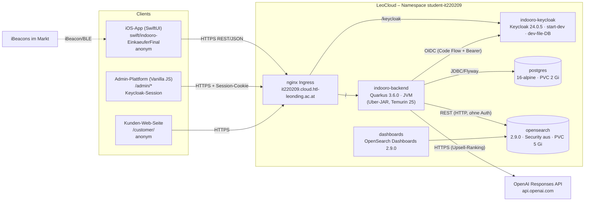
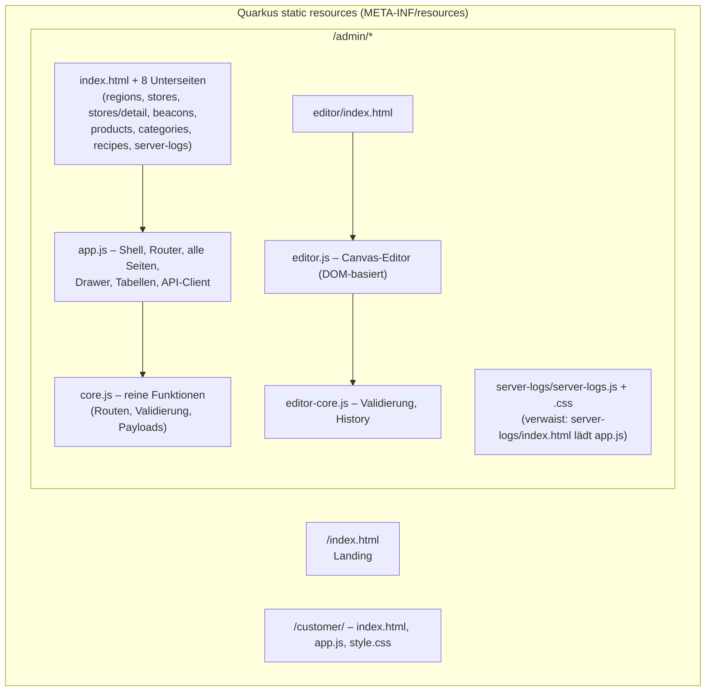
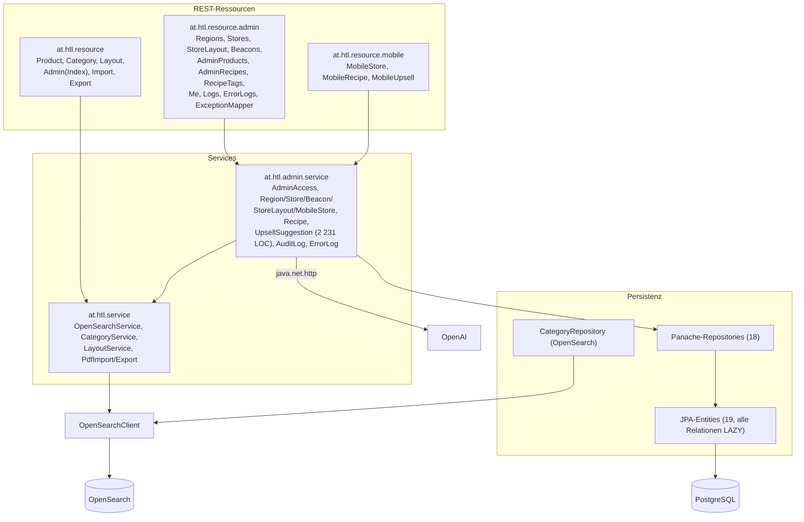
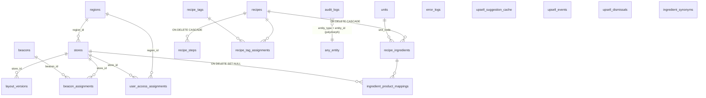
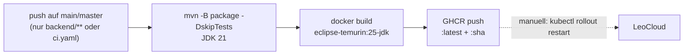

# Indooro – System Map (Phase 1: Full-Stack Discovery)

| Feld | Wert |
| --- | --- |
| Stand | 2026-09-17 |
| Git-Stand | `main` @ `63a42d4` („Increase upsell session prompt limit“), 224 Commits seit 2025-10-13 |
| Methode | Datei-für-Datei-Review aller getrackten Quellen (619 Dateien), Build- und Testläufe, Abgleich mit `openspec/` |
| Folgedokumente | [CODE_AUDIT.md](CODE_AUDIT.md) · [MODERNIZATION_BLUEPRINT.md](MODERNIZATION_BLUEPRINT.md) · Vorarbeit iOS: [docs/specs/](../specs/README.md) |

> **Einordnung der Aufgabenstellung:** Die Vorlage nennt React/Vue/Angular, GraphQL/gRPC, Microservices, Payment, Push Notifications und Redis. Nichts davon existiert in diesem Repository. Indooro ist ein **modularer Monolith** (Quarkus) mit einem **Vanilla-JS-Admin-Frontend ohne Build-Schritt**, einer **nativen SwiftUI-iOS-App** und einer **Kubernetes-Installation auf LeoCloud**. Diese Map beschreibt den tatsächlichen Stand. Nicht vorhandene Bausteine sind in §7 ausdrücklich als „nicht vorhanden“ markiert, statt sie zu erfinden.

---

## 1. Systemkontext

### 1.1 Komponenten-Steckbrief

| Komponente | Pfad | Technologie | Größe | Status |
| --- | --- | --- | --- | --- |
| Backend | `backend/indooro_server/` | Quarkus **3.6.0** (Dez 2023), Java 17 (`maven.compiler.release`), RESTEasy Reactive + Jackson, Hibernate ORM Panache, Flyway, Hibernate Validator, quarkus-oidc (`hybrid`), SmallRye OpenAPI, OpenSearch Java Client **2.9.0**, PDFBox **3.0.1**, JaCoCo | 102 Java-Dateien / 9 610 LOC in `src/main`, 8 Testklassen, 11 Flyway-Migrationen | aktiv |
| Admin-Frontend | `backend/indooro_server/src/main/resources/META-INF/resources/admin/` | ES-Module ohne Build, ohne Framework, ohne Paketmanager | `app.js` 1 488 LOC / 68 KB, `editor.js` 1 824 LOC / 61 KB, `core.js` 268 LOC, `editor-core.js` 122 LOC, 10 HTML-Einstiegsseiten | aktiv |
| Kunden-Web | `…/META-INF/resources/customer/` | Vanilla JS + **Tailwind Play-CDN** | 370 LOC | aktiv (klein) |
| iOS-App (kanonisch) | `swift/indooro-EinkaeuferFinal/` | SwiftUI, Swift 5-Sprachmodus, iOS 18.5, Xcode-Projekt `objectVersion 77`, keine SPM-Pakete | 52 Dateien, 16 687 LOC | aktiv |
| iOS Legacy | `swift/indooro-/`, `swift/indooroApp/` | SwiftUI | 9 935 bzw. 2 654 LOC | eingefroren |
| Legacy-Web | `app/` (v1, v2, launch_supermarkt, uploadPdf, configurator-demo, `db/indooro.sql` im MySQL-Dialekt) | HTML/JS | – | tot (nicht deployt) |
| BLE-Prototyp | `Beacons/` | Node/Express + Python | 285 LOC | tot |
| API-Tests | `api-tests/httpyac/` | httpYac gegen LeoCloud | 7 Suiten | aktiv |
| UI-Tests | `backend/…/src/test/playwright/`, `src/test/js/` | Playwright, `node --test` | 1 Spec, 1 Unit-Datei | aktiv |
| Infrastruktur | `k8s/`, `docker-compose.yml`, `keycloak/realm/`, `.github/workflows/ci.yaml` | Kubernetes (nginx Ingress), Docker Compose, GitHub Actions | 6 Manifeste, 1 Workflow | aktiv |
| Spezifikation | `openspec/` | OpenSpec 1.3.1, Schema `spec-driven` | 21 Specs, 13 aktive Changes, 7 archivierte | aktiv |

---

## 2. Swift-App (`swift/indooro-EinkaeuferFinal`)

Die Detailanalyse steht in [docs/specs/AUDIT.md §1.2](../specs/AUDIT.md) und [docs/specs/TSD.md](../specs/TSD.md). Hier die für die Gesamtarchitektur relevanten, **in dieser Sitzung erneut verifizierten** Fakten.

### 2.1 Architekturmuster

| Aspekt | Ist-Zustand | Bewertung |
| --- | --- | --- |
| Muster | „Manager/Store + View“: 7 `ObservableObject`-Klassen, als `@StateObject` in `ContentView` erzeugt und per Initializer an jede Seite gereicht. Kein MVVM im engeren Sinn (keine View-spezifischen ViewModels), kein TCA, keine Coordinator/Router. | Mischform; Views enthalten Geschäftslogik (z. B. Kategorie-Browse in `ShoppingFeatureViews.swift`) |
| Zentrale Klasse | `Managers/BeaconManager.swift` – 2 735 LOC: CoreBluetooth, CoreLocation-Ranging, Heading, CoreMotion, Store-Erkennung, Layout-Laden inkl. Fallback-Kaskade, Positions-Pipeline, Debug-Log, Legacy-Produktsuche | God Object |
| Navigation | `TabView` mit 5 Tabs (Start, Planung, Rezepte, Einkaufen, Karte), Sheets, `onOpenURL` für `.indoorolist` | einfach, testbar nur über UI |
| Algorithmen | `IndoorGraph` (A* auf 1-m-Raster, `Set.min` statt Heap), `RouteManager`, `MapMatcher`, `PoseFusionService`, `BeaconPositionSolver` (Gauss-Newton), `KalmanFilter` | fachlich sauber gekapselt, aber ohne Tests |

### 2.2 State Management & Concurrency

| Aspekt | Ist-Zustand (verifiziert) |
| --- | --- |
| Observation | ausschließlich `ObservableObject` + `@Published`; kein `@Observable` |
| Actor-Isolation | nur `RecipeStore` und `UpsellSuggestionStore` sind `@MainActor`; `BeaconManager`, `ShoppingListManager`, `ShoppingSessionManager`, `ProductSearchStore` nicht |
| Netzwerk | 12 Stellen mit `URLSession.shared.dataTask` + Completion-Handler; 38× `DispatchQueue.main` |
| Sprachmodus | `SWIFT_VERSION = 5.0`, `SWIFT_STRICT_CONCURRENCY` nicht gesetzt |
| **Messung Strict Concurrency** | `xcodebuild … SWIFT_STRICT_CONCURRENCY=complete` (Xcode 26.3): Build erfolgreich, **120 eindeutige Concurrency-Diagnosen in 6 Dateien** – `BeaconManager.swift` 76, `AR/RouteMarkerPool.swift` 35, `ProductSearchStore.swift` 4, `LayoutData.swift` 2, `ARNavViewController.swift` 2, `StoreMapPage.swift` 1; 37 davon tragen den Hinweis „this is an error in the Swift 6 language mode“ |

### 2.3 UI-Performance, Offline, Persistenz

| Aspekt | Ist-Zustand |
| --- | --- |
| Main Thread | CoreMotion-Callbacks (20 Hz) und Map-Matching laufen auf der Main Queue; `MultiStopRoutePlanner` baut bei jeder Positionsänderung den Graphen neu (Details: CODE_AUDIT §4.1) |
| Offline | kein Cache für Stores, Layouts, Rezepte; einziges Offline-Artefakt ist das gebündelte `Resources/layout.json` |
| Persistenz | `UserDefaults`: `shoppingListStore.v1` (alle Listen als ein JSON-Blob), `shoppingSession.*`, `selectedLayout*` |
| Secure Storage | nicht benötigt (keine Tokens, anonyme App) – **kein Keychain-Einsatz, aber auch kein Bedarf** |
| Push Notifications | nicht vorhanden |
| Background Tasks | nicht vorhanden |

### 2.4 Dependencies

| Art | Inhalt |
| --- | --- |
| SPM | **keine** Pakete (`packageReferences` fehlt im `project.pbxproj`) |
| System-Frameworks | SwiftUI, Combine, CoreBluetooth, CoreLocation, CoreMotion, MapKit, ARKit, RealityKit, UniformTypeIdentifiers |
| Test-Targets | keine (siehe `swift/indooro-EinkaeuferFinal/TESTING.md`) |
| Konfiguration | Base-URL `https://it220209.cloud.htl-leonding.ac.at/api` 4× hartkodiert (`BeaconManager.swift:160`, `ProductSearchStore.swift:7`, `RecipeStore.swift:14`, `UpsellSuggestionStore.swift:50`) |

### 2.5 Legacy-Projekte

`swift/indooro-` und `swift/indooroApp` teilen sich die Bundle-ID `at.ac.htl.leonding.indooroswift` (4 Build-Konfigurationen), die kanonische App nutzt `…indooroswift2`. In allen drei Projekten sind `xcuserdata` (10 Dateien) versioniert; `swift/indooro-EinkaeuferFinal.zip` (246 KB) liegt ungetrackt im Arbeitsverzeichnis.

---

## 3. Admin-Frontend

### 3.1 Struktur

| Aspekt | Ist-Zustand |
| --- | --- |
| Rendering | reines Client-Side-Rendering per Template-Strings und `innerHTML`; jede Unterseite lädt dieselbe `app.js`, die per `location.pathname` die Route bestimmt (`core.js:routeFromPath`) |
| Komponenten | Hilfsfunktionen als „Komponenten“: `table()`, `actions()`, `field()`, `badge()`, `openDrawer()`, `confirmMutation()`; kein Komponenten-Lifecycle |
| State | ein globales Objekt `state = { user, route, cache, filters, page }` in `app.js:30`; `state.cache` wird nie benutzt; `actionRegistry` (Map mit Closures) wächst bei jedem Render |
| Datenfluss | `request()` in `app.js:1441` – `fetch` mit `credentials: "same-origin"`, 401 → Redirect `/admin/`, 403 → Fehlermeldung |
| Formulare | `FormData` → `formValues()` → Validierung in `core.js` → Payload-Builder → API |
| Data Grids | Server liefert ganze Listen bzw. **nur die erste Seite** (Default `size=20`); Filter, Sortierung und Pagination laufen im Browser über diese Teilmenge (Details: CODE_AUDIT §3.2) |
| Editor | DOM-Elemente statt Canvas/SVG, Undo/Redo, Rotation, Beacons, Validierung; speichert entweder store-spezifisch (`/api/stores/{id}/layout/versions`) oder im Legacy-Modus global (`/api/layout/current`) |
| Build/Tooling | kein Bundler, kein TypeScript, kein Lint (`admin:lint` = `node --check`), `admin:typecheck` ist ein Alias auf Lint; Cache-Busting über manuelle Query-Strings (`?v=recipe-product-picker-20260617`, `?v=3c7b67f`) |
| Paketabhängigkeiten | Root-`package.json`: nur `@playwright/test ^1.60.0` (dev); keine Laufzeit-Abhängigkeiten |
| Bundle-Größe | ungeminifiziert: Admin ≈ 164 KB JS + 18 KB CSS; Kunden-Web lädt zusätzlich das Tailwind-Play-CDN-Skript zur Laufzeit |

### 3.2 Accessibility (WCAG 2.2) – Stichprobe

| Kriterium | Beobachtung |
| --- | --- |
| 1.3.1 Info & Beziehungen | Formularfelder haben `<label for>` (gut); Filter-Labels in `searchFilter()`/`selectFilter()` sind **nicht** mit dem Control verknüpft |
| 2.1.1 Tastatur | Editor ist mausbasiert (`mousedown`), nur 3 Tastatur-/ARIA-Stellen in `editor.js` |
| 4.1.2 Name, Rolle, Wert | Store-Detail-„Tabs“ sind Buttons ohne Funktion und ohne `role="tab"`-Verhalten; Drawer/Dialog ohne `role="dialog"`, `aria-modal` und Fokusfalle |
| 4.1.3 Statusmeldungen | Toast-Region mit `aria-live="polite"` vorhanden (gut) |
| 1.4.3 Kontrast | nicht gemessen (kein Tooling im Repo) |

---

## 4. Backend & APIs

### 4.1 Schichten und Pakete

Beobachtung: Das Paket `at.htl.admin` enthält auch **mobile/öffentliche** Logik (`MobileStoreService`, `RecipeService`, `UpsellSuggestionService`) und die globalen Exception-Mapper liegen in `resource.admin`. Die Paketnamen spiegeln die Verantwortlichkeiten nicht mehr wider.

### 4.2 Multi-Tenancy & RBAC

Indooro ist **kein Multi-Tenant-System** im SaaS-Sinn. Es gibt eine Organisation mit hierarchischem Scope **Region → Store**:

| Rolle (Keycloak-Realm-Rolle) | DB-Scope (`user_access_assignments`) | Rechte laut Code |
| --- | --- | --- |
| `admin` | kein Scope (CHECK-Constraint erzwingt `region_id`/`store_id` NULL) | alles, inkl. Produkte, Kategorien, Rezepte, Logs, Regionen-Mutationen |
| `region-manager` | `region_id` | Stores der eigenen Region lesen/anlegen/ändern/archivieren, Beacons dieser Stores, Layouts |
| `store-manager` | `store_id` | eigener Store lesen/ändern/**archivieren**, Beacons des Stores (inkl. Identitätsänderung), Layouts |

Durchsetzung zweistufig: `@RolesAllowed` auf Ressourcen **und** `AdminAccessService` (lädt pro Aufruf die aktive Zuweisung per `keycloak_subject` und prüft, dass Keycloak-Rolle und DB-Rolle übereinstimmen). HTTP-Permissions in `application.properties` ergänzen das für Pfadpräfixe. Kein `@RequestScoped`-Caching des aktuellen Benutzers (siehe CODE_AUDIT §4.3).

### 4.3 Datenbankschema (PostgreSQL, Flyway V1–V11)

| Tabelle | Besonderheiten |
| --- | --- |
| `beacons` | `uuid VARCHAR(32)` (normalisiert in V3), `identity_key` UNIQUE, `major/minor INTEGER` **ohne** Bereichsprüfung |
| `beacon_assignments` | partieller Unique-Index „ein aktives Assignment pro Beacon“ |
| `layout_versions` | `layout_json JSONB`, `UNIQUE(store_id, version_no)`, partieller Unique-Index „ein ACTIVE pro Store“ |
| `user_access_assignments` | CHECK für Rollen/Scope-Kombination, partieller Unique-Index je aktivem Subject; **V4 legt einen Admin mit fester Subject-ID `1111…` an** |
| `audit_logs` | `before_json`/`after_json` JSONB; `actor_role`/`actor_label` werden **immer** mit `SYSTEM`/`system` befüllt |
| `upsell_*` | Cache (TEXT-JSON, Unique `context_hash`), Events, Dismissals – **keine Retention** |
| Seed-Daten in Migrationen | V4/V5 (Demo-Zuweisungen), V6 (Koordinaten per fester Store-ID), V7–V10 (26 Rezepte, Bilder, Texte) |

### 4.4 Such-/Dokumentenspeicher (OpenSearch)

| Index | Mapping | Schreiber | Leser |
| --- | --- | --- | --- |
| `products` | explizit (`id` integer, `name` text + keyword, `price` double, `layoutCode`/`storeId`/`storeCode` keyword) – nur wenn über `POST /api/admin/index/create` angelegt | Admin-Produkt-API, Legacy-Bulk | Produktsuche, Rezept-Mapping, Upsell |
| `categories` | explizit, wird bei erstem Lesezugriff aus `assets/data/categories.json` geseedet | Kategorie-API | Kategorie-API |
| `layouts` | **dynamisches Mapping** (Index ohne Mapping angelegt) | `POST /api/layout/current` (anonym) | Legacy-Layout-API, iOS-Fallback, Editor-Legacy-Modus |

### 4.5 API-Vertrag (Ist)

Vollständige, maschinenlesbare Fassung: [`openspec/specs/shared-api/openapi.yaml`](../../openspec/specs/shared-api/openapi.yaml). Überblick:

| Gruppe | Basis | Auth (effektiv) | Operationen |
| --- | --- | --- | --- |
| Mobile | `/api/mobile/stores`, `/api/mobile/recipes`, `/api/mobile/upsell` | anonym | 4 + 4 + 4 |
| Katalog öffentlich | `/api/products`, `/api/categories` | anonym (GET) | 3 + 2 |
| Katalog Schreiben (Legacy) | `POST /api/products[/bulk]`, `POST/PUT /api/categories[/bulk]` | `admin` | 5 |
| Legacy-Layout | `/api/layout/current`, `/history`, `/versions/{id}` | **anonym, inkl. POST** | 4 |
| Utility | `/api/convert/pdf-to-json`, `/api/export/pdf` | **anonym** | 2 |
| Wartung | `/api/admin/index/create`, `DELETE /api/admin/index`, `/api/admin/health` | nur „authenticated“ | 3 |
| Admin | `/api/admin/me`, `/logs`, `/error-logs`, `/products`, `/recipes/**`, `/recipe-tags/**` | Rolle(n) + Scope | 1 + 1 + 1 + 3 + 17 + 4 |
| Admin-Stammdaten | `/api/regions/**`, `/api/stores/**`, `/api/stores/{id}/layout/**`, `/api/beacons/**` | Rolle(n) + Scope | 5 + 7 + 6 + 9 |
| Beispiel | `/hello` | anonym | 1 (Dead Code) |
| Framework | `/q/openapi`, `/q/swagger-ui` (nur Dev) | – | generiert |

Konventionen (Ist): JSON, deutsche Fehlermeldungen, Fehlerformat `ApiErrorResponse {status, error, method, path, timestamp}` für alle über die Mapper laufenden Fehler, Legacy-Ressourcen liefern dagegen handgebaute JSON-Strings (`{"error": "…"}`) oder `text/plain`. Paginierung nur bei Stores und Rezepten (`PageResponse {content, page, size, totalElements}`). **Keine API-Versionierung.**

### 4.6 ORM-Muster, Caching, Rate-Limiting, Async

| Thema | Ist-Zustand |
| --- | --- |
| ORM | Panache-Repository-Pattern mit HQL-Strings; alle Relationen `LAZY`, keine Fetch-Joins, kein `@BatchSize`, keine Projektionen/DTO-Queries |
| Transaktionen | `@Transactional` auf Service-Methoden; `UpsellSuggestionService.plan()`/`suggestions()` umschließen auch den OpenAI-HTTP-Aufruf |
| Caching | kein Quarkus-Cache, kein Redis. Einziger Cache: `upsell_suggestion_cache` in PostgreSQL (TTL 60 min, keine Bereinigung). Default-Layout-JSON wird pro Anfrage vom Classpath gelesen und geparst |
| Rate-Limiting | nicht vorhanden (weder App noch Ingress) |
| Async/Event-Driven | nicht vorhanden; alle Aufrufe synchron auf Worker-Threads; keine Queue, kein Outbox, keine Scheduler (`@Scheduled` fehlt) |
| Observability | JBoss-Logging; kein `quarkus-smallrye-health`, keine Metriken, kein Tracing; Fehler werden zusätzlich in `error_logs` geschrieben |
| Externe Aufrufe | OpenAI über `java.net.http.HttpClient`, pro Aufruf neu erzeugt, URL hartkodiert, Timeout 12 s (LeoCloud) |

---

## 5. Infrastruktur & CI/CD

### 5.1 Deployment-Topologie (LeoCloud)

| Ressource | Manifest | Wichtige Eigenschaften |
| --- | --- | --- |
| `Deployment/indooro-backend` | `k8s/backend.yaml` | Image `ghcr.io/htl-leo-itp-25-27-4-5bhitm/indooro-backend-v2:latest`, `imagePullPolicy: Always`, 1 Replica, TCP-Readiness/Startup-Probe, **keine** Liveness-Probe, Limits 500m/512Mi, DB-Passwort im Klartext, OpenAI-Key und OIDC-Secret per `secretKeyRef` |
| `Service/indooro-backend` | `k8s/backend.yaml` | **NodePort** |
| `Ingress/indooro-backend-ingress` | `k8s/backend-ingress.yaml` | Host `it220209.cloud.htl-leonding.ac.at`, Pfad `/`, keine TLS-Sektion, keine Rate-Limit-/Body-Size-Annotationen |
| `Deployment/postgres` | `k8s/postgres.yaml` | `postgres:16-alpine`, PVC 2 Gi, Passwort `indooro` im Klartext, keine Probes, kein Backup |
| `Deployment/opensearch` + `dashboards` | `k8s/opensearch.yaml` | 2.9.0, `plugins.security.disabled=true`, beide Services **NodePort** |
| `Deployment/indooro-keycloak` | `k8s/keycloak.yaml` | Keycloak **24.0.5** im `start-dev`-Modus mit `KC_DB=dev-file` ohne Volume, Realm-Import aus ConfigMap inkl. **Demo-Benutzern mit festen Passwörtern**, `Secret` mit `admin/admin` und Client-Secret im Manifest |
| `PVC/opensearch-pvc` | `k8s/volume-claim.yaml` | wird von keinem Manifest referenziert (verwaist) |

### 5.2 Lokale Umgebung

`docker-compose.yml`: Keycloak **26.2** (`start-dev`, Realm-Import), OpenSearch 2.9.0, Dashboards 2.9.0. **PostgreSQL fehlt** – das Backend erwartet `localhost:5432`, der Entwickler muss die DB separat starten. `scripts/orchestrator.js` startet Compose, Quarkus-Dev und einen NDJSON-Import in den Index `my-index` (nicht `products`).

### 5.3 CI/CD

| Lücke | Wirkung |
| --- | --- |
| Tests werden in CI übersprungen | 70 grüne Backend-Tests (lokal verifiziert) schützen nichts vor dem Push ins Registry |
| Kein Admin-JS-, Playwright-, httpYac-, iOS- oder OpenSpec-Job | Frontend-, Vertrags- und Spec-Drift bleiben unentdeckt |
| Drei Java-Versionen (Compile 17, CI 21, Runtime 25) | nicht reproduzierbares Laufzeitverhalten |
| `:latest` + manuelles Rollout | kein nachvollziehbarer Deploy-Stand, kein Rollback per Tag |
| Keine Dependency-/Image-Scans | veraltete Komponenten (§6) fallen nicht auf |

### 5.4 Secrets-Management

| Secret | Ablage | Bewertung |
| --- | --- | --- |
| OpenAI-API-Key | K8s-Secret `indooro-openai-secret` (nicht im Repo); lokale Notiz `documentation/leocloud-openai-secret.local.md` ist per `.gitignore` ausgeschlossen und nie committet (Git-Historie auf `sk-…`-Muster geprüft: 0 Treffer) | gut |
| OIDC-Client-Secret | K8s-Secret **im Repo** (`k8s/keycloak.yaml`, Wert `indooro-admin-secret`), identischer Fallback in `application.properties:43` | schlecht |
| Keycloak-Bootstrap-Admin | K8s-Secret im Repo: `admin` / `admin` | kritisch |
| DB-Passwort | Klartext-Env in zwei Manifesten + Default in `application.properties` | schlecht |
| Realm-Benutzer | ConfigMap im Repo mit Passwörtern `admin`/`region`/`store`, `temporary: false` | kritisch |
| httpYac-Zugangsdaten | `api-tests/httpyac/.env` lokal, korrekt ignoriert; die im README genannte `.env.example` **fehlt** im Repo | Doku-Lücke |

---

## 6. Versionslandschaft

| Komponente | Im Einsatz | Aktueller Stand (Recherche 2026-09-17) | Abstand |
| --- | --- | --- | --- |
| Quarkus | 3.6.0 | 3.33 LTS (seit 2026-03-25, Support bis 2027-03); 3.27 LTS läuft 2026-09-24 aus; nächste LTS für Ende Sept. 2026 geplant | 27 Minor-Versionen, EOL |
| Java | 17 (Compile) / 21 (CI) / 25 (Runtime) | Java 25 LTS | inkonsistent |
| OpenSearch Server + Client | 2.9.0 | 3.8.0 (2026-08-05) | Major-Sprung |
| Keycloak | 24.0.5 (k8s) / 26.2 (lokal) | 26.7.4 (2026-09-16), keine LTS-Linie | k8s deutlich veraltet |
| PDFBox | 3.0.1 | 3.0.8 | 7 Patch-Releases |
| PostgreSQL | 16-alpine | – (16 wird unterstützt) | ok |
| Playwright | ^1.60.0 | – | ok |
| Xcode/Swift | Projekt Swift 5 / Toolchain Xcode 26.3 | Swift 6.x-Sprachmodus verfügbar | Sprachmodus veraltet |
| GitHub Actions | checkout@v4, setup-java@v4, login@v3, metadata@v5, build-push@v5 | neuere Major-Versionen verfügbar | gering |

---

## 7. Nicht vorhandene Bausteine (bewusst dokumentiert)

| Aus der Aufgabenstellung | Befund |
| --- | --- |
| React/Vue/Angular/Next.js, Redux/Zustand/Pinia | nicht vorhanden – Vanilla JS mit globalem State-Objekt |
| GraphQL / gRPC / AsyncAPI-Events | nicht vorhanden – ausschließlich REST/JSON, keine asynchronen Nachrichten |
| Microservices | nicht vorhanden – ein Quarkus-Monolith |
| Payment / Data Pipelines | kein Payment; einzige „Pipeline“ ist der PDF→JSON-Konverter und der manuelle Bulk-Import |
| Push Notifications, Offline-Sync | nicht vorhanden; Einkaufslisten sind rein lokal |
| Multi-Tenant | nicht vorhanden; hierarchischer Region/Store-Scope in einer Organisation |
| Redis / Cache Layer | nicht vorhanden; PostgreSQL-Tabelle als Upsell-Cache |
| TCA / SPM-Module | nicht vorhanden |
| Kundenkonten | bewusst ausgeschlossen (README „Nicht-Ziele“) |

---

## 8. Test- und Qualitätsbasis (gemessen)

| Ebene | Werkzeug | Ergebnis dieser Sitzung |
| --- | --- | --- |
| Backend | `mvn -o test` | **70 Tests, 0 Fehler** (7 Klassen: Upsell 31, AdminRecipeResource 14, MobileRecipe 8, RecipeService 6, MobileUpsell 6, RecipeTag 4, Example 1) |
| Backend-Abdeckung | JaCoCo | **31,0 % Zeilen**, 29,0 % Branches, 27,0 % Methoden; `at.htl.service` 0 %, `at.htl.resource` 0 %, `admin.repository` 4 %, `admin.service` 41 %, `resource.mobile` 76 % |
| Nicht getestet | – | Regionen, Stores, Beacons, Layouts, AdminAccessService (RBAC), Produktsuche, Kategorien, PDF, Exception-Mapper |
| iOS | `xcodebuild` (Simulator, Strict Concurrency) | Build grün, 0 Tests vorhanden, 120 Concurrency-Diagnosen |
| Admin-JS | `node --test`, Playwright | nicht ausgeführt; Playwright-Mocks weichen vom echten Vertrag ab (z. B. `layoutCode: "A-01"`, `stores.items` statt `content`) |
| API | httpYac gegen LeoCloud | nicht ausgeführt (würde Produktivsystem und echte Zugangsdaten nutzen) |
| OpenSpec | `openspec validate --all --strict` | 34/34 gültig vor den Änderungen dieser Sitzung |
