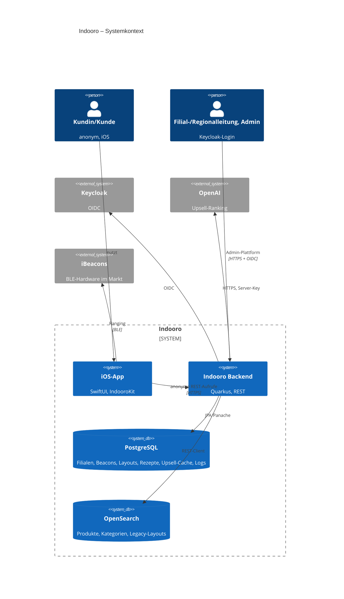
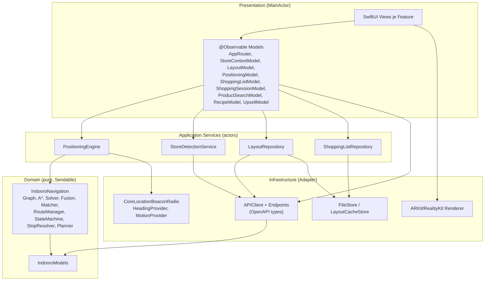

# Indooro – Architecture Blueprint

| Feld | Wert |
| --- | --- |
| Stand | 2026-09-17 |
| Zweck | Verbindliche Zielarchitektur, Architekturprinzipien und Architecture Decision Records (ADRs) |
| Umsetzung | OpenSpec-Changes `fix-ios-contract-and-spec-drift`, `modernize-ios-client-architecture`, `protect-legacy-write-endpoints`; Reihenfolge in [ROADMAP](ROADMAP.md) |
| Details | Schnittstellen, Schemata, Algorithmen: [TSD](TSD.md) |

---

## 1. Architekturprinzipien

| # | Prinzip | Konsequenz |
| --- | --- | --- |
| AP-1 | **Privacy by Design** | Position, Listen und Routen bleiben auf dem Gerät; Backend-Aufrufe der App sind anonym und tragen keine Geräte- oder Kunden-ID. |
| AP-2 | **Spec first** | Verhalten ändert sich nur über OpenSpec-Deltas; `openspec/specs` ist Single Source of Truth, `docs/specs` erklärt. |
| AP-3 | **Offline-tolerant** | Karte, Listen und Tour funktionieren ohne Netz; Online-Funktionen (Suche, Rezepte, Upsell) zeigen klare Fehlerzustände. |
| AP-4 | **Pure Core, dünne Ränder** | Navigation, Modelle und Persistenzlogik sind frameworkfrei testbar; Apple-Frameworks stecken in Adaptern. |
| AP-5 | **Compiler-geprüfte Nebenläufigkeit** | Swift 6 strict concurrency; keine manuellen Thread-Hops. |
| AP-6 | **Ein Weg ins Netz** | Genau ein `APIClient` mit einheitlichem Timeout-, Retry-, Fehler- und Logging-Verhalten. |
| AP-7 | **Vertrag statt Vermutung** | Wire-Typen aus dem Backend-OpenAPI-Dokument; Layout-JSON durch Fixture-Tests abgesichert. |
| AP-8 | **Least Privilege** | Jede schreibende Backend-Route braucht eine Rolle; anonym sind nur Lese- und Mobile-Routen. |
| AP-9 | **Kosten unter Kontrolle** | KI-Aufrufe nur serverseitig, gecacht, begrenzt, rate-limitiert, mit Token-Telemetrie. |
| AP-10 | **Einfach vor clever** | Keine Drittanbieter-Architektur-Frameworks; Standard-SwiftUI + Observation. |

---

## 2. Kontext- und Containersicht



---

## 3. iOS-Zielarchitektur

### 3.1 Schichten



Abhängigkeitsregel: Pfeile zeigen nur nach unten; Domain kennt keine Infrastruktur.

### 3.2 Verzeichnisstruktur (Soll)

```text
swift/indooro-EinkaeuferFinal/
├── MCindooroApp.xcodeproj
├── Config/
│   ├── Shared.xcconfig
│   ├── Debug-Local.xcconfig
│   ├── Debug-LeoCloud.xcconfig
│   └── Release.xcconfig
├── App/
│   ├── IndooroApp.swift
│   ├── AppEnvironment.swift
│   ├── RootView.swift
│   ├── Info.plist
│   ├── Assets.xcassets
│   ├── Localizable.xcstrings
│   └── Resources/layout.json
├── Packages/IndooroKit/
│   ├── Package.swift
│   ├── Sources/
│   │   ├── IndooroModels/
│   │   ├── IndooroNetworking/ (Endpoints/, Generated/, Mappers/, openapi.yaml → Symlink)
│   │   ├── IndooroNavigation/
│   │   ├── IndooroPositioning/
│   │   ├── IndooroPersistence/
│   │   ├── IndooroDesignSystem/
│   │   ├── FeatureStart/  FeaturePlanning/  FeatureRecipes/
│   │   ├── FeatureShopping/  FeatureMap/  FeatureUpsell/  FeatureAR/
│   │   └── IndooroTestSupport/
│   └── Tests/ (ModelsTests, NavigationTests, NetworkingTests, PersistenceTests, UpsellTests)
├── UITests/
├── Fixtures/ (Layouts/, Responses/)
└── TESTING.md
api/openapi/indooro-mobile.yaml
```

### 3.3 Zerlegung von `BeaconManager`

| Heutige Verantwortung (Zeilen) | Ziel-Komponente |
| --- | --- |
| CoreBluetooth-Scan, iBeacon-Manufacturer-Parsing (2438–2580, 2688–2735) | `CoreLocationBeaconRadio` |
| CoreLocation-Autorisierung, Ranging-Constraints (2285–2436, 2588–2662) | `CoreLocationBeaconRadio` |
| Kompass, CoreMotion (1033–1143, 2594–2634) | `HeadingProvider`, `MotionProvider` |
| RSSI-Fenster, Kalman, Konfidenz, Solver, Fusion, Matching, Anzeige-Filter (560–1000, 1144–1380) | `PositioningEngine` |
| Store-Lookup, Identitäten-Refresh, Cooldown (1452–1576, 1957–2054) | `StoreDetectionService` |
| Layout-Kaskade, History, Versionen, Bundle (1578–1956, 2093–2222) | `LayoutRepository` + `LayoutModel` |
| Mobile-Stores laden (356–392) | `StoreContextModel` |
| Produktsuche (505–556) | entfällt (Dead Code) |
| Debug-Log (1388–1418) | `DiagnosticsLog` (nur DEBUG) |
| Ziel-/Routensteuerung (293–342, 475–503, 856–917) | `PositioningModel` → Engine-Kommandos |

### 3.4 Qualitäts-Fitness-Functions

| Attribut | Prüfung | Schwelle |
| --- | --- | --- |
| Datenrennen | Build mit `SWIFT_STRICT_CONCURRENCY=complete` | 0 Diagnosen |
| Schichtregel | `IndooroNavigation`/`IndooroModels` bauen mit `swift build` auf macOS | grün |
| Performance | `MultiStopRoutePlannerPerformanceTests` | ≤ 16 ms (Gerät), ≤ 48 ms (CI-Simulator) |
| Vertrag | OpenAPI-Diff-Job | keine Abweichung |
| Tests | Unit-Coverage Navigation/Persistence/Networking | ≥ 70 % (zunächst Report) |
| Sicherheit | Secret-Scan, ATS-Check im Release-Plist | keine Treffer |
| Bundle | Inhalt ohne `.html/.js/.md`/Zusatz-Layouts | 0 Treffer |

---

## 4. Backend-Zielbild (Ausschnitt)

| Thema | Zielbild |
| --- | --- |
| Security | Methoden-spezifische HTTP-Permissions + `@RolesAllowed` + `deny-unannotated-endpoints` in `prod` (Change D) |
| Mobile-Schutz | `MobileRateLimitFilter` für Upsell-Routen (Change C) |
| Vertrag | SmallRye-OpenAPI-Export + `@Schema` auf Mobile-DTOs (Change C) |
| Build | JDK 21 LTS durchgängig (Compile, CI, `eclipse-temurin:21-jre`; siehe [BP-ADR-02](../audit/MODERNIZATION_BLUEPRINT.md)), Tests in CI, JaCoCo-Report |
| Upsell | AI-first mit Post-Validierung und Idempotenz (aktive Upsell-Changes) |
| Layout | `accessAngle`-Semantik definieren (Roadmap P2-06) |

---

## 5. Architecture Decision Records

### ADR-001 – Kanonisches iOS-Projekt
- **Status:** akzeptiert (2026-09-17)
- **Kontext:** Drei Swift-Bäume, Fixes landeten im falschen Baum (Koordinaten-Regression).
- **Entscheidung:** Nur `swift/indooro-EinkaeuferFinal` wird weiterentwickelt; Legacy-Bäume werden entfernt (Change C, Tasks 14.x).
- **Konsequenzen:** Git-Historie bleibt Referenz; Bundle-ID `…indooroswift2` bleibt.

### ADR-002 – Modularisierung über ein lokales Swift Package
- **Status:** vorgeschlagen
- **Alternativen:** (a) Ordner im App-Target, (b) mehrere Xcode-Framework-Targets, (c) lokales SPM-Paket mit mehreren Targets.
- **Entscheidung:** (c) – Zugriffskontrolle durch Modulgrenzen, `swift test` für pure Module, keine `.pbxproj`-Konflikte bei neuen Dateien.
- **Konsequenzen:** `public`-API-Pflege; SwiftUI-Previews je Feature-Target über `AppEnvironment.preview`.

### ADR-003 – Observation statt ObservableObject, kein TCA
- **Status:** vorgeschlagen
- **Kontext:** iOS 18.5 erlaubt `@Observable`; Team ist klein; TCA brächte Lernkurve und Abhängigkeit.
- **Entscheidung:** `@Observable @MainActor`-Modelle + Environment-Injection; Seiteneffekte in Actors.
- **Konsequenzen:** Feingranulare View-Updates; Combine entfällt.

### ADR-004 – Dateibasierte Persistenz statt SwiftData/Core Data
- **Status:** vorgeschlagen
- **Kontext:** < 1 MB Daten, exakte JSON-Parität mit `.indoorolist`, keine Abfragen, kein Sync.
- **Alternativen:** SwiftData (Swift-6-Isolation mit `ModelContext` aufwändiger, Migrationen schwer testbar), Core Data (Boilerplate), Realm (Drittanbieter).
- **Entscheidung:** Versionierte Codable-Datei mit atomarem Schreiben, Backup und Quarantäne.
- **Revisionsauslöser:** Geräteübergreifender Sync oder > 10 000 Einträge → SwiftData + CloudKit neu bewerten (inkl. Datenschutz-Delta).

### ADR-005 – Handgeschriebener async `APIClient` + generierte Typen
- **Status:** vorgeschlagen
- **Alternativen:** vollständig generierter OpenAPI-Client; Alamofire; reine Handarbeit.
- **Entscheidung:** `swift-openapi-generator` nur für Typen; Client selbst mit einheitlichem Retry/Timeout/Logging.
- **Konsequenzen:** Vertragsdrift wird in CI sichtbar; Layout bleibt freies JSON mit Fixture-Tests.

### ADR-006 – Kein Certificate Pinning, keine clientseitige Kryptografie
- **Status:** akzeptiert
- **Kontext:** LeoCloud-Ingress-Zertifikate werden von der Schulinfrastruktur rotiert; die App speichert keine vertraulichen Daten.
- **Entscheidung:** ATS (TLS ≥ 1.2) ohne Ausnahmen; iOS-Data-Protection-Default; kein CryptoKit, kein Keychain-Einsatz ohne konkreten Bedarf.
- **Revisionsauslöser:** Eigene Domain mit kontrollierter Zertifikatskette oder authentifizierte Kundenfunktionen.

### ADR-007 – App Attest zurückgestellt
- **Status:** zurückgestellt (P2)
- **Kontext:** Kostenrisiko der anonymen Upsell-Route.
- **Entscheidung:** Zuerst IP-basiertes Rate Limiting (Change C); App Attest (`DCAppAttestService`, serverseitige Assertion-Validierung, Key-ID-Speicher) nur, wenn Missbrauch trotz Limit auftritt.

### ADR-008 – Keine Push-Benachrichtigungen und kein Hintergrund-Ranging
- **Status:** akzeptiert
- **Begründung:** Datenschutz (AP-1), Akku, App-Review-Aufwand; die App wird aktiv im Markt genutzt.
- **Konsequenz:** Nur „When In Use“-Standort; keine `UIBackgroundModes`.

### ADR-009 – REST statt WebSockets/gRPC
- **Status:** akzeptiert
- **Begründung:** siehe TSD §6.1.

### ADR-010 – Positionierung in einem Actor
- **Status:** vorgeschlagen
- **Kontext:** 20-Hz-Motion und 0,35-s-Ticks laufen heute auf dem Main-Thread.
- **Entscheidung:** `PositioningEngine` als Actor mit `AsyncStream`-Ein- und Ausgängen; Radio-Delegates bleiben main-gebunden.
- **Konsequenzen:** Deterministische Tests mit `TestClock`; UI-Updates gedrosselt.

### ADR-011 – KI-Ranking ausschließlich serverseitig, AI-first
- **Status:** akzeptiert (aus `harden-upsell-prefilter-quality`)
- **Konsequenz:** `improve-upsell-candidate-ranking` (deterministisches Scoring) ist überholt und wird nicht umgesetzt (Roadmap P0-02).

### ADR-012 – Technologie der Admin-Plattform
- **Status:** offen
- **Kontext:** `redesign-admin-platform-layout-editor` (design.md §5) empfiehlt als Ziel eine SPA mit React, Vite, TypeScript, TanStack und Konva; umgesetzt wurde das Redesign jedoch weiterhin als modulares statisches JavaScript (`admin/core.js`, `app.js`, `editor-core.js`, `editor.js`), geprüft mit `node --check`, `node --test` und Playwright.
- **Optionen:** (a) statisches JS beibehalten und weiter modularisieren, (b) Migration zur empfohlenen SPA mit Quarkus-SPA-Fallback für `/admin/*`.
- **Entscheidungskriterium:** Wenn Layout-Editor-Anforderungen (Undo/Redo, Multi-Select, `accessAngle`-Bedienung) den statischen Ansatz übersteigen, wird (b) über einen eigenen OpenSpec-Change umgesetzt (Roadmap P2-07).
