# Indooro – Functional Specification Document (FSD)

| Feld | Wert |
| --- | --- |
| Version | 2.0 (Gesamtsystem inkl. iOS-App) |
| Stand | 2026-09-17, Git `63a42d4` + OpenSpec-Archiv `2026-09-17-integrate-ios-client-specs` |
| Normative Quelle | `openspec/specs/**` (Single Source of Truth). Dieses FSD fasst zusammen, visualisiert und nummeriert; bei Widerspruch gilt OpenSpec. |
| Verwandte Dokumente | [AUDIT](AUDIT.md) · [TSD](TSD.md) · [Architecture Blueprint](ARCHITECTURE_BLUEPRINT.md) · [ROADMAP](ROADMAP.md) |

**Status-Legende:** ✅ implementiert und spezifiziert · 🟡 implementiert mit Abweichung (Fix-Change offen) · 🔵 spezifiziert in aktivem Change (noch nicht archiviert) · ⚪ geplant (Proposal) · ⛔ Nicht-Ziel

---

## 1. Zweck und Scope

Indooro hilft anonymen Supermarkt-Kundinnen und -Kunden, Produkte in einer bestimmten Filiale zu finden und den Einkauf als Route zu erledigen. Autorisiertes Personal pflegt Regionen, Filialen, Beacons, Layouts, Produkte und Rezepte über die Admin-Plattform.

**Systembestandteile**

| Bestandteil | Technologie | Ort |
| --- | --- | --- |
| iOS-Kunden-App „Indooro“ | Swift/SwiftUI, iOS 18.5 | `swift/indooro-EinkaeuferFinal` |
| Backend-API | Quarkus 3.6, Java 17 | `backend/indooro_server` |
| Admin-Plattform + Layout-Editor | statisches HTML/CSS/JS, vom Backend ausgeliefert | `…/META-INF/resources/admin` |
| Kunden-Web (Kompatibilität) | statisches HTML/JS | `…/META-INF/resources/customer` |
| Datenhaltung | PostgreSQL (operativ), OpenSearch (Katalog, Legacy-Layouts) | `k8s/`, `docker-compose.yml` |
| Identität | Keycloak (nur Admin) | `keycloak/`, `k8s/keycloak.yaml` |
| KI-Ranking | OpenAI Responses API, nur serverseitig | `UpsellSuggestionService` |

**Glossar**

| Begriff | Bedeutung |
| --- | --- |
| Layout | JSON-Grundriss einer Filiale (`shopName`, `gridSize` in Metern, `elements`) |
| Layout-Code | `Kategorie/Meter/Fach/Reihe`, z. B. `310/1/1/1`; die ersten zwei Teile adressieren ein Regal-Element |
| Stopp | Gruppe offener Listeneinträge, die auf dasselbe Regal-Element auflösen |
| Tour / Einkaufssession | Aktiver Durchlauf einer Liste Stopp für Stopp auf der Karte |
| Blue Dot | Angezeigte Kundenposition auf der Indoor-Karte |
| Opportunity | Upsell-Gelegenheit (`station:<stopId>` oder `item:<itemId>`) |
| Fallback-Layout | Layout, das nicht das aktive Layout der Filiale ist (Server-Default, Offline-Kopie, Bundle) |

---

## 2. Personas

| ID | Persona | Ziele | Kanal | Authentifizierung |
| --- | --- | --- | --- | --- |
| P1 | **Kundin „Anna“**, 34, kauft wöchentlich in einer fremden EUROSPAR-Filiale ein | Einkauf planen, Produkte schnell finden, keine Umwege, keine Registrierung | iOS-App | keine |
| P2 | **Kunde „Herbert“**, 71, unsicher im Umgang mit Apps | einzelnes Produkt finden, große Schrift, klare Hinweise wenn Ortung unsicher | iOS-App | keine |
| P3 | **Rezept-Planerin „Lena“**, 26 | Rezept auswählen, Zutaten automatisch zur Liste, Liste mit Mitbewohner teilen | iOS-App, AirDrop | keine |
| P4 | **Filialleitung (store-manager)** | Layout der eigenen Filiale pflegen, Beacons zuordnen | Admin-Plattform | Keycloak, Scope Filiale |
| P5 | **Regionalleitung (region-manager)** | Filialen einer Region verwalten | Admin-Plattform | Keycloak, Scope Region |
| P6 | **Indooro-Admin** | Katalog, Rezepte, Mappings, Logs, alle Regionen | Admin-Plattform, Ops-Routen | Keycloak, Rolle `admin` |
| P7 | **Entwickler/Operator** | lokal entwickeln, LeoCloud deployen, Beacons kalibrieren | Xcode, kubectl, httpYac | Keycloak-Admin |
| P8 | **Präsentator (Schulprojekt-Demo)** | App ohne Beacon-Hardware vorführen | iOS-App Debug-Modus | keine |

---

## 3. Systemkontext

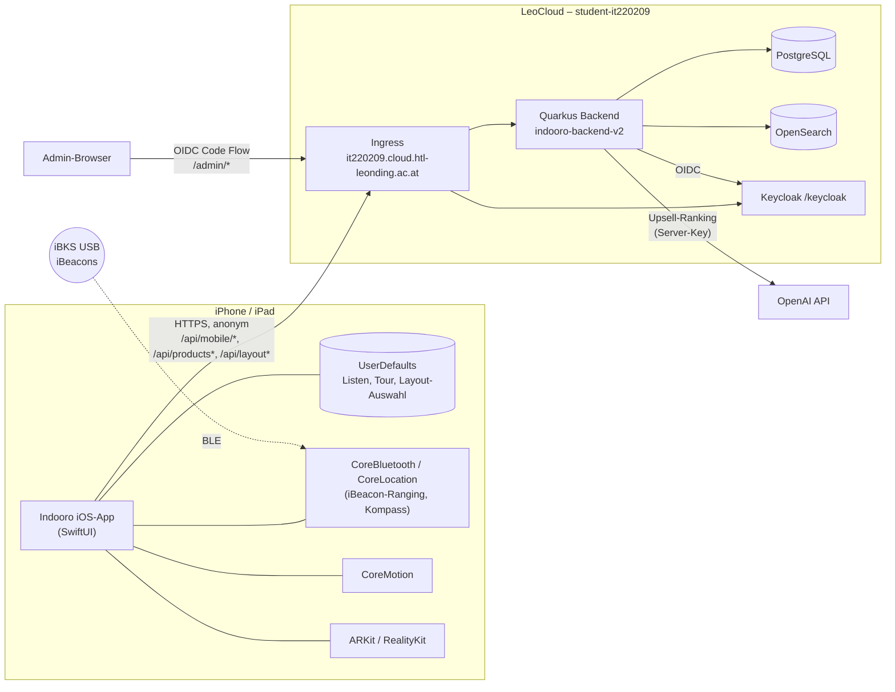

---

## 4. iOS-App – Workflows und UI-Zustände

### 4.1 App-Shell

Fünf Tabs in fester Reihenfolge (Spec `ios-client-architecture`): **Start** · **Planung** · **Rezepte** · **Einkaufen** · **Karte**. Querschnittsaktionen:

| Aktion | Auslöser | Wirkung |
| --- | --- | --- |
| Produkt auf Karte zeigen | Pfeil-Button in Suchzeile | aktive Tour stoppen → Ziel setzen → Tab Karte → Kartensuche leeren |
| Produkt einplanen | „+“ in Suchzeile / Zielkarte | Produkt zur ausgewählten Liste (Menge +1 bei offenem Duplikat) |
| Tour starten | „Tour starten“ / „Tour fortsetzen“ | Liste wählen → Upsell-Session reset → Tab Karte → letzte Filiale öffnen |
| Tour beenden | „Beenden“ / Listenlöschung | Snapshot + Routenziel löschen, Upsell-Prompt schließen |
| Datei öffnen | `.indoorolist` via Dateien/AirDrop | Import-Vorschau im Tab Einkaufen |
| Upsell-Vorschlag annehmen | Sheet „Hinzufügen“ | Produkt mit `addedFromUpsell` zur Tour-Liste, Event `accepted` |

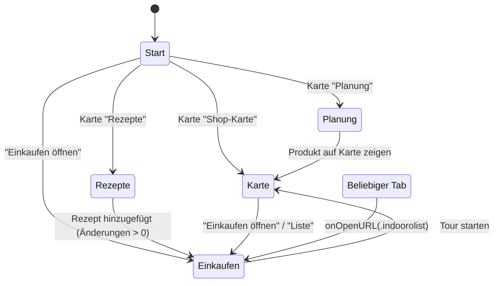

### 4.2 Karte: Filial-Übersicht ↔ Indoor-Ansicht

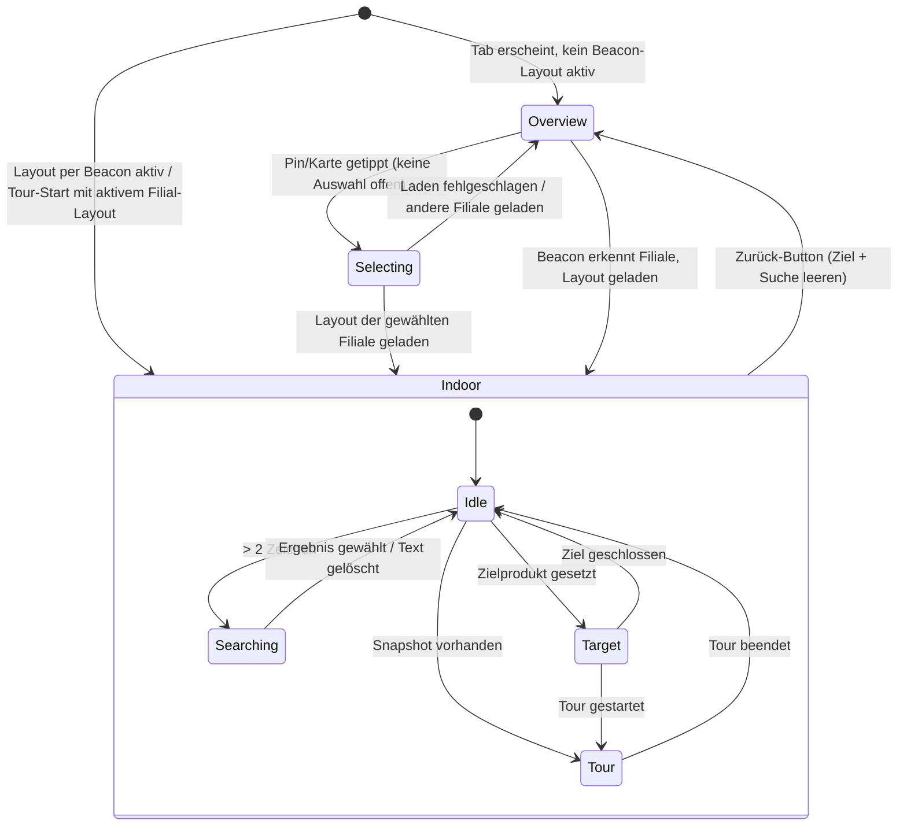

### 4.3 Layout-Lade-Kaskade (Ist + Soll)

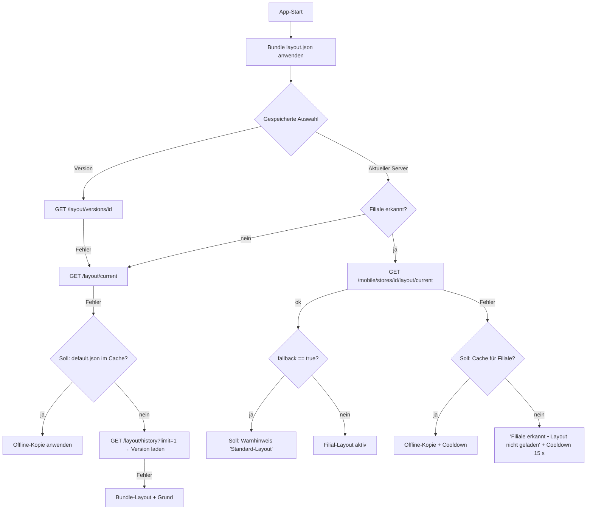

Jede Ladeoperation erhöht eine **Generation**; veraltete Antworten werden verworfen. „Soll“-Knoten kommen aus Change `fix-ios-contract-and-spec-drift`.

### 4.4 Ortung und Navigation

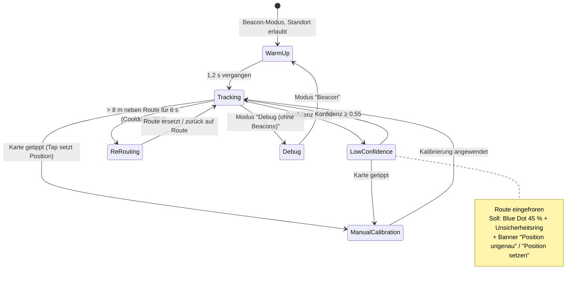

**Verarbeitungskette:** BLE/iBeacon-Sample → RSSI-Fenster (max. 12, Min/Max-Trim) → Distanz (Pfadverlust 2,8, TX −72 dBm) → Kalman → Qualität → Trilateration (≥ 3 Beacons, Gauss-Newton) → Konfidenz → Pose-Fusion → Map-Matching auf Rastergraph → Route-Update → Anzeige-Filter (≤ 1 Hz, Sprung-Bestätigung ×3).

### 4.5 Einkaufstour

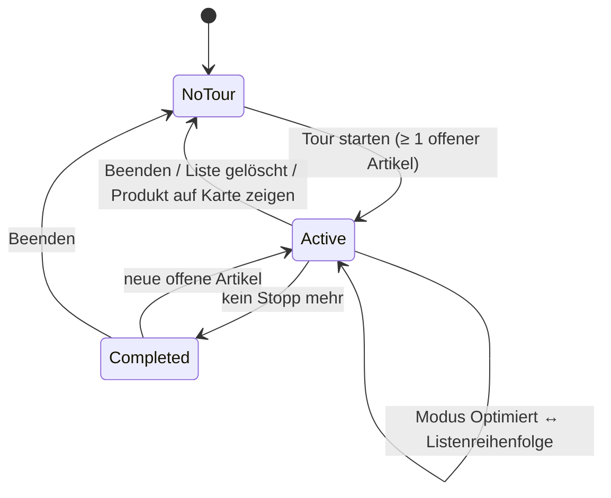

### 4.6 Upsell-Prompt

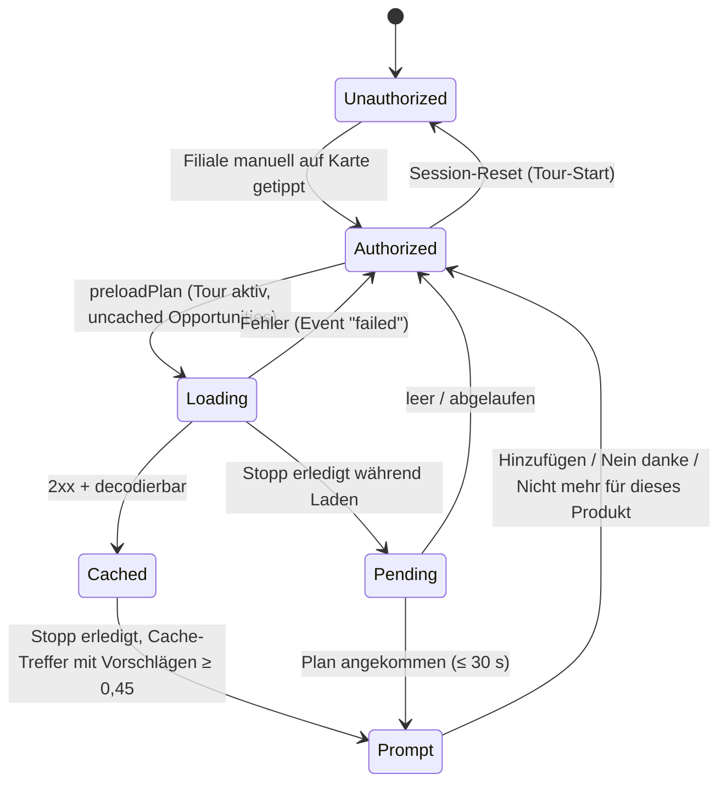

Grenzen: max. 3 Vorschläge je Prompt, max. 10 Prompts je Session, 8 s Abstand außerhalb der Tour, nie für `addedFromUpsell`-Artikel, nie für bereits gelistete Produkte.

### 4.7 Offline-First- und Local-Storage-Verhalten

| Daten | Speicherort (Ist) | Offline-Verhalten (Ist) | Soll |
| --- | --- | --- | --- |
| Einkaufslisten | `UserDefaults["shoppingListStore.v1"]` | vollständig offline nutzbar | Datei `lists.json` v2 mit Backup (Change C) |
| Aktive Tour, Routenmodus | `UserDefaults["shoppingSession.*"]` | übersteht App-Neustart | in `lists.json` |
| Layout-Auswahl | `UserDefaults["selectedLayoutMode"/"selectedLayoutId"]` | wird wiederhergestellt | unverändert |
| Indoor-Layout | nur im Speicher; Bundle-Fallback | Offline → Bundle-Layout | Cache je Filiale (Change B) |
| Filialliste | nur im Speicher | Offline → Fehlerpanel mit Retry | Cache (Roadmap P1) |
| Produktsuche | – | Offline → leere Ergebnisse (🟡) | Fehlerzustand mit Retry (Change B) |
| Rezepte | nur im Speicher | Offline → „Rezepte nicht erreichbar“ | Cache zuletzt geladener Seite (Roadmap P2) |
| Upsell-Cache | im Speicher, bis `expiresAt` (Default 60 s ohne Angabe) | Offline → keine Prompts, Tour läuft weiter | unverändert |
| Export-Dateien | `tmp/ShoppingTransfers/*.indoorolist` | offline erzeugbar, nach Teilen gelöscht | unverändert |

---

## 5. Feature Requirements

Format: **ID · Titel** — Beschreibung · Priorität (MUST/SHOULD/COULD) · Status · OpenSpec-Referenz.

### 5.1 iOS-App (FR-001 – FR-060)

| ID | Titel | Beschreibung | Prio | Status | OpenSpec |
| --- | --- | --- | --- | --- | --- |
| FR-001 | Kanonisches Projekt | Nur `swift/indooro-EinkaeuferFinal` ist Produkt-App | MUST | ✅ | ios-client-architecture |
| FR-002 | Build-Baseline | iOS 18.5, iPhone+iPad, SwiftUI | MUST | ✅ | ios-client-architecture, mobile-positioning-navigation |
| FR-003 | Fünf-Tab-Shell | Start/Planung/Rezepte/Einkaufen/Karte, Light Mode, Tint | MUST | ✅ | ios-client-architecture |
| FR-004 | Start-Dashboard | Liste mit Offen/Erledigt, aktive Tour, Einstiege, Tutorial | SHOULD | ✅ | ios-client-architecture |
| FR-005 | Zentrale Store-Instanzen | genau eine Instanz je Manager, zwei Suchstores | MUST | ✅ → ⚪ (@Observable) | ios-client-architecture |
| FR-006 | Querschnittsaktionen | Produkt fokussieren, Tour starten/stoppen, Vorschlag übernehmen | MUST | ✅ | ios-client-architecture |
| FR-007 | Berechtigungen | Bluetooth, Standort (When In Use), Kamera, Bewegung mit deutschen Texten | MUST | ✅ | ios-client-architecture |
| FR-008 | Dokumenttyp `.indoorolist` | UTI-Export, Öffnen aus Dateien/AirDrop | MUST | ✅ | ios-client-architecture |
| FR-009 | Bundle-Layout | erste Karte immer verfügbar | MUST | ✅ | ios-client-architecture |
| FR-010 | Debug-Log | ≤ 80 Zeilen, rate-limitiert | COULD | ✅ → ⚪ (nur DEBUG) | ios-client-architecture |
| FR-011 | API-Basis-URL | LeoCloud HTTPS, keine Identitäten | MUST | ✅ → ⚪ (konfigurierbar) | ios-backend-integration |
| FR-012 | Routenkatalog | feste Liste anonymer Routen | MUST | ✅ | ios-backend-integration |
| FR-013 | Tolerantes Decoding | Envelopes, Koordinaten-Aliase, numerische IDs, Beacon-Aliase | MUST | ✅ | ios-backend-integration |
| FR-014 | Stale-Response-Schutz | Request-ID/Generation je Anfrageart | MUST | ✅ | ios-backend-integration |
| FR-015 | HTTP-Statusprüfung | alle UI-relevanten Requests | MUST | 🟡 (nur Layout/Store/Upsell) | ios-backend-integration, Change B |
| FR-016 | Upsell-Timeouts | Plan 25 s, Events/Dismiss 3 s fire-and-forget | MUST | ✅ | ios-backend-integration |
| FR-017 | Datenschutz Upsell-Payload | nur lokale Listen-IDs, keine Position/Identität | MUST | ✅ | ios-backend-integration |
| FR-018 | Upsell-Events | shown/accepted/dismissed/suppressed/failed | SHOULD | ✅ | ios-backend-integration |
| FR-019 | Dismissal 24 h | „Nicht mehr für dieses Produkt“ wird serverseitig gespeichert | MUST | 🟡 (HTTP 400) | Change B |
| FR-020 | Store-gefilterte Suche | `storeId`/`storeCode` mitsenden | MUST | 🟡 | product-catalog-search, Change B |
| FR-021 | Freitextsuche Planung | ab 3 Zeichen, `size=80`, sortiert | MUST | ✅ | ios-product-planning |
| FR-022 | Kategorie-Browse | 13 Kategorien über Layout-Code-Präfix | SHOULD | ✅ | ios-product-planning |
| FR-023 | Kennzeichnungsfilter | Ohne/Bio/Demeter im Kategorie-Modus | COULD | ✅ | ios-product-planning |
| FR-024 | Schnellsuche-Chips | kategorieabhängig, ohne Kaufdaten | COULD | 🟡 (irreführender Titel) | ios-product-planning, Change B |
| FR-025 | Geplante Artikel | max. 7 Vorschau, Swipe-Löschen, Link zu allen | SHOULD | ✅ | ios-product-planning |
| FR-026 | Duplikat-Merge | gleicher Artikel+Code offen → Menge +1 | MUST | ✅ | ios-product-planning |
| FR-027 | Filial-Übersicht | MapKit, Pins nur mit echten Koordinaten | MUST | 🟡 (Fake-Koordinaten) | mobile-store-detection, ios-store-map-experience, Change B |
| FR-028 | Manuelle Filialwahl | Tap lädt Layout, Doppel-Tap gesperrt | MUST | ✅ | ios-store-map-experience |
| FR-029 | Indoor-Karte maßstäblich | Fit-to-screen, Zoom 0,65–2,5, Z-Order | MUST | ✅ | ios-store-map-experience |
| FR-030 | Rotierte Elemente | Darstellung rotiert | MUST | ✅ (Anzeige) / 🟡 (Routing) | ios-store-map-experience, Change B |
| FR-031 | Blue Dot mit Heading | Pfeil nur bei zuverlässigem Kompass | MUST | ✅ | ios-store-map-experience |
| FR-032 | Unsichere Position kennzeichnen | < 3 Beacons / Low Confidence sichtbar | MUST | 🟡 (nur AR) | mobile-positioning-navigation, Change B |
| FR-033 | Routenlinie + Restdistanz | „Noch ca. n m“ | MUST | ✅ | ios-store-map-experience |
| FR-034 | Zielkarte | Gang/Regal, Route starten, Einplanen | SHOULD | ✅ | ios-store-map-experience |
| FR-035 | Tour-Panel | Erledigt, Überspringen, Modus, offene/ungelöste Artikel | MUST | ✅ | ios-store-map-experience |
| FR-036 | Einstellungen | Tracking-Modus, Zoom, Tap setzt Ziel, AR-Start | SHOULD | ✅ | ios-store-map-experience |
| FR-037 | Karten-Tap | Ziel oder Position setzen (nur wenn freigeschaltet) | SHOULD | ✅ | ios-store-map-experience |
| FR-038 | Rezeptliste + Suche | Seite 0/20, Suche ab 2 Zeichen, Pull-to-Refresh | MUST | ✅ | ios-recipe-experience |
| FR-039 | Umlaut-Normalisierung | Transliterationen → Umlaute | SHOULD | ✅ | ios-recipe-experience |
| FR-040 | Rezeptdetail + Mapping | store-bezogener Mapping-Status je Zutat | MUST | ✅ | ios-recipe-experience |
| FR-041 | Rezept zur Liste | Liste wählen, Zutaten wählen, freie Einträge optional | MUST | ✅ | ios-recipe-experience, 🔵 recipe-catalog-shopping |
| FR-042 | Beacon-Identitäten laden | Start + alle 60 s, nur bei Änderung neu ranging | MUST | ✅ | mobile-store-detection |
| FR-043 | Ranging-Constraints | Layout-UUID/Major + Erkennungs-UUIDs | MUST | ✅ | mobile-store-detection |
| FR-044 | Store-Lookup gedrosselt | RSSI ≥ −95, Dedup, 15 s Cooldown | MUST | ✅ | mobile-store-detection |
| FR-045 | Filialwechsel per Beacon | Layout der erkannten Filiale laden | MUST | ✅ | mobile-store-detection |
| FR-046 | Layout-Fehler sichtbar | „erkannt • Layout nicht geladen“ | MUST | ✅ | mobile-store-detection |
| FR-047 | Offline-Layout-Cache | letzte Filial-/Default-Layouts | SHOULD | ⚪ | Change B |
| FR-048 | Server-Fallback-Kennzeichnung | `fallback: true` sichtbar | SHOULD | ⚪ | Change B |
| FR-049 | Positionierungs-Pipeline | dokumentierte Parameter, RSSI-Filter, Ranging-Glättung | MUST | ✅ | mobile-positioning-navigation |
| FR-050 | Zustandsmaschine | Low Confidence friert Route ein | MUST | ✅ | mobile-positioning-navigation |
| FR-051 | Sprungunterdrückung | 3 Bestätigungen, ≤ 1 Hz | MUST | ✅ | mobile-positioning-navigation |
| FR-052 | Manuelle Kalibrierung | Snap auf Graph, Route neu | MUST | ✅ | mobile-positioning-navigation |
| FR-053 | Debug-Tracking | Demo ohne Hardware | SHOULD | ✅ | mobile-positioning-navigation |
| FR-054 | Rastergraph + A* | 1-m-Raster, 4-Nachbarschaft | MUST | ✅ → ⚪ (Rotation, Heap) | mobile-positioning-navigation, Changes B/C |
| FR-055 | Reroute-Regeln | 8 m / 6 s / 20 s / 5 m / 6 m | MUST | ✅ | mobile-positioning-navigation |
| FR-056 | Listenverwaltung | ≥ 1 Liste, Anlegen/Umbenennen/Löschen | MUST | ✅ | mobile-shopping-lists |
| FR-057 | Tour-Lebenszyklus & Fortschritt | mengenbasiert | MUST | ✅ | mobile-shopping-lists |
| FR-058 | Teilen mit Mengen | Kopie / Aus Liste senden | SHOULD | ✅ | mobile-shopping-lists |
| FR-059 | Import & Merge | neue Liste oder Zusammenführen, Versionsprüfung | SHOULD | ✅ | mobile-shopping-lists |
| FR-060 | AR-Routenvorschau | begrenzte Marker, Tracking-Hinweise, Neu ausrichten | COULD | ✅ | mobile-ar-navigation |

### 5.2 Upsell (FR-061 – FR-070)

| ID | Titel | Beschreibung | Prio | Status | OpenSpec |
| --- | --- | --- | --- | --- | --- |
| FR-061 | Plan pro Station | Opportunities je Stopp bzw. ungelöstem Artikel | SHOULD | 🔵 | mobile-upsell-suggestions |
| FR-062 | Nur Katalogprodukte | KI rankt nur Backend-Kandidaten, IDs validiert | MUST | 🔵 | mobile-upsell-suggestions, mobile-upsell-quality-gates |
| FR-063 | AI-first, leerer Fallback | keine deterministischen Rateversuche | MUST | 🔵 | mobile-upsell-quality-gates |
| FR-064 | Keine Varianten-Vorschläge | gleiche Produktklasse wird verworfen | MUST | 🔵 (0/135 Tasks) | mobile-upsell-quality-control |
| FR-065 | Idempotente Opportunities | behandelte Gelegenheiten nicht erneut planen | MUST | 🔵 | mobile-upsell-quality-control |
| FR-066 | Throttling | 3/Prompt, 10/Session, 8 s Abstand | MUST | ✅ | mobile-upsell-suggestions |
| FR-067 | Telemetrie ohne Tracking | Events ohne Identität | MUST | ✅ | mobile-upsell-suggestions |
| FR-068 | Store-Tap-Gating | Plan-Preload erst nach manueller Filialwahl | SHOULD | ✅ | ios-store-map-experience |
| FR-069 | Rate Limit | 429 bei Missbrauch | SHOULD | ⚪ | Change C |
| FR-070 | Schlüssel nur serverseitig | OpenAI-Key nie im Client | MUST | ✅ | mobile-upsell-suggestions, Change C |

### 5.3 Backend, Katalog, Layout (FR-071 – FR-090)

| ID | Titel | Beschreibung | Prio | Status | OpenSpec |
| --- | --- | --- | --- | --- | --- |
| FR-071 | Mobile Store-Liste | aktive Filialen mit Adresse/Koordinaten | MUST | ✅ | mobile-store-detection |
| FR-072 | Beacon-Identitäten | normalisiert, dedupliziert, nur aktive | MUST | ✅ | mobile-store-detection |
| FR-073 | Store per Beacon | UUID (+Major/Minor), nur aktive Zuordnung | MUST | ✅ | mobile-store-detection |
| FR-074 | Aktuelles Filial-Layout | anonym, mit `fallback`-Flag | MUST | ✅ | store-layout-management |
| FR-075 | Produktsuche | OpenSearch, fuzzy, begrenzt, store-aware | MUST | ✅ | product-catalog-search |
| FR-076 | Kategorien | Liste, Lookup per Code | SHOULD | ✅ | product-catalog-search |
| FR-077 | Rezept-API mobil | Liste, Suche, Detail, Mapping | MUST | 🔵 | recipe-catalog-shopping |
| FR-078 | Upsell-API | plan, suggestions, events, dismiss | SHOULD | 🔵 | mobile-upsell-suggestions |
| FR-079 | Layout-Versionierung | Draft/Active/Archived, ein aktives je Filiale | MUST | ✅ | store-layout-management |
| FR-080 | Legacy-Global-Layout | GET anonym, POST nur Admin | MUST | 🟡 (POST anonym) | Change D |
| FR-081 | Katalogpflege | Produkt-/Kategorie-Upsert, Bulk | MUST | ✅ | catalog-maintenance-operations |
| FR-082 | Index-Verwaltung | Anlegen/Löschen nur Admin | MUST | 🟡 (nur authentifiziert) | Change D |
| FR-083 | PDF-Konvertierung/Export | nur Admin, 10 MB | SHOULD | 🟡 (anonym) | Change D |
| FR-084 | Produktiver PDF-Import | validiert, auditierbar, atomar | COULD | ⚪ | pdf-catalog-import |
| FR-085 | OpenAPI-Vertrag | exportiert, versioniert, CI-geprüft | SHOULD | ⚪ | Change C |

### 5.4 Admin-Plattform und Betrieb (FR-091 – FR-110)

| ID | Titel | Beschreibung | Prio | Status | OpenSpec |
| --- | --- | --- | --- | --- | --- |
| FR-091 | Login/Logout | Keycloak OIDC, `/admin/*` geschützt | MUST | ✅ | admin-authentication |
| FR-092 | Rollen & Scopes | admin / region-manager / store-manager über `sub` | MUST | ✅ | admin-role-access-control |
| FR-093 | Regionen | anlegen, bearbeiten, archivieren | MUST | ✅ | admin-platform-management |
| FR-094 | Filialen | CRUD, Koordinaten, Detail mit Audit/Beacons/Layouts | MUST | ✅ | admin-platform-management |
| FR-095 | Beacons | CRUD, Bulk, frei/zugeordnet, Assign/Release | MUST | ✅ | admin-platform-management |
| FR-096 | Layout-Editor | Werkzeuge, Canvas, Inspector, Versionen, Aktivieren | MUST | ✅ | store-layout-management, 🔵 redesign |
| FR-097 | Produkte (Admin) | Liste, Upsert, Löschen | MUST | ✅ | admin-platform-management |
| FR-098 | Rezepte (Admin) | CRUD, Zutaten, Schritte, Tags, Publish/Archive | MUST | 🔵 | admin-platform-management (Change) |
| FR-099 | Produkt-Mapping-Auswahl | Combobox mit echter `productId` | MUST | 🔵 | admin-recipe-product-mapping-selection |
| FR-100 | Audit- & Fehler-Logs | nur Admin | MUST | ✅ | admin-platform-management |
| FR-101 | Mehrseitige Admin-UI | echte Unterseiten, rollenabhängige Navigation | SHOULD | 🔵 | split-admin-platform-pages |
| FR-102 | accessAngle-Semantik | Zugangsseite im Editor definieren und im Routing nutzen | SHOULD | ⚪ | Roadmap P2-06 |
| FR-103 | Lokaler Stack | Keycloak + OpenSearch via Compose, Postgres lokal | MUST | ✅ | deployment-operations |
| FR-104 | LeoCloud-Deployment | Namespace, Manifeste, Rollout | MUST | ✅ | deployment-operations |
| FR-105 | Coverage-Report | JaCoCo HTML/XML | SHOULD | 🔵 | backend-test-coverage-reporting |
| FR-106 | iOS-CI | Build + Tests | SHOULD | ⚪ | Change C |
| FR-107 | Sichere Prod-Defaults | kein Default-Secret, CORS-Liste | MUST | ⚪ | Change D |
| FR-108 | Kunden-Web | Kompatibilitätsoberfläche, anonym | COULD | ✅ | customer-web-experience |

### 5.5 Nicht-Ziele

| ID | Nicht-Ziel | Quelle |
| --- | --- | --- |
| NG-01 | Serverseitige Speicherung von Kundenpositionen / Live-Tracking | project-overview, mobile-store-detection |
| NG-02 | Kundenkonten, Login in der App, Listen-Sync über Geräte | mobile-shopping-lists |
| NG-03 | Android-App | mobile-positioning-navigation |
| NG-04 | Mehrstöckige Filialen | store-layout-management |
| NG-05 | Turn-by-Turn-Sprachansagen | mobile-positioning-navigation |
| NG-06 | Marketing-/Kaufanalysen, personalisierte Werbung | project-overview |
| NG-07 | Live-Bestand aus ERP/Kasse | project-overview |
| NG-08 | Push-Benachrichtigungen, Hintergrund-BLE | Blueprint ADR-008 |

---

## 6. Sequenzdiagramme (UI → Netzwerk → Backend → Datenbank)

### 6.1 Filialerkennung per Beacon

```mermaid
sequenceDiagram
    autonumber
    participant CL as CoreLocation
    participant BM as BeaconManager
    participant API as Quarkus /api/mobile/stores
    participant SVC as MobileStoreService
    participant PG as PostgreSQL
    participant UI as StoreMapPage
    BM->>API: GET /beacon-identities (Start, alle 60 s)
    API->>SVC: listBeaconIdentities()
    SVC->>PG: beaconRepository.listActiveAssignedMobileUuids() (aktive Beacons mit aktiver Zuordnung)
    PG-->>SVC: UUIDs
    SVC-->>BM: {"uuids":[…]}
    BM->>CL: startRangingBeacons(satisfying: constraints)
    CL-->>BM: didRange([CLBeacon])
    BM->>BM: RSSI ≥ −95? nicht pending/aktiv/Cooldown?
    BM->>API: GET /by-beacon?uuid=…&major=…&minor=…
    API->>SVC: findStoreByBeacon()
    SVC->>PG: Beacon per identityKey (uuid:major:minor), sonst per UUID; aktive Zuordnung; aktive Filiale
    alt Treffer
        SVC-->>BM: 200 {store, matchedBeacon}
        BM->>API: GET /{storeId}/layout/current
        API->>SVC: currentLayout(storeId)
        SVC->>PG: layoutVersionRepository.findActiveByStoreId(storeId), sonst default-layout.json (fallback=true)
        SVC-->>BM: 200 {storeId, layoutId, source, fallback, layout}
        BM->>BM: applyLayout → Graph, Constraints, layoutRevision+1
        BM-->>UI: activeLayoutStore, activeLayoutStoreSource=.beacon
        UI->>UI: Wechsel zur Indoor-Ansicht
    else Kein Treffer
        SVC-->>BM: 404
        BM->>BM: Cooldown 15 s, detectedStore=nil, ggf. Default-Layout
    end
```

### 6.2 Manuelle Filialwahl und Produktroute

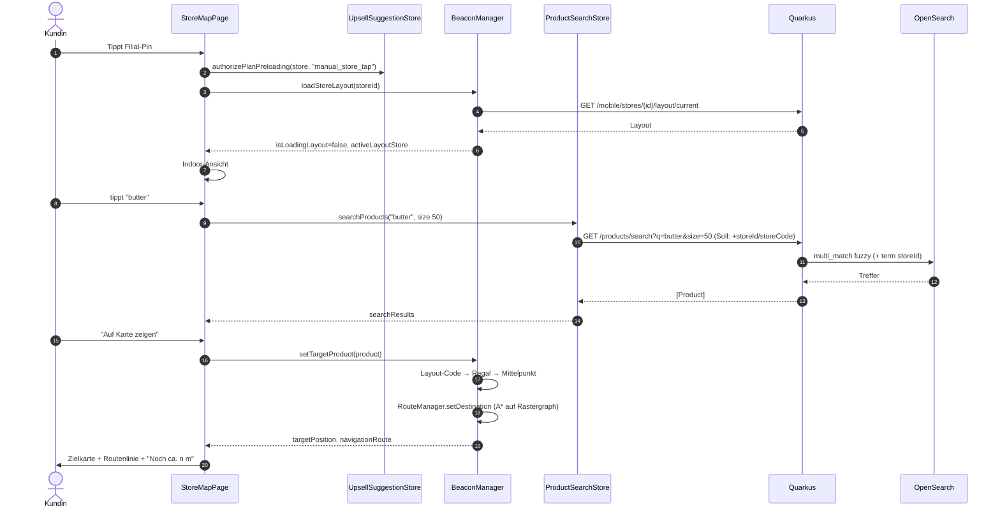

### 6.3 Tour-Stopp erledigt → Upsell

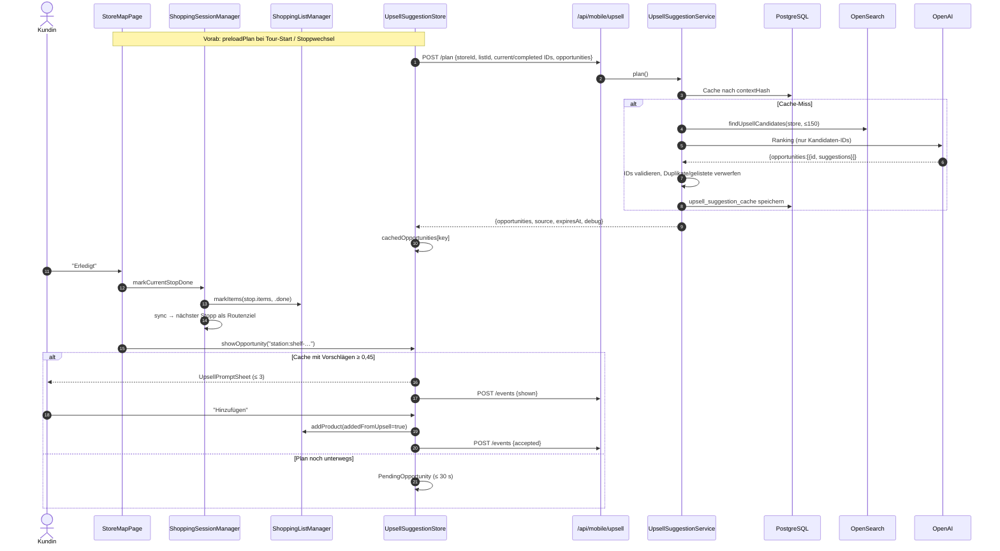

### 6.4 Rezept → Mapping → Liste

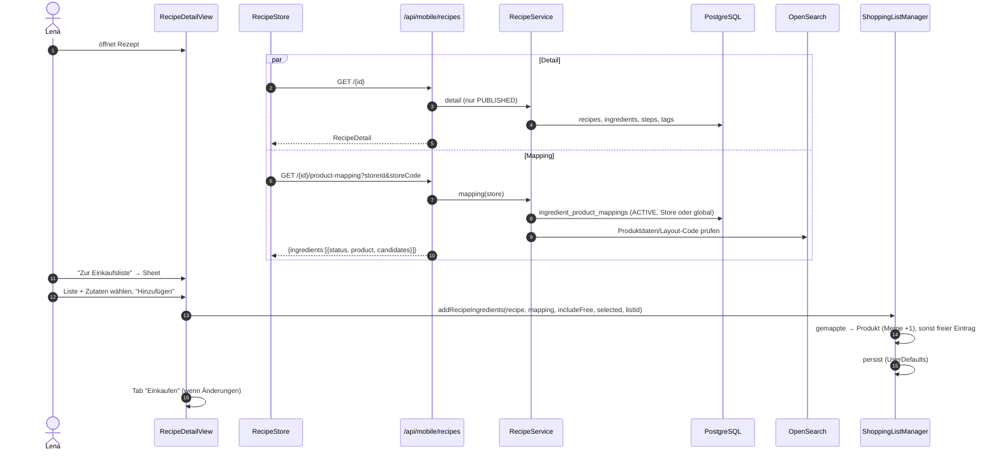

### 6.5 Liste teilen und importieren

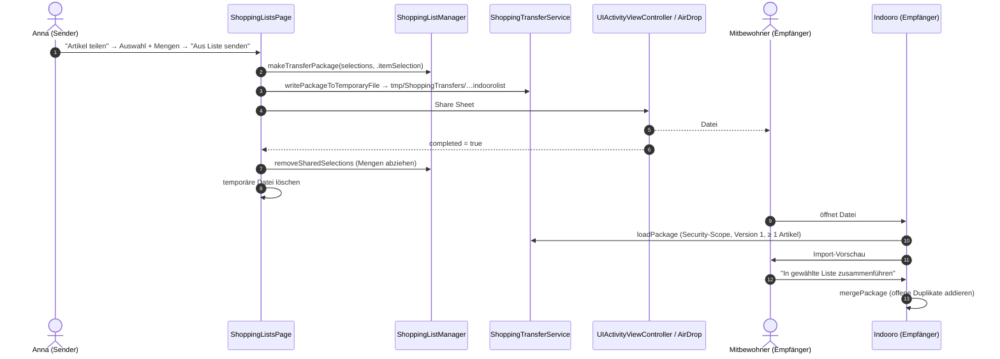

### 6.6 Admin veröffentlicht Layout → App nutzt es

```mermaid
sequenceDiagram
    autonumber
    actor FL as Filialleitung
    participant Ed as Layout-Editor (/admin/editor)
    participant KC as Keycloak
    participant API as /api/stores/{id}/layout
    participant Svc as StoreLayoutAdminService
    participant PG as PostgreSQL
    participant App as iOS-App
    FL->>Ed: öffnet Editor
    Ed->>KC: OIDC Code Flow (Session-Cookie)
    Ed->>API: GET /editor-context
    API->>Svc: Scope-Prüfung (store-manager → eigene Filiale)
    FL->>Ed: Regale, Beacons (UUID/Major/Minor) platzieren, speichern
    Ed->>API: POST /versions {layout, changeNote, activate}
    Svc->>PG: INSERT layout_versions (version_no+1; ACTIVE wenn activate=true oder noch keine aktive Version) + audit_logs CREATE/ACTIVATE
    FL->>Ed: "Aktivieren" (für eine bestehende Version)
    Ed->>API: POST /versions/{layoutId}/activate
    Svc->>PG: alte ACTIVE → ARCHIVED, neue → ACTIVE (Unique-Index) + audit_logs
    App->>API: GET /api/mobile/stores/{id}/layout/current (nächster Ladevorgang)
    API-->>App: neues Layout (fallback=false)
```

---

## 7. Nicht-funktionale Anforderungen

| ID | Kategorie | Anforderung | Messung / Quelle |
| --- | --- | --- | --- |
| NFR-01 | Genauigkeit | ca. 1 m praktische Positionsgenauigkeit bei ≥ 3 Beacons | mobile-positioning-navigation |
| NFR-02 | Stabilität | Blue Dot springt im Stand ≤ 2 m | mobile-positioning-navigation |
| NFR-03 | Aktualität | Anzeige-Update ≤ 1 Hz, Tick 0,35 s | Pipeline-Parameter |
| NFR-04 | Suchlatenz | dokumentiertes Latenzziel der Produktsuche | product-catalog-search |
| NFR-05 | Performance | Tour-Snapshot ≤ 16 ms (25 Stopps, 40×30 m) | Change C |
| NFR-06 | Upsell-Latenz | Plan ≤ 25 s Client-Timeout, OpenAI ≤ 12 s | application.properties |
| NFR-07 | Datenschutz | keine Kunden-ID, keine Positionen, keine Geräte-ID im Backend | mehrere Specs |
| NFR-08 | Sicherheit | ATS, keine Secrets im Client, Admin-Routen rollenbasiert | Changes C/D |
| NFR-09 | Verfügbarkeit | Karte bleibt bei Netzverlust nutzbar | mobile-positioning-navigation |
| NFR-10 | Barrierefreiheit | VoiceOver-Labels, Dynamic Type bis AX-XL | Change C |
| NFR-11 | Sprache | Deutsch mit korrekten Umlauten | ios-recipe-experience, Change C |
| NFR-12 | Wartbarkeit | Swift 6 strict concurrency, modulare Pakete, Tests in CI | Change C |
| NFR-13 | Kosten | Upsell-Rate-Limit, Cache, Token-Debug | Upsell-Changes, Change C |

---

## 8. Offene fachliche Punkte

| ID | Frage | Verantwortlich | Bezug |
| --- | --- | --- | --- |
| OP-01 | Welche Richtung beschreibt `accessAngle` (0° = Norden/oben?) und soll der Editor ein Bedienelement bekommen? | Team Admin/Editor | FR-102 |
| OP-02 | Sind Layouts nordausgerichtet? Die App nimmt „−y = Norden“ an; sonst ist ein Filial-Nordwinkel nötig. | Team iOS | mobile-positioning-navigation |
| OP-03 | Soll die App-Store-Marke „SPAR“ im UI erscheinen dürfen? (Change B ersetzt durch „Filialen“) | Auftraggeber | FR-027 |
| OP-04 | Soll die Layout-Versionswahl (heute toter Code) für Kund:innen sichtbar sein oder nur im Debug-Menü? | Team iOS | AUD-18 |
| OP-05 | Welche manuellen Abnahmetests der Rezept-/Upsell-Changes gelten als bestanden? | Team | AUD-04 |
