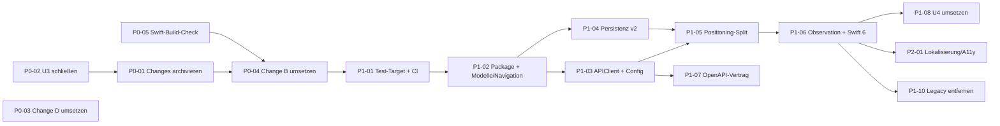

# Indooro – Migrations- und Modernisierungs-Roadmap

| Feld | Wert |
| --- | --- |
| Stand | 2026-09-17 |
| Grundlage | [AUDIT](AUDIT.md) (Befunde `AUD-xx`, Vertragsfehler `Cx`), [FSD](FSD.md), [TSD](TSD.md), [Blueprint](ARCHITECTURE_BLUEPRINT.md) |
| Ausführung | Jede Zeile wird über den genannten OpenSpec-Change umgesetzt; Detail-Tasks stehen in dessen `tasks.md`. |

**Change-Kürzel**

| Kürzel | OpenSpec-Change | Status |
| --- | --- | --- |
| A | `2026-09-17-integrate-ios-client-specs` | archiviert ✅ |
| B | `fix-ios-contract-and-spec-drift` | Proposal, 1/43 Tasks |
| C | `modernize-ios-client-architecture` | Proposal, 0/64 Tasks |
| D | `protect-legacy-write-endpoints` | Proposal, 0/22 Tasks |
| U1 | `add-upsell-cross-sell-suggestions` | archiviert 2026-09-21 ✅ |
| U2 | `harden-upsell-prefilter-quality` | archiviert 2026-09-21 ✅ |
| U3 | `improve-upsell-candidate-ranking` | überholt, archiviert ohne Spec-Übernahme (`--skip-specs`) ✅ |
| U4 | `stabilize-upsell-quality-and-request-lifecycle` | 0/135 Tasks |
| R1 | `add-recipe-shopping-list-integration` | archiviert 2026-09-21 ✅ |
| R2 | `improve-recipe-product-mapping-selection` | archiviert 2026-09-21 ✅ |
| X1 | `align-openspec-audit-findings` | repariert (RENAMED) und archiviert 2026-09-21 ✅ |
| X2 | `split-admin-platform-pages` | archiviert 2026-09-21 ✅ |
| X3 | `redesign-admin-platform-layout-editor` | archiviert 2026-09-21 ✅ |
| X4 | `add-backend-jacoco-coverage-reporting` | archiviert 2026-09-21 ✅ |

**Priorität:** **P0** = vor der nächsten Demo/externen Nutzung (Sicherheit, Datenverlust, kaputte Features, SSoT-Lücken) · **P1** = nächster Sprint (Wartbarkeit, Qualität, Architektur-Fundament) · **P2** = danach (Ausbau, Politur).
**Aufwand:** S ≤ ½ Tag · M ≤ 2 Tage · L ≤ 1 Woche · XL > 1 Woche.

---

## Abhängigkeitsgraph

---

## P0 – Sofort

| ID | Aufgabe | Befund | Change / Tasks | Aufwand | Abnahmekriterium |
| --- | --- | --- | --- | --- | --- |
| P0-01 | ✅ **Erledigt 2026-09-21.** **Abgeschlossene Changes archivieren**, damit `openspec/specs` vollständig ist. Reihenfolge: X4 → X2 → X3 → R1 (nach Bestätigung der 3 manuellen Tests) → R2 → U1 (nach manuellem Test 9.4) → U2 (nach 6.6/6.7) → X1 (nach Korrektur, siehe P0-06). Befehl je Change: `npx -y @fission-ai/openspec@1.3.1 archive <name> --yes`; danach TBD-Purposes ersetzen. | AUD-04 | – | M | `openspec/specs` enthält `recipe-catalog-shopping`, `mobile-upsell-suggestions`, `mobile-upsell-quality-gates`, `admin-recipe-product-mapping-selection`, `backend-test-coverage-reporting`; `validate --all --strict` grün |
| P0-02 | ✅ **Erledigt 2026-09-21** (archiviert mit `--skip-specs`). **U3 als überholt schließen**: in `proposal.md` „Superseded by harden-upsell-prefilter-quality (AI-first)“ vermerken, offene Tasks streichen, Change ohne Spec-Übernahme entfernen (`git rm -r openspec/changes/improve-upsell-candidate-ranking` nach Team-Entscheid; Historie bleibt in Git). | AUD-05 | U3 | S | Keine widersprüchlichen Ranking-Requirements mehr in aktiven Changes |
| P0-03 | **Backend-Schreibrouten absichern** (`POST /api/layout/current`, `/api/convert`, `/api/export`, Index-Routen), Prod-Secret ohne Default, CORS-Liste, 10-MB-Limit. | AUD-20–22, AUD-30 | D (alle Tasks) | M | httpYac-Rollenmatrix: anonym 401, store-manager 403, admin 2xx; iOS-Smoke gegen LeoCloud grün |
| P0-04 | **iOS-Vertragsfehler und Spec-Drift beheben**: Dismiss-Limit, Fake-Koordinaten, Adresse, Fallback-Flag, Low-Confidence-Darstellung, store-gefilterte Suche, verlustfreies Produkt-Decoding, HTTP-Status, Datumsformat, Layout-Cache, Rotation im Graph, Beschriftung „Passt gut dazu“. | C1–C6, C9, AUD-08–13 | B (Tasks 1–11) | L | Alle Szenarien der B-Deltas manuell bestätigt; Backend-Test `suppressMinutes=1440` grün |
| P0-05 | **Swift-Build-Check dokumentieren**: `xcodebuild … -scheme MCindooroApp … build` einmal ausführen und Ergebnis in `swift/indooro-EinkaeuferFinal/TESTING.md` festhalten (Baseline vor Umbau). | AUD-03 | B 11.3 | S | Build-Log mit Xcode-Version im Repo-Dokument |
| P0-06 | ✅ **Erledigt 2026-09-21.** **`align-openspec-audit-findings` reparieren**: Delta `catalog-maintenance-operations` nutzt `MODIFIED` mit Namen „…lookup and protected bulk import“, die permanente Spec heißt „…lookup and bulk import“ → `## RENAMED Requirements` (FROM/TO) ergänzen oder Namen angleichen, sonst scheitert das Archivieren. | AUD-34 | X1 | S | `archive align-openspec-audit-findings` läuft ohne Fehler |
| P0-07 | **Repository-Hygiene**: `swift/indooro-EinkaeuferFinal.zip` löschen, `xcuserdata/` in `.gitignore`, versionierte `UserInterfaceState.xcuserstate` entfernen. | AUD-02 | C 2.6, 14.2 | S | `git status` zeigt keine Xcode-User-Dateien mehr |

## P1 – Nächster Sprint

| ID | Aufgabe | Befund | Change / Tasks | Aufwand | Abnahmekriterium |
| --- | --- | --- | --- | --- | --- |
| P1-01 | **Test-Target + iOS-CI**: `IndooroKit`-Testtargets, Fixtures, `.github/workflows/ios.yaml`; Backend-CI auf JDK 21 mit Tests (einheitliche Java-Version, siehe [BP-ADR-02](../audit/MODERNIZATION_BLUEPRINT.md#7-architekturentscheidungen-dieses-blueprints)). | AUD-03, AUD-36 | C 1, 3, 13.4–13.5 | M | CI grün mit ≥ 1 Test je Suite; Backend-Tests laufen in CI |
| P1-02 | **Pure Module extrahieren** (`IndooroModels`, `IndooroNavigation`), Charakterisierungstests, Binary-Heap-A*, Graph-Snapshot, Distanzmatrix; `Pathfinder` löschen. | AUD-16, AUD-18 | C 4, 5 | L | Charakterisierungstests identisch; Performance-Test ≤ Budget |
| P1-03 | **`APIClient` + Build-Konfigurationen**: async/await, Retry, Timeouts, Fehlermapping; xcconfig mit `IndooroAPIBaseURL`; ATS ohne Arbitrary Loads. | C10, AUD-15, AUD-29 | C 2.1–2.3, 6 | L | Kein `URLSession.shared.dataTask` mehr; `MCindooroApp (Local)` spricht `localhost:8080` |
| P1-04 | **Persistenz v2** mit Migration, Backup, Quarantäne. | AUD-25 | C 8 | M | Migrationstest aus v1-Fixture grün; Korruptionstest grün |
| P1-05 | **`BeaconManager` zerlegen** in Radio, Heading, Motion, `PositioningEngine`, `StoreDetectionService`, `LayoutRepository`. | AUD-14, AUD-17 | C 9 | XL | Datei `BeaconManager.swift` gelöscht; Engine-Tests grün; Gerätetest mit Beacons ohne Regression |
| P1-06 | **Observation + Swift 6**: `@Observable`-Modelle, `AppEnvironment`, `AppRouter`, `Tab`-API, `SWIFT_VERSION 6`, strict concurrency, `os.Logger`. | AUD-15, AUD-19 | C 10, 11 | L | 0 Concurrency-Diagnosen; keine `print`-Aufrufe in Release |
| P1-07 | **OpenAPI-Vertrag**: Schema-Export, `@Schema`, `api/openapi/indooro-mobile.yaml`, Swift-Typgenerierung, CI-Diff. | C1–C5 (Prävention) | C 7 | M | CI schlägt bei DTO-Änderung ohne YAML-Update fehl |
| P1-08 | **Upsell-Lebenszyklus (U4)** im neuen `UpsellModel` umsetzen: Varianten-Filter, Diversität, idempotente Opportunities, kanonischer Zustand, `no_candidates`-Behandlung, begrenzter Retry. | – | U4 (135 Tasks) | XL | U4-Verifikation 13.x/15.x erfüllt |
| P1-09 | **Rate Limiting** für Upsell-Routen, iOS behandelt 429. | AUD-31 | C 13.1–13.3 | M | 21. Plan-Request in 10 min → 429, kein OpenAI-Aufruf |
| P1-10 | **Legacy-Swift-Bäume entfernen**, `config.yaml`/README aktualisieren. | AUD-01, AUD-02 | C 14 | S | Nur ein `.xcodeproj` unter `swift/` |
| P1-11 | **App-Ressourcen bereinigen**: Asset-Katalog mit Icon, Präsentation/README/Layouts aus dem Target. | AUD-23 | C 2.4–2.5 | S | Bundle-Inhaltsprüfung ohne Treffer |
| P1-12 | **Index-Erstellung explizit fehlschlagen lassen**, wenn der Index existiert (Spec-Drift). | AUD-35 | D 2.8 | S | `POST /api/admin/index/create` zweimal → zweiter Aufruf 409 |

## P2 – Ausbau und Politur

| ID | Aufgabe | Befund | Change | Aufwand | Abnahmekriterium |
| --- | --- | --- | --- | --- | --- |
| P2-01 | **Lokalisierung & Barrierefreiheit**: String Catalog, Umlaute in Fehlertexten, VoiceOver für Karte/Tour, Dynamic Type. | AUD-27, AUD-28 | C 12 | M | VoiceOver liest Restdistanz und nächsten Stopp |
| P2-02 | **Dark Mode**: Palette definieren, `preferredColorScheme(.light)` entfernen. | AUD-27 | neuer Change `add-ios-dark-mode` | M | Alle Tabs in Dark Mode lesbar (Kontrast ≥ 4.5:1) |
| P2-03 | **Serverseitiger Kategorie-Filter**: `GET /api/products?categoryCode=` statt 500er-Liste + Client-Filter; Kategorien aus `/api/categories` statt hartkodiert. | AUD-24 | neuer Change `add-product-category-filter` (ändert `product-catalog-search` › „Category-code product lookup is not assumed“) | M | Kategorie-Browse lädt ≤ 100 Produkte und nutzt Backend-Kategorien |
| P2-04 | **Offline-Cache für Filialen und Rezepte** (letzte Antworten, Anzeige „Stand vom …“). | AUD-26 | neuer Change `add-ios-offline-catalog-cache` | M | Flugmodus zeigt zuletzt geladene Filialen/Rezepte |
| P2-05 | **Layout-Versionswahl** entscheiden (OP-04): im Diagnose-Menü reaktivieren oder endgültig entfernen. | AUD-18, C8 | Teil von C 10.5 | S | Entscheidung im Spec dokumentiert |
| P2-06 | **`accessAngle` definieren**: Semantik (Grad, Nullrichtung, Drehsinn) in `store-layout-management`, Editor-Bedienelement, konsistenter Default (heute 90 neu / 0 Export), App nutzt Zugangsseite als Routenziel. | AUD-12, OP-01 | neuer Change `define-shelf-access-side` | L | Route endet auf der Gangseite des Regals |
| P2-07 | **Admin-Frontend-Technologie** entscheiden (ADR-012). | – | neuer Change nach Entscheidung | S (Entscheid) / XL (Migration) | ADR-Status „akzeptiert“ |
| P2-08 | **Nord-Ausrichtung der Filiale** (OP-02): optionaler `northOffsetDegrees` im Layout, Heading-Korrektur in der App. | – | neuer Change `add-layout-north-offset` | M | Heading-Pfeil stimmt in gedrehten Filialen |
| P2-09 | **App Attest** evaluieren, falls Rate Limiting nicht reicht. | AUD-31 | ADR-007 | L | Entscheidungsnotiz |
| P2-10 | **Rezept-Paginierung** (heute nur Seite 0/20) mit Nachladen beim Scrollen. | – | neuer Change `add-recipe-pagination` | S | Mehr als 20 Rezepte erreichbar |
| P2-11 | **Stopp-Reihenfolge 2-opt** (Feature-Flag) nach Messung. | AUD-16 | C Decision 8 | S | Kürzere Tourlänge ohne Laufzeitüberschreitung |
| P2-12 | **Java-Versionen vereinheitlichen** oder bewusst anheben (17/21/25). | AUD-36 | neuer Change `align-java-runtime` | S | Compile, CI und Image nutzen dieselbe Hauptversion |
| P2-13 | **Recipe-Bild-URLs entkoppeln**: relative Pfade in DB, Basis-URL im Backend/Client auflösen (heute LeoCloud-absolute URLs in V9). | – | neuer Change `relative-recipe-image-urls` | S | Lokale Umgebung zeigt Bilder vom lokalen Backend |

---

## Swift-Modernisierungs-Audit (Kurzfassung)

| Thema | Befund | Roadmap |
| --- | --- | --- |
| Combine vs. async/await | Combine nur implizit über `@Published`; Netzwerk vollständig Completion-Handler | P1-03, P1-06 |
| NavigationStack vs. NavigationLink | bereits `NavigationStack`; einzelne `NavigationLink(destination:)` → `navigationDestination(for:)` | P1-06 |
| Swift 6 / Strict Concurrency | Swift 5, minimal checking; 4 von 6 Stores ohne Actor-Isolation; 38 `DispatchQueue.main.async` | P1-06 |
| Observation | 7 `ObservableObject`-Klassen | P1-06 |
| Main-Thread-Last | Motion 20 Hz + Tick 0,35 s + Graph-Neuaufbau je Positionsupdate | P1-02, P1-05 |
| Persistenz | ein `UserDefaults`-Blob, stiller Datenverlust bei Decode-Fehler | P1-04 |
| Tests/CI | keine | P1-01 |
| Konfiguration/ATS | Base-URL 4× hartkodiert, `NSAllowsArbitraryLoads` | P1-03 |
| Dead Code | `Pathfinder`, 4 Views, Such-Duplikat, 2 Modelle | P0-04, P1-02, P2-05 |

Vollständige Tabelle: [TSD §2.4](TSD.md#24-modernisierungs-audit-swift-patterns).

---

## Definition of Done (für jede Roadmap-Zeile)

1. OpenSpec-Change validiert: `npx -y @fission-ai/openspec@1.3.1 validate <change> --strict`.
2. Alle Tasks des Changes abgehakt; manuelle Tests mit Datum und Gerät im Task-Text vermerkt.
3. Backend: `./mvnw verify` grün; iOS: `xcodebuild … test` grün (ab P1-01).
4. `docs/specs/*` bei geänderten Verträgen aktualisiert.
5. Change archiviert, generierte Purpose-Platzhalter ersetzt, `validate --all --strict` grün.
