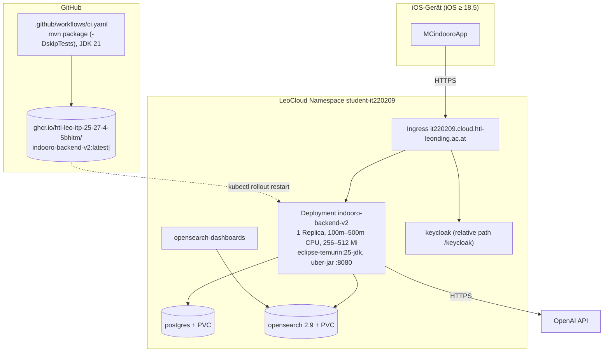
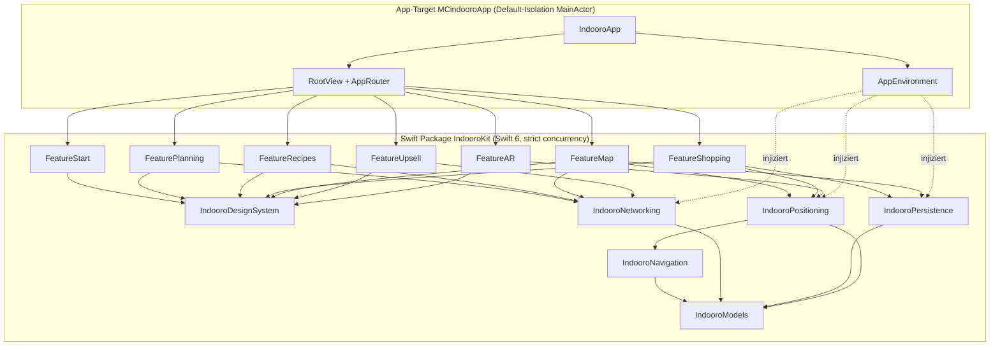
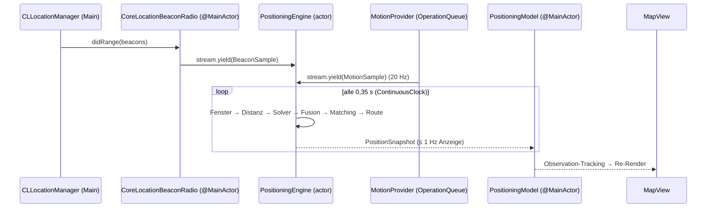
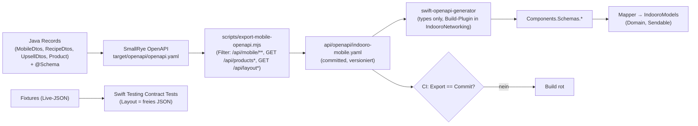

# Indooro – Technical Specification Document (TSD)

| Feld | Wert |
| --- | --- |
| Version | 2.0 |
| Stand | 2026-09-17, Git `63a42d4` |
| Scope | Ist-Architektur (verifiziert) + verbindliche Zielvorgaben aus den OpenSpec-Changes `fix-ios-contract-and-spec-drift`, `modernize-ios-client-architecture`, `protect-legacy-write-endpoints` |
| Normative Quelle | `openspec/specs/**`; Zielarchitektur und ADRs: [ARCHITECTURE_BLUEPRINT.md](ARCHITECTURE_BLUEPRINT.md) |

Kennzeichnung: **[IST]** = heute im Code, **[SOLL]** = durch offenen Change festgelegt.

---

## 1. Laufzeit- und Deployment-Architektur



**Java-Versionen [IST]:** Compile `maven.compiler.release=17`, CI JDK 21, Runtime-Image JDK 25 (Befund AUD-36). **[SOLL]** JDK 21 LTS an allen drei Stellen (`maven.compiler.release=21`, CI JDK 21 mit `mvn -B verify`, Runtime-Image `eclipse-temurin:21-jre`) gemäß BP-ADR-02 in `docs/audit/MODERNIZATION_BLUEPRINT.md`.

**Umgebungsvariablen Backend (k8s/backend.yaml):** `DB_HOST`, `DB_PORT`, `DB_NAME`, `DB_USERNAME`, `DB_PASSWORD`, `OPENSEARCH_PORT`, `OPENAI_API_KEY` (Secret), `OPENAI_UPSELL_ENABLED`, `OPENAI_UPSELL_MODEL`, `OPENAI_UPSELL_REASONING_EFFORT`, `OPENAI_UPSELL_TIMEOUT_MS`, `UPSELL_MAX_CANDIDATES`, `QUARKUS_OIDC_AUTH_SERVER_URL`, `QUARKUS_OIDC_CLIENT_ID`, `QUARKUS_OIDC_CREDENTIALS_SECRET` (Secret), `QUARKUS_OIDC_APPLICATION_TYPE`, `QUARKUS_HTTP_PROXY_PROXY_ADDRESS_FORWARDING`, `QUARKUS_OIDC_TOKEN_STATE_MANAGER_STRATEGY`, `QUARKUS_OIDC_TOKEN_STATE_MANAGER_SPLIT_TOKENS`.

**Konfiguration (application.properties) – Upsell:** `upsell.enabled=true`, `upsell.max-candidates=150`, `upsell.max-suggestions=3`, `upsell.min-confidence=0.45`, `upsell.cache-ttl-minutes=60`, `openai.upsell.enabled=false` (Default, in k8s überschrieben), `openai.upsell.model=gpt-5.4-mini`, `openai.upsell.reasoning-effort=none`, `openai.upsell.timeout-ms=12000`.

---

## 2. Swift-Anwendungsarchitektur

### 2.1 Ist-Architektur [IST]

```mermaid
classDiagram
    direction LR
    class indooroAppApp {
        +body:
        Scene
    }
    class ContentView {
        @StateObject beaconManager
        @StateObject shoppingListManager
        @StateObject shoppingSessionManager
        @StateObject mapProductSearch
        @StateObject productsSearch
        @StateObject recipeStore
        @StateObject upsellStore
        selectedSection: AppSection
        targetProduct: Product?
    }
    class BeaconManager {
        <<ObservableObject, NSObject>>
        CBCentralManagerDelegate
        CLLocationManagerDelegate
        +beacons, shelves, gridWidth, gridHeight
        +rawUserPosition, userPosition, userHeadingRadians
        +navigationRoute, targetPosition
        +isLowConfidence, navigationStatusMessage
        +mobileStores, detectedStore, activeLayoutStore
        +layoutRevision, activeLayoutDescription
        +setTargetProduct(), loadStoreLayout(), setTrackingMode()
        +setManualUserPosition(), refreshMobileStores()
    }
    class ShoppingListManager {
        <<ObservableObject>>
        +lists
        +selectedListID
        +revision
    }
    class ShoppingSessionManager {
        <<ObservableObject>>
        +activeListID
        +routeMode
        +snapshot
    }
    class ProductSearchStore {
        <<ObservableObject>>
        +searchResults
        +isSearching
    }
    class RecipeStore {
        <<@MainActor ObservableObject>>
        +recipes
        +selectedRecipe
        +mappingResponse
    }
    class UpsellSuggestionStore {
        <<@MainActor ObservableObject>>
        +activePrompt
        +isLoading
    }
    class NavigationPipeline {
        IndoorGraph
        BeaconPositionSolver
        PoseFusionService
        MapMatcher
        RouteManager
        NavigationStateMachine
        KalmanFilter per beacon
    }
    indooroAppApp --> ContentView
    ContentView --> BeaconManager
    ContentView --> ShoppingListManager
    ContentView --> ShoppingSessionManager
    ContentView --> ProductSearchStore
    ContentView --> RecipeStore
    ContentView --> UpsellSuggestionStore
    BeaconManager *-- NavigationPipeline
    ShoppingSessionManager ..> BeaconManager : sync(), setRouteTargetPosition()
    ShoppingSessionManager ..> ShoppingListManager : list(with:), markItems()
```

| Aspekt | Ist |
| --- | --- |
| UI | SwiftUI, `NavigationStack` in allen Tabs (keine veralteten `NavigationView`), `NavigationLink(destination:)` in der Rezeptliste, `UIViewRepresentable` für Zoom-ScrollView, `UIViewControllerRepresentable` für AR und Share Sheet |
| State | `ObservableObject`/`@Published` (Combine-Runtime), `@StateObject` in `ContentView`, `@ObservedObject` in Kindern |
| Isolation | `RecipeStore`, `UpsellSuggestionStore`: `@MainActor`; übrige: implizit Main-Thread über `DispatchQueue.main.async` |
| Threads | CoreBluetooth-Queue `nil` (Main), CoreLocation-Delegate Main, CoreMotion `.main` (20 Hz), `Timer` 0,35 s auf Main-RunLoop, URLSession-Callbacks auf Hintergrund → Main-Hop |
| Netzwerk | `URLSession.shared.dataTask` + Completion-Handler, Request-ID/Generation gegen Stale-Responses |
| Persistenz | `UserDefaults` (Details §7) |
| Abhängigkeiten | keine Swift Packages |
| Tests | keine |

### 2.2 Ziel-Architektur [SOLL] (Change `modernize-ios-client-architecture`)



Regeln:

1. `IndooroModels` und `IndooroNavigation` importieren keine UI- oder Radio-Frameworks (macOS-testbar).
2. Feature-Targets importieren sich nicht gegenseitig; tab-übergreifende Aktionen laufen über `AppRouter`.
3. Alle Modelle sind `@Observable @MainActor`, alle Services `actor` oder `Sendable`-Structs.
4. Dependency Injection über `AppEnvironment` (`.live`, `.preview`, `.test`), keine Singletons (`URLSession.shared`, `UserDefaults.standard` nur im Live-Adapter).

**Objektmodell Ziel:**

| Modell (`@Observable @MainActor`) | Verantwortung | Ersetzt |
| --- | --- | --- |
| `AppRouter` | Tab-Auswahl, Produkt fokussieren, Tour starten/stoppen, Datei-Import | Closures in `ContentView` |
| `StoreContextModel` | Filialliste, erkannte/aktive Filiale, Auswahlstatus | Teile von `BeaconManager` |
| `LayoutModel` | aktives Layout, Beschreibung, Fallback-Art, Revision, Versionsauswahl | Teile von `BeaconManager` |
| `PositioningModel` | angezeigte Position, Heading, vertrauenswürdig, Status, Route, Tracking-Modus | Teile von `BeaconManager` |
| `ShoppingListModel` | Listen-CRUD, Merge, Transfer | `ShoppingListManager` |
| `ShoppingSessionModel` | Tour, Snapshot, Routenmodus | `ShoppingSessionManager` |
| `ProductSearchModel` ×2 | Suche, Kategorie-Browse, Fehlerzustand | `ProductSearchStore` |
| `RecipeModel` | Liste, Suche, Detail, Mapping | `RecipeStore` |
| `UpsellModel` | Plan-Cache, Pending, Prompt, Events | `UpsellSuggestionStore` |

| Service | Typ | Verantwortung |
| --- | --- | --- |
| `APIClient` | actor | HTTP, Retry, Timeout, Fehler-Mapping, Logging |
| `CoreLocationBeaconRadio` | `@MainActor` class | CL/CB-Delegates → `AsyncStream<BeaconSample>` |
| `HeadingProvider` / `MotionProvider` | `@MainActor` / Queue-basiert | Kompass, DeviceMotion |
| `PositioningEngine` | actor | Tick, Filter, Solver, Fusion, Matching, Route → `AsyncStream<PositionSnapshot>` |
| `StoreDetectionService` | actor | Identitäts-Refresh, Lookup-Dedup, Cooldown |
| `LayoutRepository` | actor | Server → Cache → History → Bundle |
| `ShoppingListRepository` | actor | Datei-Persistenz v2, Migration |
| `LayoutCacheStore` | actor | `Application Support/LayoutCache` |

### 2.3 Concurrency-Konzept [SOLL]



Build-Settings App-Target: `SWIFT_VERSION = 6.0`, `SWIFT_STRICT_CONCURRENCY = complete`, `SWIFT_DEFAULT_ACTOR_ISOLATION = MainActor`. Apple-Frameworks ohne vollständige Annotationen: `@preconcurrency import CoreBluetooth`.

### 2.4 Modernisierungs-Audit (Swift-Patterns)

| Pattern | Ist | Soll | Change |
| --- | --- | --- | --- |
| `ObservableObject` + `@Published` | 7 Klassen | `@Observable` | C |
| Combine | nur als Runtime für `@Published`; `import Combine` in 3 Dateien ohne Publisher-Pipelines | entfällt | C |
| Completion-Handler-Netzwerk | 100 % | `async/await` über `APIClient` | C |
| `DispatchQueue.main.async` | 38 Stellen | Actor-Isolation | C |
| `NavigationView` | 0 | – | – |
| `NavigationStack` | 7 | beibehalten; Rezepte → `navigationDestination(for:)` | C |
| `TabView` + `.tabItem` | ja | `Tab(_:systemImage:value:)` (iOS 18) | C |
| `onChange(of:initial:)` (iOS 17) | ja | beibehalten | – |
| SwiftUI `Map(position:)` / `Annotation` (iOS 17) | ja | beibehalten | – |
| `PreviewProvider` | 1 | `#Preview` | C |
| `Timer.scheduledTimer` | 1 | `ContinuousClock`-Loop im Actor | C |
| `print` | 26 | `os.Logger` | C |
| Swift-6-Diagnosen | nicht geprüft | 0 | C |

---

## 3. Networking Engine

### 3.1 Ist [IST]

| Call-Site | Methode | Timeout | Statusprüfung | Stale-Schutz | Fehler-UI |
| --- | --- | --- | --- | --- | --- |
| `BeaconManager.performRequest` (Stores, Layouts, History) | GET | Default 60 s | ja | Generation | Beschreibungstext/Status |
| `BeaconManager.handleDetectedStoreBeacon` | GET | 60 s | ja (404 speziell) | pending-Key | nein |
| `BeaconManager.refreshStoreDetectionBeaconsIfNeeded` | GET | 60 s | ja | Flag | nein |
| `ProductSearchStore` | GET | 60 s | **nein** | Request-ID | **nein** |
| `RecipeStore` | GET | 60 s | **nein** | Request-ID | ja (Text) |
| `UpsellSuggestionStore.preloadPlan` | POST | 25 s | ja | Request-ID + Signatur | nein (Event `failed`) |
| `UpsellSuggestionStore.sendBestEffort` | POST | 3 s | ignoriert | – | nein |

### 3.2 Soll [SOLL]

```swift
public struct APIEnvironment: Sendable {
    public let baseURL: URL                      // Info.plist "IndooroAPIBaseURL"
    public static func current(bundle: Bundle = .main) throws -> APIEnvironment
}

public enum HTTPMethod: String, Sendable { case get = "GET", post = "POST" }

public struct RetryPolicy: Sendable {
    public let maxRetries: Int                   // idempotentRead = 2, none = 0
    public let baseDelay: Duration               // 0.5 s, exponentiell (×2)
    public let maxJitter: Duration               // 250 ms
    public let retryableStatus: Set<Int>         // [502, 503, 504]
    public let retryableURLErrors: Set<URLError.Code> // [.timedOut, .networkConnectionLost, .cannotConnectToHost]
    public static let idempotentRead: RetryPolicy
    public static let none: RetryPolicy
}

public protocol APIClientProtocol: Sendable {
    func send<E: Endpoint>(_ endpoint: E) async throws(APIError) -> E.Response
    func fire<E: Endpoint>(_ endpoint: E) async
}
```

**Endpunkt-Katalog [SOLL]:**

| Endpoint-Typ | Methode + Pfad | Query/Body | Response | Timeout | Retry |
| --- | --- | --- | --- | --- | --- |
| `MobileStoresEndpoint` | GET `/mobile/stores` | – | `[MobileStoreSummary]` | 15 s | read |
| `BeaconIdentitiesEndpoint` | GET `/mobile/stores/beacon-identities` | – | `StoreDetectionBeaconCatalog` | 15 s | read |
| `StoreByBeaconEndpoint` | GET `/mobile/stores/by-beacon` | `uuid`, `major`, `minor` | `StoreByBeaconResponse` | 15 s | read (404 ohne Retry) |
| `StoreLayoutEndpoint` | GET `/mobile/stores/{id}/layout/current` | – | `MobileLayoutResponse` | 20 s | read |
| `DefaultLayoutEndpoint` | GET `/layout/current` | – | `LayoutData` | 20 s | read |
| `LayoutHistoryEndpoint` | GET `/layout/history` | `limit` | `[LayoutVersionSummary]` | 15 s | read |
| `LayoutVersionEndpoint` | GET `/layout/versions/{id}` | – | `LayoutData` | 20 s | read |
| `ProductSearchEndpoint` | GET `/products/search` | `q`, `size`, `storeId?`, `storeCode?` | `[Product]` (lossy) | 15 s | read |
| `ProductListEndpoint` | GET `/products` | `size` | `[Product]` (lossy) | 15 s | read |
| `RecipeListEndpoint` | GET `/mobile/recipes` | `page`, `size`, `tag?` | `PageResponse<RecipeSummary>` | 15 s | read |
| `RecipeSearchEndpoint` | GET `/mobile/recipes/search` | `q`, `page`, `size` | `PageResponse<RecipeSummary>` | 15 s | read |
| `RecipeDetailEndpoint` | GET `/mobile/recipes/{id}` | – | `RecipeDetail` | 15 s | read |
| `RecipeMappingEndpoint` | GET `/mobile/recipes/{id}/product-mapping` | `storeId?`, `storeCode?` | `RecipeProductMappingResponse` | 15 s | read |
| `UpsellPlanEndpoint` | POST `/mobile/upsell/plan` | `UpsellPlanRequest` | `UpsellPlanResponse` | 25 s | none |
| `UpsellEventEndpoint` | POST `/mobile/upsell/events` | `UpsellEventRequest` | leer | 3 s | none (fire) |
| `UpsellDismissEndpoint` | POST `/mobile/upsell/dismiss` | `UpsellDismissRequest` | leer | 3 s | none (fire) |

**Token-Refresh:** Die Kunden-API ist anonym; es gibt keinen Token. `APIClient` besitzt einen optionalen `AuthorizationProvider`-Hook (`func authorize(_ request: inout URLRequest) async throws`), der in allen Builds `nil` ist. Sollte eine authentifizierte Funktion eingeführt werden, erfolgt Refresh dort mit Single-Flight-Actor (ein laufender Refresh, wartende Requests hängen sich an) und einmaliger Wiederholung nach 401.

**Fehlermapping auf UI (deutsch):**

| `APIError` | Text |
| --- | --- |
| `.offline` | „Keine Internetverbindung.“ |
| `.transport(.timedOut)` | „Der Server antwortet nicht rechtzeitig.“ |
| `.http(404, m)` | `m ?? "Nicht gefunden."` |
| `.http(429, _)` | „Zu viele Anfragen – bitte kurz warten.“ |
| `.http(5xx, _)` | „Der Server antwortete mit Status <code>.“ |
| `.decoding` | „Die Antwort des Servers konnte nicht gelesen werden.“ |
| `.cancelled` | (keine Anzeige) |

---

## 4. Security-Architektur

| Thema | Ist | Soll / Entscheidung | Referenz |
| --- | --- | --- | --- |
| Transport | HTTPS zu LeoCloud, aber `NSAllowsArbitraryLoads = true` | ATS ohne Ausnahmen; `localhost`-Ausnahme nur `Debug-Local` | Change C |
| Certificate Pinning | nein | **bewusst nein** (Zertifikatsrotation der Schulinfrastruktur, Aussperr-Risiko) | Blueprint ADR-006 |
| Keychain | nicht genutzt (keine Secrets) | nicht nötig; künftige Geräte-Secrets nur mit `kSecAttrAccessibleAfterFirstUnlockThisDeviceOnly` | Change C |
| CryptoKit | nicht genutzt | Kein Bedarf: keine lokale Verschlüsselung sensibler Daten (Listen enthalten keine personenbezogenen Daten); Data Protection `NSFileProtectionCompleteUntilFirstUserAuthentication` (iOS-Default) für `Application Support` | Blueprint ADR-006 |
| App Attest | nicht genutzt | P2-Evaluation für `/api/mobile/upsell/plan` (`DCAppAttestService` + serverseitige Assertion-Prüfung) | Blueprint ADR-007 |
| Secrets im Client | keine | CI-Secret-Scan | Change C |
| OpenAI-Key | nur Backend (k8s Secret) | unverändert | mobile-upsell-suggestions |
| Rate Limiting | keins | Token-Bucket je Client-IP: plan/suggestions 20/10 min, events/dismiss 120/10 min, HTTP 429 | Change C |
| Backend-Schreibrouten | teils anonym (AUD-20–22) | Rollenpflicht `admin` | Change D |
| CORS | `*` | Origin-Liste je Profil | Change D |
| OIDC-Secret | Default-Fallback | kein Default in `prod` | Change D |
| Datenschutz | keine Kunden-ID, keine Positionen im Backend, Upsell-`sessionId = null` | unverändert; Logs mit `privacy: .private` | NFR-07 |
| Logging | Bodies per `print` | `os.Logger`, Bodies nur DEBUG | Change C |
| Admin-Auth | Keycloak OIDC Hybrid, Rollen + DB-Scope | unverändert | admin-authentication, admin-role-access-control |

---

## 5. Datenmodelle

### 5.1 Swift-Domänen- und Wire-Modelle (vollständig)

| Swift-Typ | Felder (Typ) | Protokolle | Backend-Gegenstück |
| --- | --- | --- | --- |
| `Product` | `id: Int`, `name: String`, `price: Double`, `layoutCode: String` | Codable, Identifiable, Hashable | `at.htl.model.Product` (+ `storeId?`, `storeCode?`, nullable Felder) |
| `IndooroBeacon` | `id: String`, `name: String`, `beaconUUID: UUID?`, `beaconMajor/Minor: UInt16?`, `rssi: Int`, `distance: Double`, `lastSeenAt: TimeInterval?`, `measurementQuality: Double`, `txPower: Double?`, `positionX/Y: Double` | Identifiable | abgeleitet aus Layout-Element `type=beacon` |
| `LayoutData` | `shopName`, `gridSize: GridSize`, `elements: [LayoutElement]`, `exportDate?`, `layoutId?` (flexibel String/Zahl), `savedAt?`, `recordType?` | Codable, Sendable | `layout_versions.layout_json`, OpenSearch `layouts` |
| `GridSize` | `width: Double`, `height: Double` (Meter) | Codable, Sendable | – |
| `LayoutElement` | `id: Int64`, `type: String`, `beaconId?`, `beaconUUID?`, `beaconMajor/Minor: Int?`, `x`, `y: Double`, `width?`, `height?`, `color?`, `label?`, `category?`, `meter: Int?`, `rotation: Double?`, `accessAngle: Double?`, `locked: Bool?`; berechnet `isBeacon`, `categoryBase`, `effectiveMeter`, `resolvedCategoryCode` | Codable, Identifiable, Sendable | Editor-Element |
| `LayoutVersionSummary` | `layoutId`, `shopName`, `savedAt?`, `exportDate?`, `elementCount?`; `displayName`, `detailText` | Codable, Identifiable, Hashable, Sendable | `LayoutService.LayoutHistoryEntry` |
| `LayoutSelectionMode` | `currentServer`, `version` | String-Enum | – |
| `MobileStoreSummary` | `id: UUID`, `storeCode`, `name`, `city`, `street?`, `zipCode?`, `country?`, `latitude?`, `longitude?`; **[SOLL]** `address?` | Decodable, Hashable, Identifiable, Sendable | `MobileDtos.MobileStoreSummary(id, storeCode, name, city, address, latitude, longitude)` |
| `MatchedBeaconSummary` | `beaconId: UUID`, `beaconCode`, `identityKey` | Decodable | `MobileDtos.MatchedBeaconSummary` |
| `StoreByBeaconResponse` | `store`, `matchedBeacon` | Decodable | `MobileDtos.StoreByBeaconResponse` |
| `MobileLayoutResponse` | `storeId?`, `layoutId?`, `layout`; **[SOLL]** `source?`, `fallback?` | Decodable | `MobileDtos.MobileLayoutResponse(storeId, layoutId, source, fallback, layout)` |
| `StoreDetectionBeaconCatalog` | `uuidStrings: [String]` (aus Array, `uuids`, `beacons`, `identities`) | Decodable | `BeaconIdentitiesResponse(uuids)` |
| `ShoppingListItemStatus` | `open`, `done`, `missing`, `skipped` | Codable | – |
| `ShoppingRouteMode` | `optimized`, `listOrder` | Codable | – |
| `ShoppingListItem` | `id: UUID`, `productID: Int?`, `name`, `price?`, `layoutCode?`, `quantity: Int`, `note?`, `sortOrder?`, `status`, `addedAt`, `updatedAt: Date`, `sourceRecipeId: UUID?`, `sourceRecipeName?`, `ingredientName?`, `ingredientQuantity?`, `ingredientUnit?`, `mappingConfidence: Double?`, `manuallyConfirmed: Bool?`, `addedFromUpsell: Bool` | Codable, Identifiable, Hashable | – (nur lokal) |
| `ShoppingList` | `id`, `name`, `items`, `createdAt`, `updatedAt`, `isArchived`; `openItemCount`, `completedItemCount` | Codable, Identifiable, Hashable | – |
| `ShoppingStop` | `id: String` (`shelf-<id>`), `shelfID: Int64?`, `title`, `mapPoint: CGPoint`, `items`, `orderSeed` | Identifiable, Hashable | – |
| `ShoppingRouteSnapshot` | `listID`, `listName`, `routeMode`, `orderedStops`, `unresolvedItems`, `completedItems`, `totalStopCount`, `totalProductCount` + berechnete Zähler/Progress | – | – |
| `ShoppingSessionBanner` | `listName`, `currentStopTitle`, `remainingStopCount`, `remainingProductCount`, `unresolvedProductCount` | – | – |
| `ShoppingTransferKind` | `fullList`, `itemSelection` | Codable | – |
| `ShoppingTransferItem` | `productID: Int`, `name`, `price: Double`, `layoutCode`, `quantity`, `note?`, `status` | Codable, Hashable | – |
| `ShoppingTransferPackage` | `id: UUID`, `version: Int (=1)`, `kind`, `sourceListID?`, `sourceListName`, `senderDisplayName?`, `note?`, `exportedAt: Date`, `items` | Codable, Identifiable | – (Dateiformat §7.2) |
| `ShoppingShareSelection` | `itemID: UUID`, `quantity: Int` | Identifiable, Hashable | – |
| `RecipeTag` | `id: UUID`, `code`, `name`, `kind?`, `status?` | Codable | `RecipeTagResponse` |
| `RecipeSummary` | `id`, `slug`, `title`, `summary?`, `imageUrl?`, `servings: Int`, `prep/cook/totalTimeMinutes?`, `status?`, `publishedAt: String?`, `mappedIngredientCount?`, `totalIngredientCount?`, `tags` | Codable | `RecipeSummaryResponse` (`publishedAt: Instant`, Zähler `int`) |
| `RecipeDetail` | Summary-Felder + `description?`, `imageAlt?`, `archivedAt?`, `createdAt?`, `updatedAt?`, `ingredients`, `steps` | Codable | `RecipeDetailResponse` |
| `RecipeIngredient` | `id`, `position`, `displayName`, `canonicalName?`, `quantity: Double?`, `quantityText?`, `unitCode?`, `unitDisplayName?`, `preparationNote?`, `optional: Bool` | Codable | `RecipeIngredientResponse` (`quantity: BigDecimal`) |
| `RecipeStep` | `position`, `instruction`, `durationMinutes?` (id = position) | Codable | `RecipeStepResponse` (+ `id: UUID`, ignoriert) |
| `RecipeProductMappingResponse` | `recipeId`, `storeId?`, `storeCode?`, `ingredients` | Codable | gleichnamig |
| `RecipeIngredientMappingStatus` | `ingredientId`, `ingredientName`, `status: RecipeMappingState`, `product?`, `candidates`, `confidence: Double?`, `manuallyConfirmed`, `reason?` | Codable | `IngredientMappingStatusResponse` (`status: String`, `confidence: BigDecimal`) |
| `RecipeMappingState` | `MAPPED`, `UNMAPPED`, `MULTIPLE_CANDIDATES`, `UNAVAILABLE_IN_STORE`, `PRODUCT_WITHOUT_LAYOUT` | Codable | Strings im Service |
| `MappedRecipeProduct` | `id: Int`, `name`, `price?`, `layoutCode?`, `storeId?`, `storeCode?`; `product: Product?` nur mit Preis und Layout-Code | Codable | `MappedRecipeProduct` |
| `RecipePageResponse<T>` | `content`, `page`, `size`, `totalElements` | Codable | `CommonDtos.PageResponse<T>` |
| `UpsellProductSummary` | `id`, `name`, `price?`, `layoutCode?`, `storeId?`, `storeCode?`, `brand?`, `category?`, `imageUrl?`, `hasLayoutPosition` | Decodable | gleichnamig |
| `UpsellSuggestion` | `product`, `reason`, `confidence: Double` | Decodable | gleichnamig |
| `UpsellPlanRequest` | `storeId?`, `storeCode?`, `shoppingListId?`, `currentListProductIds`, `completedProductIds`, `source`, `opportunities` | Encodable | gleichnamig (`opportunities` ≤ 80) |
| `UpsellOpportunityRequest` | `opportunityId` (≤ 100), `triggerProductIds` (≤ 20), `triggerProductNames` (≤ 20 × 120) | Encodable | gleichnamig |
| `UpsellPlanResponse` | `opportunities`, `source?`, `expiresAt: Date?`, `debug?` | Decodable | gleichnamig |
| `UpsellOpportunityResponse` | `opportunityId`, `triggerProductIds`, `suggestions` | Decodable | gleichnamig |
| `UpsellPlanDebug` | `requestId`, `model`, `responseSource`, `elapsedMs`, `openAiElapsedMs`, `inputTokens`, `outputTokens`, `totalTokens`, `cachedInputTokens`, `reasoningTokens`, `fallbackReason`, `opportunityCount`, `candidateCount` (alle optional) | Decodable | gleichnamig |
| `UpsellEventRequest` | `eventType` (≤ 40), `checkedProductId?`, `suggestedProductId?`, `storeId?`, `storeCode?`, `sessionId?`, `source?`, `metadataJson?` (≤ 4000) | Encodable | gleichnamig |
| `UpsellDismissRequest` | `checkedProductId`, `suggestedProductId?`, `storeId?`, `storeCode?`, `sessionId?`, `suppressMinutes?` | Encodable | gleichnamig (**Limit-Fehler C1**) |
| `UpsellPrompt` | `id`, `opportunityId`, `checkedProductId`, `checkedProductName`, `triggerProductIds`, `listID`, `store?`, `source`, `suggestions` | Identifiable, Hashable | – |
| `UpsellRequest`, `UpsellSuggestionResponse` | Einzel-Suggestion-API | Codable | **ungenutzt** (Change B entfernt) |
| `NavigationRoute` | `points: [SIMD2<Float>]`, `signature: String` (FNV-1a über mm-quantisierte Punkte) | Equatable | – |
| `TrackingMode` | `beacon`, `debugNoBeacons` | – | – |
| `StoreLayoutActivationSource` | `beacon`, `manual` | Sendable | – |
| `ManualCalibrationEvent` | `revision`, `mapPoint`, `timestamp` | Equatable | – |
| Navigation-Typen | `IndoorGraphNode(id, mapPoint, floor)`, `IndoorGraphEdge(id, from, to, polyline, type, cost)`, `IndoorEdgeType(corridor, door, stairs)`, `IndoorEdgeProjection`, `IndoorRoute(nodeIDs, edgeIDs, polyline, totalCost)`, `BeaconAnchorMeasurement`, `BeaconPositionEstimate`, `RawPoseSample`, `RadioFix`, `FusedPose`, `PoseSource`, `MapMatchedPose`, `RouteUpdateResult`, `NavigationMode/State/Event/Action` | – | – |
| AR-Typen | `ARMapAlignment`, `ARCalibrationSource(entranceAnchor, manualConfirmation, liveEstimate)`, `ARAlignmentSnapshot`, `ARPreviewWaypoint`, `ARRoutePreviewPlan`, `ARPresentationState(ready, blocked)`, `ARRouteRenderConfiguration`, `SampledRoutePoint`, `ARNavigationHUDModel` | – | – |

### 5.2 Layout-JSON-Schema (Vertrag Editor ⇄ App)

```json
{
  "shopName": "EUROSPAR Leonding/Hart",
  "gridSize": { "width": 30, "height": 20 },
  "exportDate": "2026-05-19T09:12:00Z",
  "layoutId": "c0a8…",
  "savedAt": "2026-05-19T09:12:00Z",
  "elements": [
    { "id": 1716100000001, "type": "shelf", "x": 2, "y": 3, "width": 4, "height": 1,
      "category": "520/1", "meter": 1, "label": "Molkerei", "color": "#DBEAFE",
      "rotation": 0, "accessAngle": 90, "locked": false },
    { "id": 1716100000002, "type": "beacon", "x": 0.5, "y": 0.5,
      "beaconId": "Beacon 1", "beaconUUID": "e2c56db5-dffb-48d2-b060-d0f5a71096e0",
      "beaconMajor": 1, "beaconMinor": 1, "identityKey": "e2c56db5dffb48d2b060d0f5a71096e0:1:1" },
    { "id": 1716100000003, "type": "entrance", "x": 14, "y": 19, "width": 2, "height": 1 }
  ]
}
```

Koordinatensystem: Ursprung oben links, x nach rechts, y nach unten, Einheit Meter. App-Annahme: −y zeigt nach Norden (offener Punkt OP-02). `rotation` in Grad um den Element-Mittelpunkt. `accessAngle` ist ohne definierte Semantik (OP-01).

### 5.3 PostgreSQL-Schema (Flyway V1–V11)

```mermaid
erDiagram
    regions ||--o{ stores : "region_id"
    stores ||--o{ beacon_assignments : "store_id"
    beacons ||--o{ beacon_assignments : "beacon_id"
    stores ||--o{ layout_versions : "store_id"
    regions |o--o{ user_access_assignments : "region_id"
    stores |o--o{ user_access_assignments : "store_id"
    recipes ||--o{ recipe_ingredients : "recipe_id (cascade)"
    recipes ||--o{ recipe_steps : "recipe_id (cascade)"
    recipes ||--o{ recipe_tag_assignments : "recipe_id"
    recipe_tags ||--o{ recipe_tag_assignments : "tag_id"
    units |o--o{ recipe_ingredients : "unit_code"
    recipe_ingredients |o--o{ ingredient_product_mappings : "recipe_ingredient_id"
    stores |o--o{ ingredient_product_mappings : "store_id"
    regions {
        uuid id PK
        varchar code UK
        varchar name
        text description
        varchar status
        timestamptz created_at
        timestamptz updated_at
    }
    stores {
        uuid id PK
        uuid region_id FK
        varchar store_code UK
        varchar name
        varchar street
        varchar zip_code
        varchar city
        varchar country
        text notes
        varchar status
        timestamptz archived_at
        float8 latitude
        float8 longitude
    }
    beacons {
        uuid id PK
        varchar beacon_code UK
        varchar identity_key UK
        varchar32 uuid
        int major
        int minor
        text notes
        varchar status
    }
    beacon_assignments {
        uuid id PK
        uuid beacon_id FK
        uuid store_id FK
        timestamptz assigned_at
        timestamptz released_at
        bool is_active
    }
    layout_versions {
        uuid id PK
        uuid store_id FK
        int version_no
        varchar layout_name
        jsonb layout_json
        varchar status
        text change_note
        varchar created_by_role
        varchar created_by_label
        timestamptz activated_at
    }
    audit_logs {
        uuid id PK
        varchar entity_type
        uuid entity_id
        varchar action
        varchar actor_role
        varchar actor_label
        text summary
        jsonb before_json
        jsonb after_json
    }
    error_logs {
        uuid id PK
        int status_code
        varchar method
        varchar path
        text message
        varchar error_type
        text stack_trace
    }
    user_access_assignments {
        uuid id PK
        varchar keycloak_subject
        varchar username
        varchar email
        varchar role
        uuid region_id FK
        uuid store_id FK
        varchar status
    }
    units {
        varchar code PK
        varchar display_name
        varchar unit_kind
        numeric gram_factor
        numeric milliliter_factor
        varchar status
    }
    recipes {
        uuid id PK
        varchar slug UK
        varchar title
        text summary
        text description
        text image_url
        varchar image_alt
        int servings
        int prep_time_minutes
        int cook_time_minutes
        int total_time_minutes
        varchar status
        timestamptz published_at
        timestamptz archived_at
    }
    recipe_ingredients {
        uuid id PK
        uuid recipe_id FK
        int position
        varchar display_name
        varchar canonical_name
        numeric quantity
        varchar quantity_text
        varchar unit_code FK
        text preparation_note
        bool is_optional
    }
    recipe_steps {
        uuid id PK
        uuid recipe_id FK
        int position
        text instruction
        int duration_minutes
    }
    recipe_tags {
        uuid id PK
        varchar code UK
        varchar name
        varchar kind
        varchar status
    }
    recipe_tag_assignments {
        uuid recipe_id PK
        uuid tag_id PK
    }
    ingredient_product_mappings {
        uuid id PK
        uuid recipe_ingredient_id FK
        varchar canonical_name
        uuid store_id FK
        varchar store_code
        int product_id
        varchar product_name_snapshot
        varchar layout_code_snapshot
        varchar mapping_type
        numeric confidence
        bool manually_confirmed
        varchar status
    }
    ingredient_synonyms {
        uuid id PK
        varchar canonical_name
        varchar synonym
        varchar locale
        varchar status
    }
    upsell_suggestion_cache {
        uuid id PK
        int checked_product_id
        uuid store_id
        varchar store_code
        varchar context_hash UK
        text response_json
        varchar source
        timestamptz expires_at
    }
    upsell_events {
        uuid id PK
        varchar event_type
        int checked_product_id
        int suggested_product_id
        uuid store_id
        varchar store_code
        varchar session_hash
        varchar source
        text metadata_json
    }
    upsell_dismissals {
        uuid id PK
        int checked_product_id
        int suggested_product_id
        uuid store_id
        varchar store_code
        varchar session_hash
        int dismissal_count
        timestamptz suppressed_until
    }
```



Alle Tabellen außer `units`/`recipe_tag_assignments` haben zusätzlich `created_at`, `updated_at` (`timestamptz NOT NULL`).

**Constraints und Indizes (Auszug, vollständig in den Migrationen):**

| Objekt | Definition |
| --- | --- |
| `ck_*_status` | `regions/stores/beacons`: `ACTIVE|ARCHIVED`; `layout_versions`: `DRAFT|ACTIVE|ARCHIVED`; `recipes`: `DRAFT|PUBLISHED|ARCHIVED`; `user_access_assignments`: `ACTIVE|DISABLED` |
| `uk_beacon_active_assignment` | partiell: ein aktives Assignment je Beacon |
| `uk_store_active_layout` | partiell: eine `ACTIVE`-Version je Filiale |
| `uk_layout_version_store_no` | `(store_id, version_no)` |
| `ck_user_access_scope` | admin ohne Scope, region-manager nur Region, store-manager mit Filiale |
| `uk_user_access_active_subject` | ein aktives Assignment je `keycloak_subject` |
| `ck_stores_latitude_range` / `longitude_range` | −90…90 / −180…180 |
| `uk_recipe_ingredients_position`, `uk_recipe_steps_position` | Position je Rezept eindeutig, > 0 |
| `ck_ingredient_product_mappings_type` | `EXACT|CATEGORY|SYNONYM|MANUAL` |
| `uk_active_recipe_ingredient_product_mapping` | partiell je Zutat + Filiale (COALESCE Null-UUID) + Produkt |
| `uk_upsell_suggestion_cache_context` | `context_hash` eindeutig |
| Indizes | `idx_stores_region_status`, `idx_layout_versions_store_status_created`, `idx_audit_logs_entity`, `idx_error_logs_created_at`, `idx_recipes_status_title`, `idx_ingredient_mappings_*`, `idx_upsell_*` |

### 5.4 OpenSearch

| Index | Mapping | Nutzung |
| --- | --- | --- |
| `products` | `id: integer`, `name: text(standard) + name.keyword(≤256)`, `price: double`, `layoutCode: keyword`, `storeId: keyword`, `storeCode: keyword` | Suche: `bool.should` aus `term name.keyword^10`, `match_phrase name^4`, `match name fuzziness AUTO ^2`, `term layoutCode^6`; optionale `filter term storeId/storeCode` |
| `categories` | Kategorie-Dokumente (Code, Name) | `/api/categories` |
| `layouts` | globale Legacy-Layouts + History | `/api/layout/*` |

Befund AUD-35: `createIndex()` verschluckt „Index existiert bereits“ nur als Warnung, während `catalog-maintenance-operations` eine explizite Fehlermeldung verlangt.

---

## 6. Schnittstellen

### 6.1 Protokollwahl

| Option | Entscheidung | Begründung |
| --- | --- | --- |
| REST/JSON | **verwendet** | einfache anonyme Lesezugriffe, CDN/Proxy-freundlich, bestehende httpYac-Suiten |
| WebSockets / SSE | **nicht verwendet** | keine serverseitigen Push-Ereignisse nötig; Positionen bleiben auf dem Gerät (NG-01); Layout-Änderungen sind selten und werden beim nächsten Laden übernommen |
| gRPC | **nicht verwendet** | kein HTTP/2-End-to-End über Ingress garantiert, Admin-Browser benötigt REST, Mehraufwand ohne Nutzen |

### 6.2 Mobile REST-API (Detailvertrag)

**`GET /api/mobile/stores`** → `200`

```json
[{ "id": "ad61389a-7486-48fa-afa2-9b5e4132f6a8", "storeCode": "SPAR-Leonding-001",
   "name": "EUROSPAR Leonding/Hart", "city": "Leonding",
   "address": "Poststraße 10, 4060 Leonding", "latitude": 48.2680495, "longitude": 14.2618747 }]
```

**`GET /api/mobile/stores/beacon-identities`** → `200 {"uuids": ["e2c56db5dffb48d2b060d0f5a71096e0"]}`

**`GET /api/mobile/stores/by-beacon?uuid=<32hex|uuid>&major=<int>&minor=<int>`** → `200 {"store": {…}, "matchedBeacon": {"beaconId": "…", "beaconCode": "B-001", "identityKey": "…:1:1"}}` · `404` wenn kein aktiver Beacon/keine aktive Zuordnung/Filiale inaktiv.

**`GET /api/mobile/stores/{storeId}/layout/current`** → `200 {"storeId": "…", "layoutId": "…"|null, "source": "…", "fallback": false, "layout": { Layout-JSON }}` · `404` Filiale unbekannt/inaktiv.

**`GET /api/products/search?q=<text>&size=<n>&storeId=<uuid>&storeCode=<code>`** → `200 [Product]` · `400` ohne `q` · `500 {"error": …}`.

**`GET /api/mobile/recipes?tag&page&size`**, **`/search?q&page&size`** → `200 {"content": [RecipeSummary], "page": 0, "size": 20, "totalElements": 26}` (nur `PUBLISHED`, `size` ≤ 50).

**`GET /api/mobile/recipes/{id}`** → `200 RecipeDetail` · `404`.

**`GET /api/mobile/recipes/{id}/product-mapping?storeId&storeCode`** → `200 RecipeProductMappingResponse`.

**`POST /api/mobile/upsell/plan`**

```json
{ "storeId": "ad61389a-…", "storeCode": "SPAR-Leonding-001", "shoppingListId": "5E0B…",
  "currentListProductIds": [101, 205], "completedProductIds": [77], "source": "shopping_session",
  "opportunities": [ { "opportunityId": "station:shelf-1716100000001",
                       "triggerProductIds": [77], "triggerProductNames": ["Butter"] } ] }
```

→ `200`

```json
{ "opportunities": [ { "opportunityId": "station:shelf-1716100000001", "triggerProductIds": [77],
    "suggestions": [ { "product": { "id": 88, "name": "Vollkornbrot", "price": 2.49, "layoutCode": "445/1/2/1",
      "storeId": null, "storeCode": null, "brand": null, "category": null, "imageUrl": null, "hasLayoutPosition": true },
      "reason": "Passt zu Butter", "confidence": 0.82 } ] } ],
  "source": "openai", "expiresAt": "2026-09-17T10:30:00Z",
  "debug": { "requestId": "…", "model": "gpt-5.4-mini", "inputTokens": 5012, "outputTokens": 140 } }
```

**`POST /api/mobile/upsell/events`** → `2xx` (Body egal) · **`POST /api/mobile/upsell/dismiss`** → `2xx`; `suppressMinutes` **[IST]** 1–30 (DTO) / **[SOLL]** 1–43 200.

**Fehlerformat** (Admin-/Mobile-Resources über `ApiWebApplicationExceptionMapper`/`ApiThrowableExceptionMapper`): JSON mit Statuscode und Nachricht; Fehler werden zusätzlich über `ErrorLogService` in `error_logs` persistiert.

### 6.3 Admin- und Wartungs-API

Vollständige Routenliste mit Rollen: [AUDIT.md §1.4](AUDIT.md#14-backend-endpunkte-ist-stand). Rollenmodell: `admin` (global), `region-manager` (Region), `store-manager` (Filiale); Scope aus `user_access_assignments` per Keycloak-`sub`.

### 6.4 End-to-End Type Safety Strategy [SOLL]



Regeln: DTO-Änderungen ohne aktualisierte YAML schlagen in CI fehl; Breaking Changes brauchen einen OpenSpec-Delta mit iOS-Auswirkungsliste (Spec `ios-backend-integration`).

---

## 7. Lokale Datenformate

### 7.1 UserDefaults [IST]

| Key | Typ | Inhalt |
| --- | --- | --- |
| `shoppingListStore.v1` | Data (JSON) | `{"lists": [ShoppingList], "selectedListID": UUID?}` – JSONEncoder-Default (Datum als Sekunden seit 2001) |
| `shoppingSession.activeListID` | String | UUID der aktiven Tour-Liste |
| `shoppingSession.routeMode` | String | `optimized` \| `listOrder` |
| `selectedLayoutMode` | String | `currentServer` \| `version` |
| `selectedLayoutId` | String? | Layout-ID bei Versionswahl |

### 7.2 `.indoorolist` (Version 1)

```json
{
  "exportedAt": "2026-09-17T08:00:00Z",
  "id": "0F7E…",
  "items": [ { "layoutCode": "520/1/1/1", "name": "Vollmilch", "note": null,
               "price": 1.29, "productID": 101, "quantity": 2, "status": "open" } ],
  "kind": "itemSelection",
  "note": null,
  "senderDisplayName": null,
  "sourceListID": "5E0B…",
  "sourceListName": "Wochenende",
  "version": 1
}
```

Pretty-printed, sortierte Keys, ISO-8601. Dateiname `<Name>-<8 Zeichen ID>.indoorolist`.

### 7.3 Dateien [SOLL]

| Pfad | Inhalt |
| --- | --- |
| `Application Support/ShoppingLists/lists.json` | `{"schemaVersion": 2, "selectedListID", "activeTourListID", "routeMode", "lists"}` |
| `…/lists.json.bak` | vorherige Version |
| `…/lists.corrupt-<ISO8601>.json` | unlesbare Datei (Quarantäne) |
| `Application Support/LayoutCache/<storeId>.json`, `default.json` | `{"savedAt", "response": MobileLayoutResponse}`; `isExcludedFromBackup` |

---

## 8. Algorithmen (iOS)

| Schritt | Formel / Regel |
| --- | --- |
| RSSI → Distanz | `d = clamp(10^((TX − RSSI)/(10·2.8)), 0.35, 11)`, TX aus Advertisement oder −72 dBm |
| Fensterung | ≤ 12 Samples; bei ≥ 5 Min/Max verwerfen; Mittelwert |
| Kalman | 1-D, `R = 0.02`, `Q = 4.0` |
| Mess-Qualität | `0.42·stability + 0.33·clamp(n/6, 0.2, 1) + 0.25·freshness`, `stability = clamp(1 − σ/9, 0.08, 1)` |
| iBeacon-Qualität | `0.42·clamp((RSSI+92)/34) + 0.38·clamp(1 − acc/6) + 0.20·proximity` |
| Tracking-Konfidenz | `0.30·clamp((n−2)/3) + 0.30·Q̄ + 0.20·F̄ + 0.20·clamp(1 − dmin/12)` |
| Solver-Konfidenz | `0.24·count + 0.28·geometry + 0.24·quality + 0.24·clamp(1 − residual/2.2)` |
| Gesamt | `0.45·tracking + 0.55·solver`; < 0.35 → LowConfidence, ≥ 0.55 → Tracking |
| Anzeige | EMA α 0.35; publish wenn ≥ 1 s und (≥ 0.85 m oder ≥ 3 s); Sprung > `2.5·Δt + 0.85` m braucht 3 Bestätigungen |
| Heading | Karte = `π − Peilung`; zuverlässig bei Genauigkeit 0…25°; EMA α 0.24; Bewegungs-Heading bei > 0.12 m, gültig 1.4 s |
| Graph | 1-m-Raster, Blockade durch alle Elemente außer `beacon`/`entrance`, 4-Nachbarschaft, Kosten 1 |
| Routing | A* (euklidisch) zwischen nächsten Knoten; Polyline = Start + Kanten + Ziel |
| Reroute | > 8 m & Alternativ-Gewinn ≥ 2 für 6 s; Cooldown 20 s; ≥ 5 m bewegt; Ersatz nur bei ≥ 6 m Unterschied |
| Multi-Stopp | Nearest-Neighbour über A*-Kosten ab aktueller Position; Gleichstand → Listen-Seed |
| Stopp-Auflösung | erstes Nicht-Beacon-Element mit `category` beginnt mit Kategorie und (falls Element-Meter) Meter = zweiter Teil; Ziel = Mittelpunkt |

---

## 9. Build, Test, Betrieb

| Bereich | Ist | Soll |
| --- | --- | --- |
| iOS-Build | Xcode manuell, Scheme `MCindooroApp` | 3 Konfigurationen/Schemes, xcconfig |
| iOS-Tests | keine | Swift Testing + XCUITest, CI `ios.yaml` |
| Backend-Build | `mvn -B package -DskipTests` (JDK 21) | `mvn -B verify` (JDK 21), JaCoCo-Artefakt |
| Backend-Tests | 8 Testklassen, JS-Unit, Playwright, httpYac | + Security-Matrix (Change D), Rate-Limit-Tests (Change C) |
| OpenSpec | `npx -y @fission-ai/openspec@1.3.1 validate --all --strict` | zusätzlich CI-Job |
| Deploy | GHCR `latest` + `kubectl rollout restart` | Rollout per SHA-Tag, Smoke `npm run api:test:public` |
| Observability | `quarkus.log`, `error_logs`, Upsell-Debug-Payload | + `os.Logger`-Kategorien iOS, 429-Metriken |

**Lokale Entwicklung:** `docker compose up` (Keycloak :8180, OpenSearch :9200, Dashboards :5601) + lokaler PostgreSQL (`DB_*`), `./mvnw quarkus:dev` (:8080), iOS-Scheme `MCindooroApp (Local)` **[SOLL]**.

**Messwerte-Tabelle** (wird durch Change C Task 15.5 befüllt): Snapshot-Rebuild, Main-Thread-Zeit je Tick, App-Start, Bundle-Größe.
