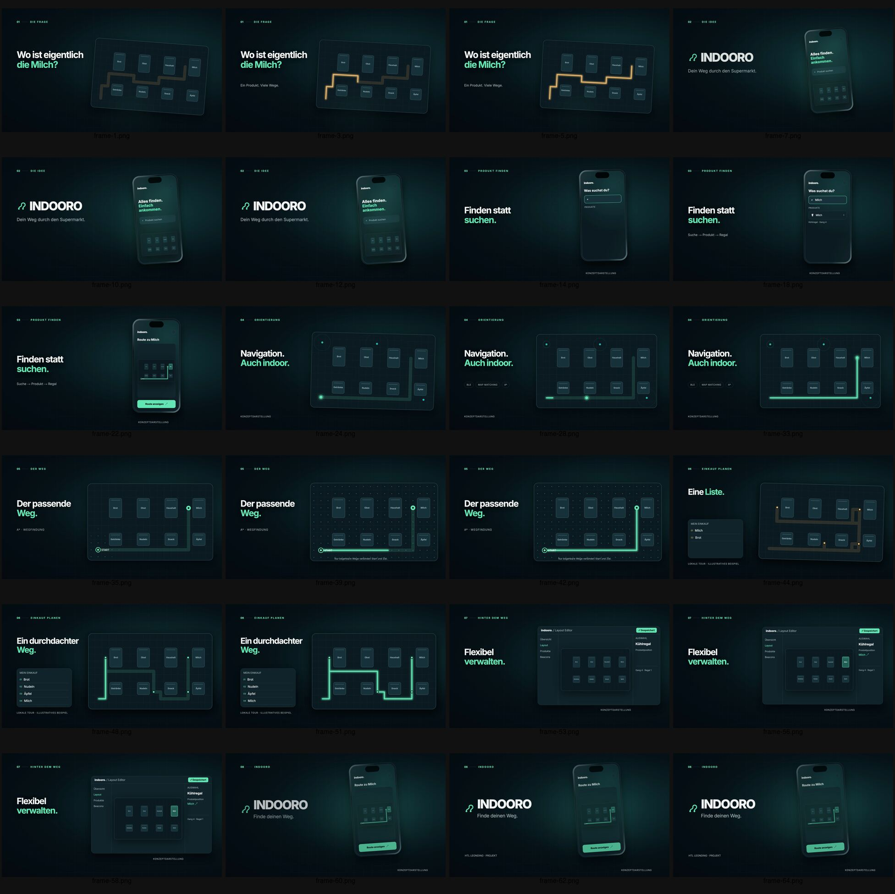

# V1 scene-by-scene creative review

Method: sampled **encoded final MP4** frames at 1, 3, 5, 7, 10, 12, 14, 18, 22, 24, 28, 33, 35, 39, 42, 44, 48, 51, 53, 56, 58, 60, 62 and 64 seconds; compared each scene with `Scenes.tsx`, `Film.tsx` and the V1 storyboard. This is an evidence-based still/source audit, not a claim of continuous playback. Durations follow `src/design/tokens.ts`.

| Scene / interval | Intent and observed image | Critical judgment / V2 response |
|---|---|---|
| 01 Problem, 0–6 s | At 1/3/5 s, left question `Wo ist eigentlich die Milch?` faces a small tilted shelf diagram and amber line. 6 s establishes friction, but no customer or actual aisle appears. | Abstract problem needs too much reading; replace with a brief, readable pause by a stylized shopper among modular digital aisles. Keep the amber detour as a brief graphic accent only. |
| 02 Reveal, 6–13 s | At 7/10/12 s, a wordmark and phone remain in a near identical left/right layout. The home screen is small; the phone/identity spends 7 s before the task begins. | Brand is recognizable but early reveal stalls momentum. Introduce the phone as the shopper activates it in the digital store; reserve the full brand hero for the end. |
| 03 Search, 13–23 s | At 14/18/22 s, search field gains `Milch`, a result, then map mode. The real product interaction is legible but occupies 10 s in a mostly fixed phone shot; UI microcopy is tiny at 540p. | The strongest reusable story beat. Compress to a controlled search/select/map progression with a clear stylized touch cue and a readable result. |
| 04 Position, 23–34 s | At 24/28/33 s, blue/teal dots, beacon rings and a path animate on the same schematic map. Labels `BLE`, `MAP MATCHING`, `A*` appear. | 11 s of mechanism before the benefit. Technical chips compete with customer comprehension. Keep a position cue only if visually supported and avoid implying measured performance. |
| 05 Route, 34–43 s | At 35/39/42 s, route and dot network occupy the right half; headline `Der passende Weg.` remains left. Source uses a Manhattan-distance node wave while actual final route is A*. | Repeats scene 04's map composition for 9 s and shifts into algorithm explanation. For an ad, use the route as directional energy through the digital aisle; omit A* text and wave. |
| 06 List, 43–52 s | At 44/48/51 s, amber route changes to mint and list rows swap. Source and V1 notes confirm crossfades, not physical reordering. | Technically interesting but a second product story after the core search benefit. Remove from the 26 s ad; retain for an optional separate feature spot. |
| 07 Admin, 52–59 s | At 53/56/58 s, a full editor panel fills the right half; the `✓ Gespeichert` badge is already present. | An admin audience appears late in a customer ad and breaks point of view. Exclude from V2. |
| 08 Hero, 59–65 s | At 60/62/64 s, phone/wordmark/claim settle and hold. This is the cleanest brand composition, though same dark graphic world and left/right geometry persist. | Rebuild as a shorter 3–4 s payoff with a remembered human discovery and one crisp brand lockup. Retain route glyph direction, redesign timing. |

## Narrative and editing diagnosis

The current film communicates a problem, named product, search, route, extra features and brand in sequence. It reads as a technical product explainer because it spends 20 seconds on positioning/routing and 16 seconds on list/admin concepts, while the customer's physical success is never shown. The identity arrives before a viewer sees the solution work. Typography uses a repeated left headline/right illustration grammar in all eight scenes; the repeated composition reduces the impact of otherwise competent vector craft. Source-level transitions rely on opacity overlaps; sampled frames show visual continuity in color but do not demonstrate the promised literal map/phone/glyph morphs. Deliberate pauses in a premium ad would be useful, yet V1's long holds do not reveal new information.

## Human element

No visible person, hand, supermarket aisle, real shelf or product pickup occurs in the sampled final frames or any scene component. The viewer never sees *when* a customer opens Indooro, what uncertainty feels like, how a selection changes their direction, or the moment the product is found. V2 should bind each UI beat to one stylized shopper's need, activation, movement and discovery in a modular digital store. The route must visibly change that shopper's direction. A path composited into the environment is a narrative visualization, not proof of an AR or turn-by-turn feature.

## What still works

The dark teal/mint palette, sharp route line, restrained vector map and compact search → result → map progression form a coherent visual basis. The frame-based animation, graph tests and isolated Remotion package are valuable technical assets. The idea of a line linking physical movement with map movement can become V2's signature transition if newly choreographed rather than inherited as a crossfade.
